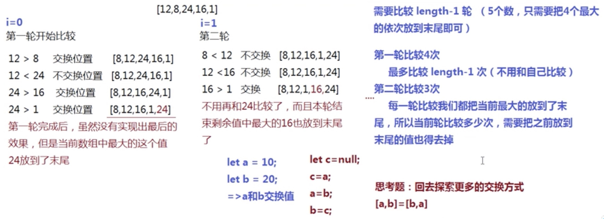
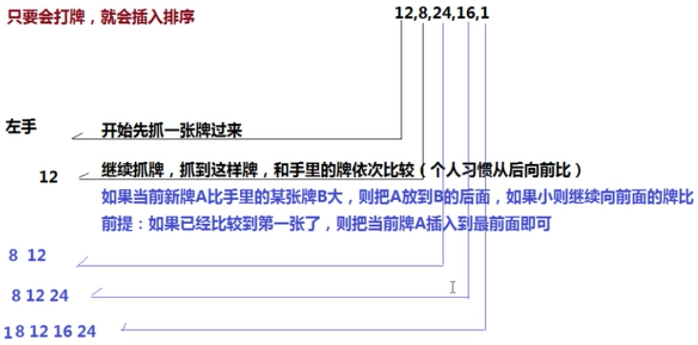
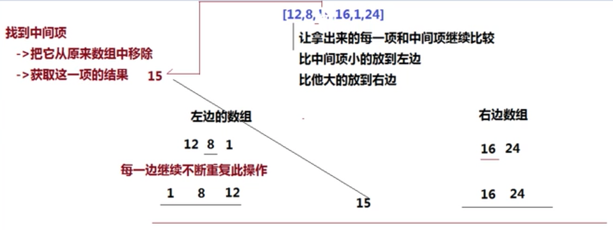

# 排序
## 1.冒泡排序：for循环
最好的时间复杂度：o(n^2)

最差的时间复杂度：o(n^2)

冒泡思想：让数组中的当前项和后一项进行比较，如果当前项比后一项大，则两项交换位置（让大的靠后）即可



代码实现：
```javascript
function bubble(arr) {
    let tmp = null;
    // 外层循环i控制比较的轮数
    for (let i = 0; i < arr.length - 1; i++) {
        // i = 0 第一轮：一个都没有放到排序好的数组里
        // i = 1 第二轮：经过第一轮，排序好的数组已经在数组里放了1个值
        // i = 2 第三轮：经过第一、二轮，排序好的数组已经在数组里放了2个值
        // ....
        // 里层循环控制每一轮比较的次数j
        // arr.length - 1 - i 每循环一轮之后剩余要比较的元素个数就少一个，所以经过i轮循环后需要比较的元素就只有arr.length - 1 - i个
        for (let j = 0; j < arr.length - 1 - i; j++) {
            if (arr[j] > arr[j+1]) {
                // 当前项大于后一项
                tmp = arr[j];
                arr[j] = arr[j+1];
                arr[j+1] = tmp;
            }
        }
    }
    return arr;
}

// 测试结果
let arr = [2, 1, 5, 3, 9, 4];
arr = bubble(arr);
console.log(arr); // [1, 2, 3, 4, 5, 9]
```

## 2.插入排序：for循环

思想：开辟一个新的数组，存放从要排序的数组中取到的值，然后再一个一个从未排序的数组中取值，再和新数组中的各个元素比较（可以从后往前（从新数组最后一项比较）也可以从前往后（从新数组第一项开始比较）），直到新元素插入到新数组中

最好的时间复杂度：o(n^2)

最差的时间复杂度：o(n^2)

```javascript
function insertSort(arr) {
    // 1.准备一个新数组，用来存储从数组中取到的元素（类似抓到手里的牌），开始先取一个元素（类似先抓一张牌进来）
    let newArr = [];
    // 先存放第一个元素到新数组
    newArr.push(arr[0]);
    // 2.从第二项开始依次取元素（类似依次抓牌），一直到所有的元素都取完（一直到所有的牌都抓光）
    for (let i = 1; i < arr.length; i++) {
        // a是新取的元素（新抓的牌）
        let a = arr[i];
        // 和newArr中的元素依次比较（和newArr手里的牌依次比较（从后往前比较））
        for (let j = newArr.length - 1; j >= 0; j--) {
            // 每一次都要比较newArr中的元素（手里的牌）
            let b = newArr[j];
            // 如果当前新元素a（新牌a）比要比较的元素b（牌b）大，则把a放到b的后面
            if (a > b) {
                // 把a放到b的后面
                newArr.splice(j+1, 0, a);
                // 结束此轮新牌和手里的牌比较
                // 一定要记得break; 否则排序会有问题
                break;
            }
            // 已经比较到第一项，把新牌放到手中最前面即可
            // 如果新牌已经和手里的牌比较到了第一项，则直接把新牌放到手里的最前面即可
            if (j === 0) {
                newArr.unshift(a);
            }
        }
    }
    return newArr;
}
// 测试结果
let arr = [2, 1, 5, 3, 9, 4];
arr = insertSort(arr);
console.log(arr); // [1, 2, 3, 4, 5, 9]
```

```javascript
// 自己手写的：
function insert(arr) {
    let newArr = [];
    // newArr.push(arr[0]);
    newArr[0] = arr[0];
    for (let i = 1; i < arr.length; i++) {
        for(let j = newArr.length - 1; j >= 0; j--){
            if(arr[i] >= newArr[j]){
                newArr.splice(j+1, 0, arr[i]);
                break;
            }
            if (j === 0) {
                newArr.unshift(arr[i]);
                break;
            }
        }
    }
    return newArr;
}
var resArr = insert([3, 2, 8, 1, 5, 4, 0, 9]);
console.log(resArr); // 测试结果：[0, 1, 2, 3, 4, 5, 8, 9]
```

## 3.快速排序：递归
思路：



最好的时间复杂度：o(nlogn)

最差的时间复杂度：o(n^2)

基础知识：
递归：函数执行的时候自己调用自己
```javascript
function fn() {
    fn(); // Uncaught RangeError: Maximum call stack size exceeded 这种死递归会导致栈溢出
}
fn();
```

```javascript
function fn() {
    setTimeout(fn, 0); // 这种看似死递归的方法不会导致栈溢出错误
}
fn();
```

```javascript
// 递归实现1-10累加的和
function sum(n) {
    if(n > 10) {
        // 递归的出口
        return 0;
    }
    return n + sum(n + 1);
    // return 1 + sum(2)
    // return 1 + 2 + sum(3)
    // return 1 + 2 + 3 + sum(4)
    // ......
    // return 1 + 2 + 3 + 4 + ... + 10 + sum(11)
    // return 1 + 2 + 3 + 4 + ... + 10 + 0
}
let total = sum(1);
console.log(total); // 55
```

快排的代码实现
```javascript
function quickSort(arr) {
    // 4.结束递归，找到递归的出口（当arr中小于等于1项时，则不用再继续处理）
    if (arr.length <= 1) {
        return arr;
    }

    // 1.找到数组的中间项，在原有的数组中把它移除
    let midIndex = Math.floor(arr.length / 2);
    // 基础知识细节：因为splice会返回被删除元素组成的数组，所以要通过取数组元素的下标获取到元素值，如：[1, 2, 3, 4, 5, 9].splice(2, 1)返回的是[3]，所以要通过[3][0]获取到3这个元素值
    let midValue = arr.splice(midIndex, 1)[0];

    // 2.准备左右两个数组，循环剩下数组中的每一项，比当前项小的放到左边数组中，反之放到右边数组中
    let arrLeft = [];
    let arrRight = [];
    for(let i = 0; i < arr.length; i ++) {
        arr[i] < midValue ? arrLeft.push(arr[i]) : arrRight.push(arr[i]);
    }

    // 3.递归方式让左右两边的数组持续这样处理，一直到左右两边都排好序为止（最后让左边 + 中间值 + 右边拼接成为最后的结果）
    // concat可以将值连接到数组，参考mdn：https://developer.mozilla.org/zh-CN/docs/Web/JavaScript/Reference/Global_Objects/Array/concat
    return quickSort(arrLeft).concat(midValue, quickSort(arrRight));
}
// 测试结果
let arr = [2, 1, 5, 3, 9, 4];
arr = quickSort(arr);
console.log(arr); // [1, 2, 3, 4, 5, 9]
```

```javascript
// 自己写的
function quickSort(arr){
    if(arr.length <= 1) {
        return arr;
    }
    let midValue = null;
    let midIndex = Math.floor(arr.length / 2);
    let leftArr = [];
    let rightArr = [];
    midValue = arr.splice(midIndex, 1)[0];
    for (let i = 0; i < arr.length; i++) {
        if(midValue > arr[i]) {
            leftArr.push(arr[i]);
        }
        else {
            rightArr.push(arr[i]);
        }
    }
    console.log('left:', leftArr, 'rightArr:', rightArr);
    return quickSort(leftArr).concat(midValue, quickSort(rightArr));
}

var resArr = quickSort([3, 2, 8, 1, 5, 4, 0, 9]);
console.log(resArr);
// 测试结果
// Script snippet %236:134 left: (5) [3, 2, 1, 4, 0] rightArr: (2) [8, 9]
// Script snippet %236:134 left: [0] rightArr: (3) [3, 2, 4]
// Script snippet %236:134 left: [] rightArr: (2) [3, 4]
// Script snippet %236:134 left: [3] rightArr: []
// Script snippet %236:134 left: [8] rightArr: []
// Script snippet %236:139 (8) [0, 1, 2, 3, 4, 5, 8, 9]
```

## 4. 归并排序
最好的时间复杂度：o(nlogn)

最差的时间复杂度：o(nlogn)

思想：分而治之的思想，拆，排序，合并
```javascript
function mergeSort(arr) {
    // 递归的出口
    if(arr.length === 1){
        return arr;
    }
    // 拆解的过程
    let mid = Math.floor(arr.length / 2);
    let leftArr = mergeSort(arr.slice(0, mid));
    let rightArr = mergeSort(arr.slice(mid));
    let sortedArr = merge(leftArr, rightArr);
    return sortedArr;
}

// 合并的过程
function merge(leftA, rightA) {
    let newA = [];
    while(leftA.length && rightA.length){
        // 因为拆分的数组都是排好序的，所以合并的时候正常首位比对就行
        if (leftA[0] < rightA[0]) {
            newA.push(leftA.shift());
        }
        else {
            newA.push(rightA.shift());
        }
    }
    while(leftA.length) {
        newA.push(leftA.shift());
    }
    while(rightA.length){
        newA.push(rightA.shift());
    }
    return newA;
}

var mergeArr = [3, 9, 6, 7, 2, 4, 1];
var res = mergeSort(mergeArr);
console.log(res); // [1, 2, 3, 4, 6, 7, 9]
```

# 查找&二叉树的遍历
## 5. 实现二分查找：输入的数组必须是一个已经排好序的数组，如果未排序，则先进行排序
时间复杂度：o(log2n)
如果找到目标值，则返回目标值在数组中的下标。
算法的核心是通过移动左右下标指针来实现的，不管是非递归实现还是递归实现，都是通过移动`low`和`high`来实现的。

非递归实现

```javascript
function binSearch(arr, target){
    let low = 0;
    let high = arr.length - 1;
    while(low <= high) {
        // 注意这个mid取值是根据low和high的平均值来取值的，且要放在while循环里，每次更新low和high之后才会重新计算mid
        let mid = Math.floor((low + high) / 2);
        if (arr[mid] === target) {
            return mid;
        }
        else if (arr[mid] < target) {
            low = mid + 1;
        }
        else {
            high = mid - 1;
        }
    }
    return -1;
}
let res = binSearch([1, 3, 5, 8, 9], 3);
console.log(res); // 1
```

递归实现
```javascript
function binSearch(arr, low, high, target){
    if(low > high) {
        return -1;
    }
    let mid = Math.floor((low + high) /2);
    if (arr[mid] == target) {
        return mid;
    }
    else if (arr[mid] < target) {
        low = mid + 1;
        // 一定要记得把递归调用的结果return出去，否则就出错了
        return binSearch(arr, low, high, target);
    }
    else {
        high = mid - 1;
        // 同上
        return binSearch(arr, low, high, target);
    }
}
let res = binSearch([1, 3, 5, 8, 9], 0, 4, 3);
console.log(res); // 1
```

## 6. 实现二叉树的广度优先搜索
* 深度优先不需要记住所有的节点, 所以占用空间小, 而广度优先需要先记录所有的节点占用空间大；
* 深度优先有回溯的操作(没有路走了需要回头)所以相对而言时间会长一点；

* 深度优先采用的是堆栈的形式, 即先进后出；
* 广度优先则采用的是队列的形式, 即先进先出；

```javascript
// 构造一棵二叉树
function BinTree(value, left, right) {
    this.value = value;
    this.left = left;
    this.right = right;
}

// 注意构造节点的顺序是先构造子节点，再构造父节点。
var node6 = new BinTree('6', '', '');
var node5 = new BinTree('5', '', '');
var node4 = new BinTree('4', '', '');
var node3 = new BinTree('3', node6, '');
var node2 = new BinTree('2', node4, node5);
var node1 = new BinTree('1', node2, node3);

function bfs(node) {
    if (!node){
        console.log("this is an empty tree");
        return;
    }
    var que = [];
    que.push(node);
    // 当que数组非空的时候继续while循环
    while(que.length){
        // 注意是shift，从第一个元素开始打印
        var tmpNode = que.shift();
        console.log(tmpNode.value);
        if (tmpNode.left) {
            que.push(tmpNode.left);
        }
        if (tmpNode.right) {
            que.push(tmpNode.right);
        }
    }
}

bfs(node1); // 1 2 3 4 5 6
```

## 7. 实现二叉树的深度优先搜索（有赞二面笔试）
### 1) 递归实现
```javascript
// 构造一棵二叉树
function BinTree(value, left, right) {
    this.value = value;
    this.left = left;
    this.right = right;
}

// 注意构造节点的顺序是先构造子节点，再构造父节点。
var node6 = new BinTree('6', '', '');
var node5 = new BinTree('5', '', '');
var node4 = new BinTree('4', '', '');
var node3 = new BinTree('3', node6, '');
var node2 = new BinTree('2', node4, node5);
var node1 = new BinTree('1', node2, node3);

// 递归实现
function depSearch(node) {
    if (!node){
        console.log("this is an empty tree");
        return;
    }
    var que = [];
    que.push(node);
    while(que.length) {
        // 从最后一个元素输出
        var tmpNode = que.pop();
        console.log(tmpNode.value);
        if(tmpNode.left) {
            depSearch(tmpNode.left);
        }
        if (tmpNode.right) {
            depSearch(tmpNode.right);
        }
    }
}

depSearch(node1); // 1 2 4 5 3 6

// 非递归实现，构造二叉树的方式需要改改，带children的形式
```

## 8.二叉树镜像
请完成一个函数，输入一个二叉树，该函数输出它的镜像。

例如输入：

     4
   /   \
  2     7
 / \   / \
1   3 6   9
镜像输出：

     4
   /   \
  7     2
 / \   / \
9   6 3   1

 

示例 1：

输入：root = [4,2,7,1,3,6,9]
输出：[4,7,2,9,6,3,1]

方法一：非递归，采用二叉树的广度优先搜索，然后交换二叉树中各个节点的左右子节点
```javascript
function mirrorTree(node){
    if(!node){
        return null;
    }
    let queue = [];
    queue.push(node);
    while(queue.length){
        let tmpNode = queue.shift();
        console.log(tmpNode.value);
        // 交换两个元素的位置
        let tmp = tmpNode.left;
        tmpNode.left = tmpNode.right;
        tmpNode.right = tmp;
        if(tmpNode.left){
            queue.push(tmpNode.left);
        }
        if(tmpNode.right){
            queue.push(right);
        }
    }
}

// 构造一棵二叉树
function BinTree(value, left, right) {
    this.value = value;
    this.left = left;
    this.right = right;
}

// 注意构造节点的顺序是先构造子节点，再构造父节点。
var node7 = new BinTree('9', null, null);
var node6 = new BinTree('6', null, null);
var node5 = new BinTree('3', null, null);
var node4 = new BinTree('1', null, null);
var node3 = new BinTree('7', node6, node7);
var node2 = new BinTree('2', node4, node5);
var node1 = new BinTree('4', node2, node3);

mirrorTree(node1);
```

## 9. （新东方三面）洗牌算法 ——> 给一个数组随机调整数组中的元素顺序，随机排列数组内的元素
http://www.fly63.com/article/detial/5005

```javascript
// 洗牌算法：时间复杂度：O(n)
// 思路：http://www.fly63.com/article/detial/5005
// 从最后一个元素开始随机和其他元素交换顺序
// 方法1：直接在原数组上交换元素的顺序
function shuffle(arr) {
    for (let i = arr.length - 1; i > 0; i--) {
        // 注意这里随机的数要用Math.floor()取整，
        let swapIdx = Math.floor(Math.random() * (i - 1));
        // 使用解构来交换两个元素的顺序
        [arr[i], arr[swapIdx]] = [arr[swapIdx], arr[i]];
    }
}

let arr = [1, 2, 3, 4, 5, 6];
shuffle(arr);
console.log(arr); // 随机顺序 [4, 6, 1, 5, 2, 3]

// 方法2：开辟新的数组空间
function shuffle(arr) {
    let newArr = [];
    while (arr.length) {
        let swapIdx = Math.floor(Math.random() * (arr.length - 1));
        // 注意splice返回的是一个数组，所以获取数组元素需要通过[0]获取到具体的元素
        newArr.push(arr.splice(swapIdx, 1)[0]);
    }
    return newArr;
}

console.log(shuffle([1, 2, 3, 4, 5, 6, 7, 8, 9])); // (9) [1, 3, 5, 6, 7, 4, 8, 2, 9]
```

## 10.（有赞三面）：给定一个整数数组`arr`和一个目标值`target`，请你在该数组中找出和为目标值的那两个整数，并返回他们的数组下标。你可以假设每种输入只会对应一个答案。但是，你不能重复利用这个数组中同样的元素。

方法一：时间复杂度O(n^2)：`while循环(n)*indexOf(n)`
```javascript
function arrSum(arr, target){
    let i = 0;
    while(i < arr.length - 1){
        let res = target - arr[i];
        if(arr.slice(i+1).indexOf(res) !== -1){
            return [i, arr.indexOf(res) + i];
        }
        else {
            i++;
        }
    }
    return -1;
}

console.log(arrSum(arr, target));
```

方法二：暴力解法，两个for循环，时间复杂度：O(n^2)
```javascript
function arrSum(arr, target){
    for(let i = 0; i < arr.length - 1; i++){
        for(let j = i+1; j<arr.length; j++){
            if(arr[i] + arr[j] === target){
                return [i, j];
            }
        }
    }
    return -1;
}

var nums = [2, 11, 7, 15];
var target = 9;
console.log(arrSum(nums, target)); // [0, 2]
```

方法3：hash映射，利用对象{}，时间复杂度O(n)
```javascript
function arrSum(arr, target){
    let obj = {};
    for(let i = 0; i < arr.length; i++){
        // 注意存储的下标可能是0，所以这里判断的时候，需要加一下下标为0的判断
        if(obj[target - arr[i]] || obj[target - arr[i]] === 0){
            return [i, obj[target - arr[i]]];
        }
        else {
            obj[arr[i]] = i;
        }
    }
    return -1;
}
var nums = [2, 11, 7, 15];
var target = 9;
console.log(arrSum(nums, target)); // [2, 0]
```

方法4：直接用Map
```javascript
function arrSum(arr, target){
    let map = new Map();
    for(let i = 0; i < arr.length; i++){
        if(map.get(target - arr[i]) || map.get(target - arr[i]) === 0){
            return [i, map.get(target - arr[i])]
        }
        else {
            map.set(arr[i], i);
        }
    }
    return -1;
}
var nums = [2, 11, 7, 15];
var target = 9;
console.log(arrSum(nums, target)); // [0, 2]
```

## 11.合并两个有序数组
给你两个有序整数数组 nums1 和 nums2，请你将 nums2 合并到 nums1 中，使 num1 成为一个有序数组。
说明:
初始化 nums1 和 nums2 的元素数量分别为 m 和 n 。
你可以假设 nums1 有足够的空间（空间大小大于或等于 m + n ）来保存 nums2 中的元素。
```javascript
// 输入:
nums1 = [1, 2, 3, 0, 0, 0], m = 3
nums2 = [2, 5, 6],       n = 3

// 输出: [1,2,2,3,5,6]
```

解题注意：1. nums1和nums2都是有序数组

方法一：`concat`连接两个数组，`filter`过滤元素值为0的元素，`sort`排序
时间复杂度：`O(n^2) filter N * sort N`
```javascript
function combineArr(arr1, arr2){
    // filter过滤掉元素值为0的情况
    return arr1.concat(arr2).filter(ele => ele).sort((a, b) => a - b);
}
var nums1 = [1, 2, 3, 0, 0, 0];
var nums2 = [2, 5, 6];
combineArr(nums1, nums2); // [1,2,2,3,5,6]
```

方法二：`splice + sort`这种方式如果数组元素为0的值不是在数组末尾可能会有问题。
时间复杂度：`O(n)`
```javascript
function combineArr(arr1, m, arr2, n){
    // 去除arr1中末尾的0
    arr1.splice(m, n, ...arr2);
    return arr1.sort((a, b) => a-b);
}
var nums1 = [1, 2, 3, 0, 0, 0];
var nums2 = [2, 5, 6];
combineArr(nums1, 3, nums2, 3); // [1,2,2,3,5,6]
```

方法三：通过插入排序算法
时间复杂度：`O(n^2)` 两个for循环
```javascript
function combineArr(arr1, m, arr2, n){
    // 去掉arr1中元素值为0的元素
    let newArr = arr1.splice(0, m);
    // 插入排序算法：arr2是待排序的数组，newArr是已排序的数组，将arr2的元素插入newArr
    for(let i = 0; i< arr2.length; i++){
        for(let j = newArr.length - 1; j > 0; j--){
            if(arr2[i] >= newArr[j]){
                newArr.splice(j + 1, 0, arr2[i]);
                // 插入之后记得要break，不然会继续内存循环
                break;
            }
            if(j === 0){
                newArr.unshift(arr2[i]);
            }
        }
    }
    return newArr;
}
var nums1 = [1, 2, 3, 0, 0, 0];
var nums2 = [2, 5, 6];
combineArr(nums1, 3, nums2, 3); // [1,2,2,3,5,6]
```

## 12.给定两个数组，编写一个函数来计算它们的交集
示例1：
输入: nums1 = [1,2,2,1], nums2 = [2,2]
输出: [2]

示例2：
输入: nums1 = [4,9,5], nums2 = [9,4,9,8,4]
输出: [9,4]

说明：
输出结果中的每个元素一定是唯一的。 我们可以不考虑输出结果的顺序。

方法一：暴力求交集
时间复杂度：O(n^2)
```javascript
function intersection(arr1, arr2){
    // let newArr = [];
    // for(let i = 0; i < arr1.length; i++){
    //     if(arr2.indexOf(arr1[i])){
    //         newArr.push(arr1[i]);
    //     }
    // }
    // return [...new Set(newArr)];

    // ======
    let newArr1 = arr1.length > arr2.length ? arr2 : arr1;
    let newArr2 = arr1.length > arr2.length ? arr1 : arr2;
    return [...new Set(newArr1.filter(ele => newArr2.indexOf(ele) !== -1))]
}
var nums1 = [4,9,5];
var nums2 = [9,4,9,8,4];
intersection(nums1, nums2); // [4, 9]
```

方法二：Map
时间复杂度：O(n)
```javascript
function intersection(arr1, arr2){
    let obj = {};
    let newArr = [];
    arr1.forEach(ele => obj[ele] = true);
    arr2.forEach(ele => {
        if(obj[ele]){
            newArr.push(ele);
        }
    })
    return [...new Set(newArr)];
}
var nums1 = [4,9,5];
var nums2 = [9,4,9,8,4];
intersection(nums1, nums2);
```