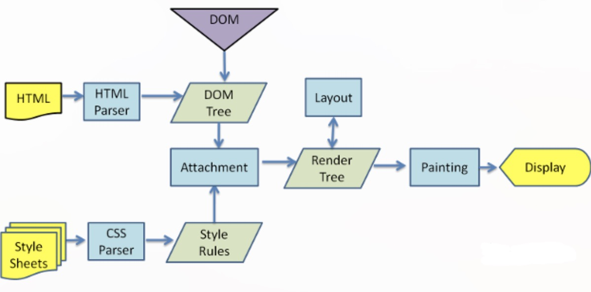

### js100题：https://mp.weixin.qq.com/s/KEVpdAqAU3oqJ6hTYSduBw
### js的数据类型有哪些？
基本数据类型6种：栈存储
`Boolean`\\`Number`\\`String`\\`undefined`\\`null`\\`Symbol`

复杂数据类型、引用数据类型：堆存储
`Object`\\`Array`\\`Function`

`Symbol`：代表创建后独一无二且不可变的数据类型。出现的原因估计主要是解决可能出现的全局变量冲突的问题。

### undefined和null的区别
https://mp.weixin.qq.com/s/3wuTkzoEY_f6_dmKgj8iXg

1. `Undefined`类型：值`undefined`是全局对象的一个属性；原始值：`window.undefined`
(1) 声明了一个变量，但未对其初始化时，这个变量的值就是`undefined`。
```javascript
var data;
console.log(data === undefined); //true
```
(2) 也可以显式的把一个变量声明为`undefined`
```javascript
var data = undefined;
console.log(data === undefined); //true

var value = 1;
console.log(data); //1

value = undefined;
console.log(data === undefined); // true
```
(3) 对未定义的变量执行`typeof`操作符也会返回`undefined`
```javascript
//data变量未定义
var value;
console.log(typeof data); // "undefined"
console.log(typeof value); // "undefined"
```
对`undefined`直接`typeof`也会返回`undefined`：
```javascript
typeof undefined === 'undefined'; // true
```
(4) 函数如果没有使用`return`语句指定返回值，就会返回一个`undefined`值
(5) 调用函数时没有传参数值，参数同样也会被初始化为`undefined`值

1. `Null`类型：值`null`是一个字面量
`null`表示一个空对象指针，只是变量未指向任何对象。可以把`null`理解为未创建的对象
（1）`null`常出现在返回类型是对象，但没有关联值的地方。
（2）
```javascript
typeof null === 'object'; // true
```
(3) null的应用场景：
a. 如果定义的变量在将来用于保存对象，那么最好将该变量初始化为null，而不是其他值。
b. 当一个数据不再需要使用时，我们最好通过将其值设置为null来释放其引用，这个做法叫做解除引用。

**扩展**：解除引用
1. 解除引用的真正作用是让值脱离执行环境，以便垃圾收集器在下次运行时将其回收。
2. 解除引用还有助于消除有可能出现的循环引用的情况。这一做法适用于大多数全局变量和全局对象的属性，局部变量会在它们离开执行环境时(函数执行完时)自动被解除引用。


#### undefined和null的关系
```javascript
console.log(null == undefined); // true
console.log(null === undefined); // false
```

### `Number([]) => 0` 和 `Number({}) => NaN`的原因
`[]`数组有`valueOf()`转成`[]`非基本数据类型，然后`[]`再调用`toString()`转成`""`即转成了基本数据类型空字符串，而空字符串`""`转成数字类型是`0`；
`{}`对象通过`valueOf()`转成`{}`非基本数据类型，然后`{}`再调用`toString()`转成`'[object Object]'`转成了基本类型非空字符串，而非空字符串`'[object Object]'`转成数字就是`NaN`；

## 什么是事件委托
事件委托本质上是利用了浏览器事件冒泡的机制。因为事件在冒泡过程中会上传到父节点，并且父节点可以通过事件对象获取到
目标节点，因此可以把子节点的监听函数定义在父节点上，由父节点的监听函数统一处理多个子元素的事件，这种方式称为事件代理。

使用事件代理可以不必要为每一个子元素都绑定一个监听事件，这样减少了内存上的消耗。并且使用事件代理还可以实现事件的动态绑定，比如说新增了一个子节点，并不需要单独地为它添加一个监听事件，它所发生的事件会交给父元素中的监听函数来处理。

瀑布流就是用事件委托实现的，对新增子节点则无需单独为新增的子节点增加事件监听，而是在新子节点创建之前已经直接加在了父节点中。

## 移动端300ms延迟
移动端的点击事件的有延迟，时间是多久，为什么会有？怎么解决这个延时？
https://juejin.im/post/5ce764a2f265da1b8c19645a

问题原因：移动端浏览器 会在 `touchend` 和 `click` 事件之间，等待 `300ms - 350ms`，判断用户是否会进行双击手势用以缩放文字。
怎么解决：
1. 可以通过设置`viewport`来处理禁止缩放：`content="user-scalable=no"`
   `<meta name="viewport" content="user-scalable=no"/>`


## 进程和线程
进程：在操作系统上打开一个软件，跑软件的时候软件代码会开启一个进程，一个软件跑起来至少会有一个进程，进程和进程之间是相互隔离的（比如某个应用程序挂掉了，不会影响其它应用程序），资源不共享。查看进程可以用进程管理器（资源管理器windows）查看，比如mac上可以打开activity monitor查看都有哪些进程，进程级别的管理。
线程：一个进程可以开启很多个线程，在activity monitor查看器中可以看到有Threads线程列，就表示每个进程中包含多少个线程。
    线程是程序并发执行的最小单位。

比如：比如在微信中可以同时打字、接受消息、听语音、看视频等操作。微信开启了一个进程，但是又很多的线程。相互独立又相互协作。
为什么需要多线程，同一时间可以做多件事情。

进程的概念（操作系统进行资源分配和调度的一个独立单位）、进程和线程的关系、进程的特点（相互隔离、资源不共享）、进程举例、为什么需要线程（并发、同时可以做多件事情）、线程举例、查看进程和线程


新状态：进程已经创建，但未被OS接纳为可执行进程。（还没有申请到相应的资源）。
就绪态：进程做好了准备，准备执行（只等待处理机）。
执行状态：该进程正在执行（单处理机，某一时刻仅一个进程占用处理机）。
阻塞状态：等待某事件发生才能执行，如等待I/O完成。
终止状态。

## 栈、队列、数组、链表的关系

栈、队列、数组、链表都是线性存储结构

### 数组
1. 数组是用一组连续的内存空间来存储的；
2. 数组是一个有序的数据集合，可以通过数组名称和索引访问；
3. 数组支持随机访问，根据数组下标访问的时间复杂度是O(1)；
4. 数组插入和删除效率相对较低。数组为了保持内存数据的连续性，会导致插入、删除这两个操作比较低效，因为底层通常是要进行大量的数据移动来保持数据的连续性。
插入与删除的时间复杂度如下：
插入：从最好 O(1) ，最坏 O(n) ，平均 O(n)
删除：从最好 O(1) ，最坏 O(n) ，平均 O(n)

### 栈
1. 栈是先进后出的数据结构
2. 新添加或待删除的元素都保存在栈的末尾，称作栈顶，另一端就叫栈底
3. 从栈的操作特性来看，是一种 操作受限的线性表，只允许在一端插入和删除数据。
4. js中可以用数组实现栈：push、pop
   
### 队列
1. 队列是先进先出的数据结构
2. 队列在尾部添加新元素，并从队首移除元素
3. js中可以用数组实现：push、shift

### 链表
链表是一种物理存储单元上非连续、非顺序的存储结构，数据元素的逻辑顺序是通过链表中的指针链接次序实现的。

### 数组和链表的区别
1. 占用的内存空间
* 链表占用空间可以是连续的也可以是非连续的；
* 数组占用空间为连续的；
* 相同量数据数组占用内存较少，因为链表需要存储前驱或者后继节点的位置信息；
2. 长度的可变性
* 链表长度可变。
* 数组的长度在定义时需给出，超过长度会造成溢出。注意：但是js中的数组是动态的，数组长度可变，不会造成溢出的情况。
3. 数据的操作
* 链表插入和删除比较方便(不需移动其他元素, 只需改变指针)，缺点是访问效率低，存储空间利用率低。
* 数组查询数据方便，插入和删除效率低（数组为了保持内部数据的连续性，在插入和删除操作中底层需要进行大量数据移动来保持数据的连续性）。

## Set && Map
`Set`：类似数组，成员值是唯一的，key和value是同一个。
`WeakSet`：
（1）WeakSet 的成员只能是对象，而不能是其他类型的值。
（2）垃圾回收机制不考虑 WeakSet 对该对象的引用，不存在内存泄漏问题。
`Map`：类似对象，也是键值对结构，但是对象的key只能是字符串类型，Map“键”的范围不限于字符串，各种类型的值（包括对象）都可以当作键。
* Map转为对象：
如果所有 Map 的键都是字符串，它可以无损地转为对象。
如果有非字符串的键名，那么这个键名会被转成字符串，再作为对象的键名。
```javascript
function strMapToObj(strMap) {
  let obj = Object.create(null);
  for (let [k, v] of strMap) {
    obj[k] = v;
  }
  return obj;
}

const myMap = new Map()
  .set('yes', true)
  .set('no', false);
strMapToObj(myMap)
// { yes: true, no: false }
```
* 对象转为 Map
  对象转为 Map 可以通过`Object.entries()`。
  ```javascript
  let obj = {"a":1, "b":2};
  let map = new Map(Object.entries(obj));
  ```
  手动写转换函数
  ```javascript
  function objToStrMap(obj) {
    let strMap = new Map();
    for (let k of Object.keys(obj)) {
        strMap.set(k, obj[k]);
    }
    return strMap;
  }
    objToStrMap({yes: true, no: false})
    // Map {"yes" => true, "no" => false}
  ```
`WeakMap`：
（1）WeakMap只接受对象作为键名（null除外），不接受其他类型的值作为键名。
（2）WeakMap的键名所指向的对象，不计入垃圾回收机制。
典型应用场景：DOM节点作为key，不会导致内存泄漏。

## 协商缓存和强制缓存
https://juejin.im/post/5ccfccaff265da03ab233bf5

浏览器如何判断是否有缓存？
下面涉及到http状态码`304`常考点。


浏览器缓存分为`强制缓存`和`协商缓存`
`强制缓存`：浏览器不会向服务器发送任何请求，直接从本地缓存中读取文件并返回Status Code: 200 OK

`200 (form memory cache)`: 不访问服务器，一般已经加载过该资源且缓存在了内存当中，直接从内存中读取缓存。浏览器关闭后，数据将不存在（资源被释放掉了），再次打开相同的页面时，不会出现from memory cache。
`200 (from disk cache)`： 不访问服务器，已经在之前的某个时间加载过该资源，直接从硬盘中读取缓存，关闭浏览器后，数据依然存在，此资源不会随着该页面的关闭而释放掉下次打开仍然会是from disk cache。
`header`头参数：
* `Expires`：过期时间，如果设置了时间，则浏览器会在设置的时间内直接读取缓存，不再请求。
* `Cache-Control`：当值设为`max-age=300`时，则代表在这个请求正确返回时间（浏览器也会记录下来）的5分钟内再次加载资源，就会命中强缓存。
  `cache-control`常用值设置：
  （1）`max-age`：用来设置资源（representations）可以被缓存多长时间，单位为秒；
  （2）`s-maxage`：和max-age是一样的，不过它只针对代理服务器缓存而言；
  （3）`public`：指示响应可被任何缓存区缓存；
  （4）`private`：只能针对个人用户，而不能被代理服务器缓存；

**注意：**区分强制缓存和协商缓存是根据`cache-control`的以下取值来区分的：
  （5）`no-cache`（协商缓存）：强制客户端直接向服务器发送请求，也就是说每次请求都必须向服务器发送。服务器接收到请求，然后判断资源是否变更，是则返回新内容，否则返回304，未变更。这个很容易让人产生误解，使人误以为是响应不被缓存。实际上`Cache-Control: no-cache`是会被缓存的，只不过每次在向客户端（浏览器）提供响应数据时，缓存都要向服务器评估缓存响应的有效性。即协商缓存。
  （6）`no-store`：禁止一切缓存（这个才是响应不被缓存的意思）。

优先访问`memory cache`，其次是`disk cache`，最后是请求网络资源。

`协商缓存`：浏览器会向服务器发送请求，服务器会根据这个请求的`request header`的一些参数来判断是否命中协商缓存，如果命中（即浏览器缓存的资源没有更新），则返回`304`状态码并带上新的`response header`通知浏览器从缓存中读取资源；如果判断的结果是缓存的资源更新了，则会返回`200 OK`，将新的资源返回给浏览器。
`header`头参数：
`Last-Modifed/If-Modified-Since`和`Etag/If-None-Match`是分别成对出现的，呈一一对应关系。
`Last-Modified`：浏览器向服务器发送资源最后的修改时间
`If-Modified-Since`：当资源过期时（浏览器判断Cache-Control标识的max-age过期），发现响应头具有`Last-Modified`声明，则再次向服务器请求时带上头`if-modified-since`表示请求时间。服务器收到请求后发现有`if-modified-since`则与被请求资源的最后修改时间进行对比（`Last-Modified`）,若最后修改时间较新（大），说明资源又被改过，则返回最新资源，HTTP 200 OK;若最后修改时间较旧（小），说明资源无新修改，响应HTTP 304 走缓存。

## HTML5的离线缓存
https://mp.weixin.qq.com/s/Q-Z8kYWSUJpkpAkTBv1Igw?

### 离线缓存和浏览器缓存的区别

## 为什么要初始化 CSS 样式
因为浏览器的兼容问题，不同浏览器对有些标签的默认值是不同的，如果没对CSS初始化往往会出现浏览器之间的页面显示差异。比如浏览器默认的字体大小有16px的有14px的。

## 如何做图片的上传和预览？
1. 通过接口缓存，返回图片地址预览；
2. 通过转成base64缓存在本地，这样有个问题就是base64的文件比较大；
3. 利用html5新增的`fileReader`api：https://wiki.developer.mozilla.org/zh-CN/docs/Web/API/FileReader

## for...of for...in Object.keys()遍历对象的属性？
`Object.keys()`：对象自身可枚举的属性，非继承的属性（即不包括原型链上的属性）
`for...in`：可遍历自身和继承的可枚举属性（即包括原型链上的属性）。（Symbol类型的可枚举属性被迭代的对象是遍历不到的）
`for...of`：可遍历`Symbol`类型的对象属性

https://mp.weixin.qq.com/s/mMXRsg-sNwxsXwk07Z4FIA

## 判断一个变量是否是数组？
1. `Array.isArray(arr)`
2. `arr instanceof Array`
3. `arr.constructor === Array`或者`arr.__proto__ === Array.prototype`
4. `Object.prototype.toString.call(arr) === '[object Array]'`：判断是否是数组需要使用call立即调用，如果不用call直接传入数组到toString()中返回的是`[object object]`，而不会区分是否是数组`[object Array]`
5. 根据数组能力来判断：`arr.slice`
```js
var a = []
undefined
var b = {}
undefined
a.slice
ƒ slice() { [native code] }
b.slice
undefined
```


## 判断一个变量的类型有哪些方式？
1. `typeof`
2. `instanceof`
3. `Object.prototype.toString.call()`：如果直接这样调用`Object.prototype.toString(变量)`不使用call，这样等价于`Object.prototype`这个对象 `对象.toString()`，所以一直返回的都是`[object Object]`。所以一定一定要用call绑定到需要转换的变量上。

## 什么是函数作用域？
函数作用域的含义是指，属于这个函数的全部变量都可以在整个函数的范围内使用及复用。

## js执行上下文 
js的可执行代码：`全局代码`、`函数代码`、`eval代码`

当执行到一个函数的时候，就会进行准备工作，这里的“准备工作”，让我们用个更专业一点的说法，就叫做"执行上下文(execution contexts)"

### js执行上下文类型包括：
* 全局执行上下文： 这是默认的、最基础的执行上下文。不在任何函数中的代码都位于全局执行上下文中。（执行上下文的栈底永远会有一个全局执行上下文）
  它做了两件事：
  1. 创建一个全局对象，在浏览器中这个全局对象就是 window 对象。
  2. 将 this 指针指向这个全局对象。
  注意：一个程序中只能存在一个全局执行上下文。
* 函数执行上下文： 每次调用函数时，都会为该函数创建一个新的执行上下文。
  1. 每个函数都拥有自己的执行上下文，`但是只有在函数被调用的时候才会被创建`；
  2. 一个程序中可以存在任意数量的函数执行上下文；
  3. 每当一个新的执行上下文被创建，它都会按照特定的顺序执行一系列步骤。
  4. 当执行一个函数的时候，就会创建一个执行上下文，并且压入执行上下文栈，当函数执行完毕的时候，就会将函数的执行上下文从栈中弹出。
* Eval函数执行上下文： 运行在 eval 函数中的代码也获得了自己的执行上下文。

## 常用的linux命令有哪些？
https://mp.weixin.qq.com/s/LFftM9GAdqAH5myO3q3E0Q

1. ls 命令 : 显示目录内容列表
2. cd 命令 : 切换工作目录
3. pwd 命令 : 显示工作目录
4. rm 命令 : 删除文件/目录
5. tail 命令 : 查看文件内容
6. cat 命令 : 查看文件内容
7. mv 命令 : 文件移动/改名
8. mkdir 命令 : 创建目录
9. rmdir 命令 : 删除空目录
10. touch 命令 : 新建文件
11. cp 命令 : 复制文件/目录
12. which 命令 : 查找文件
13. ping 命令 : 检测主机
14. telnet 命令 : 端口是否可访问
15. grep 命令 : 查找关键字
16. | 命令 : 管道命令
17. clear 命令 : 清除屏幕
18. find 命令 : 查找文件

## 小程序父子组件的通信
1. 在父组件中可以通过设置子组件的`properties`来向子组件传递数据；
2. 在`父组件中定义messages对象`，`对子组件dispatch方法进行拦截`，从而达到子组件向上通信；
   父组件定义message对象，拦截子组件dispatch方法。
3. 子组件可以通过`triggerEvent`方法触发父组件的自定义事件进行传参；
4. 如果以上几种方式不足以满足需要，父组件还可以通过 `this.selectComponent` 方法获取子组件实例对象，这样就可以直接访问组件的任意数据和方法。

## 小程序事件对象event包含的内容
`type`	String	事件的类型
`timeStamp`	Integer	事件触发的时间戳（毫秒）
`target`	Object	触发事件的组件的属性值集合，详细属性参见 target
`currentTarget`	Object	当前组件的一些属性值集合，详细属性参见 currentTarget
`detail`	Object	自定义事件对象属性列表，详细属性参见 detail
`touches`	Array	触摸事件类型存在，存放当前停留在屏幕中的触摸点信息的数组，touch 详细属性参见 touch
`changedTouches`	Array	触摸事件类型存在，存放当前变化的触摸点信息的数组, changedTouch changedTouch

## 小程序的运行机制
https://smartprogram.baidu.com/docs/develop/framework/operating-environment/

智能小程序运行在三端：`iOS`、`Android` 和 `用于调试的开发者工具`。
三端的脚本执行环境以及用于渲染非原生组件的环境是各不相同的：
`iOS`
新版本，小程序的逻辑层的 js 代码运行在 `jscore` 中，视图层在 webview 中渲染。
`Android`
新版本，小程序的逻辑层的 js 代码运行在 `V8` 中，视图层基于自研的 T7 内核在 webview 渲染。
`开发工具`
小程序逻辑层的 js 代码是运行在 `electron` 中，视图层是由 `Chromium 59.0.3071.115 Webview` 来渲染的。
## setData
setData 函数用于将数据，从逻辑层发送到视图层，当开发者调用 setData 后，数据的变化会引起视图层的更新。

https://smartprogram.baidu.com/docs/develop/framework/performance-tips/

#### 为什么建议不要过于频繁调用setData，应考虑将多次setData合并成一次setData调用？
setData方法是开发者通`逻辑层向视图层发送数据的方法`。<font color="red">每一次 setData 的调用，都会触发一次通信，而每一次的通信都会消耗一定的系统资源。</font>
setData接口的调用涉及逻辑层与渲染层间的线程通信，通信过于频繁可能导致处理队列阻塞，界面渲染不及时而导致卡顿，应避免无用的频繁调用。

#### 为什么小程序无法使用window、document
框架本身并非运行在浏览器中，所以 JavaScript 在 Web 中的一些能力都无法使用，如 document , window 等，这会使得小程序应用更接近原生；
框架中不可使用 window, document, location, navigator, localStorage, history等Web、浏览器 API。

页面的脚本逻辑是在`JsCore`中运行，`JsCore是一个没有窗口对象的环境`，所以不能在脚本中使用window，也无法在脚本中操作组件


## 字体图标和图片的区别？
字体文件（字体图标）：
优点：
1. 优化效果好（轻量级）：由于图标字体体积更小而携带的信息并未削减，可大大减少HTTP请求。
2. 灵活性更高：图标字体可以得到CSS的很好支持，大小和颜色都很容易用CSS控制。
3. 兼容性更广：图标字体支持现代浏览器，甚至是低版本的IE浏览器，所以可以放心的使用它。 相比于位图放大图片会出现失真、缩小又会浪费掉像素点，图标字体不会出现这种情况。
4. 显示效果佳：矢量图标字体与分辨率无关，无论屏幕PPI高或低，显示效果俱佳。

缺点：
1. 由于图标字体只能被渲染成单色或者CSS3的渐变色，使得它不能被广泛使用。
2. 很多精美图标字体是收费的，不过精美开源的免费图标也越来越多，并提供下载使用。
3. 自已创作图标字体费时费力，后期维护成本偏高。

图片：一般北京通图片，img图片等都会用jpg、png的图片

## 如何实现两个变量的交换
1. 通过一个临时变量交换；`let tmp = a; a = b; b = tmp;`
2. es6结构： `[a, b] = [b, a]`
3. 利用数组特性：
  ```javascript
  var a = 1, b = 2;
  a = [a, b];
  b = a[0];
  a = a[1];
  ```
4. 算术运算：缺点：存在变量溢出问题。
  ```javascript
  let a = 5
  let b = 4

  // 接下来就是见证神奇的时刻，来，镜头请对准我。
  // 二者之和
  a = a + b
  // 二者之和 - b的值，剩余a的值赋值给变量b
  b = a - b
  // 此刻a还是二者之和，a - b此刻相当于二者之和 - 变量b(a的值)，那么此刻剩余的就是变量b的值，赋值给a变量
  a = a - b

  // yes, we did!
  console.log(a) // 4
  console.log(b) // 5
  ```

## 如果在一个url后面直接拼参数会有什么问题，如：url + ? + key=value
1. 不能直接加`?`拼接，因为url里可能已经带了参数；
2. key可能存在覆盖的情况，如果url之前的参数已经有了key值，新加的key值会覆盖掉之前的key值；
3. 参数需要转码
4. url可能存在#hash的情况

## DOM创建和修改常用的api
```js
// 创建节点
createElement
createTextNode
createDocumentFragment('临时节点')
// 修改节点
appendChild parent.appendChild(child)
insertBefore parentNode.insertBefore(newNode,refNode);
removeChild parent.removeChild(node)
replaceChild
```

## 浏览器解析渲染的过程
* 解析HTML，生成DOM树；
* 解析CSS，生成CSSOM树；
* 将DOM树和CSSOM树关联，生成渲染树(Render Tree)；
* 布局render树（Layout/reflow），负责各元素尺寸、位置的计算；
* 绘制render树（paint），绘制页面像素信息；
* 将像素发送给GPU，展示在页面上。(Display)


## 观察者模式和发布订阅模式的相同点和区别？（待补充）
https://juejin.im/post/5a14e9edf265da4312808d86

**观察者模式**：观察者和发布者相互知道对方，直接传递信息。
**发布-订阅**：发布者和订阅者相互不清除对方是谁，需要通过第三方（相当于中介）事件发布订阅中心作为媒介来传递信息。
中介需要提供订阅的方法（`on`）、发布的方法（`emit`）


### 发布-订阅的简单实现
1. 有一个中间的介质(类)
2. 介质上需要提供一个订阅的方法(on)
3. 介质上需要提供一个发布的方法(emit)
```js
/* 1.一个中间的介质 */
function Events() {
  this.subArr = [];
}

/* 2.介质上有一个订阅的方法on */
Events.prototype.on = function (fn) {
  this.subArr.push(fn);
}

/* 2.介质上有一个发布的方法emit */
Events.prototype.emit = function (params) {
  this.subArr.forEach(fn => fn(params));
}

let event = new Events();

event.on((params) => {
  console.log(params);
})

event.on((params) => {
  params = `${params} LOVE YOU`
  console.log(params);
})

event.emit('I')
```

### 观察者模式的简单实现
1. 被观察者要存放在观察者中
2. 被观察者要提供一个更新数据的方法(setState)
3. 被观察者需要提供一个注册观察者的方法(attach)
4. 观察者要提供一个方法(update)用来监控被观察者的数据发生改变之后做出响应
```js
function Observer(state) { // 被观察者
  this.state = state; // 被观察这个的初始状态
  this.subArr = [];
}

/* 3.被观察者注册观察者的方法 */
Observer.prototype.attach = function (subject) {
  this.subArr.push(subject);
}

/* 2.被观察者的更新状态方法 */
Observer.prototype.setState = function (newState) {
  let oldState = this.state;
  this.state = newState;
  this.subArr.forEach(subject => subject.update(oldState, newState));
}

function Subject(name, target) { // 观察者
  this.name = name;
  /* 1.将被观察这个存放到观察者中 */
  this.target = target;
}

/* 4.观察者监控被观察者状态变化做出响应的方法 */
Subject.prototype.update = function (oldState, newState) {
  console.log(this.name, oldState, newState);
}

let observer = new Observer('happy');

let subject1 = new Subject('me', observer);
let subject2 = new Subject('you', observer);

observer.attach(subject1);
observer.attach(subject2);

observer.setState('sad');
observer.setState('cry');
```