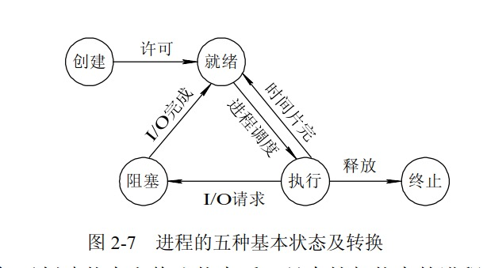
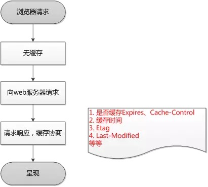
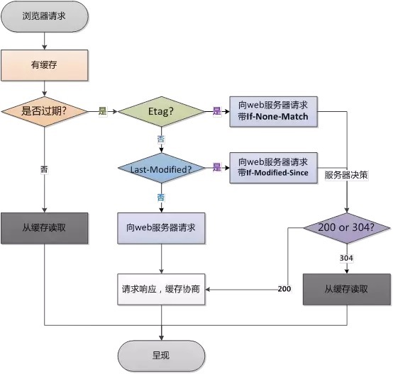
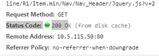

### js100题：https://mp.weixin.qq.com/s/KEVpdAqAU3oqJ6hTYSduBw
### js的数据类型有哪些？
基本数据类型6种：栈存储
`Boolean`\\`Number`\\`String`\\`undefined`\\`null`\\`Symbol`

复杂数据类型、引用数据类型：堆存储
`Object`\\`Array`\\`Function`

`Symbol`：代表创建后独一无二且不可变的数据类型。出现的原因估计主要是解决可能出现的全局变量冲突的问题。

### undefined和null的区别
https://mp.weixin.qq.com/s/3wuTkzoEY_f6_dmKgj8iXg

1. `Undefined`类型：值`undefined`是全局对象的一个属性；原始值：`window.undefined`
(1) 声明了一个变量，但未对其初始化时，这个变量的值就是`undefined`。
```javascript
var data;
console.log(data === undefined); //true
```
(2) 也可以显式的把一个变量声明为`undefined`
```javascript
var data = undefined;
console.log(data === undefined); //true

var value = 1;
console.log(data); //1

value = undefined;
console.log(data === undefined); // true
```
(3) 对未定义的变量执行`typeof`操作符也会返回`undefined`
```javascript
//data变量未定义
var value;
console.log(typeof data); // "undefined"
console.log(typeof value); // "undefined"
```
对`undefined`直接`typeof`也会返回`undefined`：
```javascript
typeof undefined === 'undefined'; // true
```
(4) 函数如果没有使用`return`语句指定返回值，就会返回一个`undefined`值
(5) 调用函数时没有传参数值，参数同样也会被初始化为`undefined`值

1. `Null`类型：值`null`是一个字面量
`null`表示一个空对象指针，只是变量未指向任何对象。可以把`null`理解为未创建的对象
（1）`null`常出现在返回类型是对象，但没有关联值的地方。
（2）
```javascript
typeof null === 'object'; // true
```
(3) null的应用场景：
a. 如果定义的变量在将来用于保存对象，那么最好将该变量初始化为null，而不是其他值。
b. 当一个数据不再需要使用时，我们最好通过将其值设置为null来释放其引用，这个做法叫做解除引用。

*扩展*：解除引用
1. 解除引用的真正作用是让值脱离执行环境，以便垃圾收集器在下次运行时将其回收。
2. 解除引用还有助于消除有可能出现的循环引用的情况。这一做法适用于大多数全局变量和全局对象的属性，局部变量会在它们离开执行环境时(函数执行完时)自动被解除引用。


#### undefined和null的关系
```javascript
console.log(null == undefined); // true
console.log(null === undefined); // false
```

### `Number([]) => 0` 和 `Number({}) => NaN`的原因
`[]`数组有`valueOf()`转成`[]`非基本数据类型，然后`[]`再调用`toString()`转成`""`即转成了基本数据类型空字符串，而空字符串`""`转成数字类型是`0`；
`{}`对象通过`valueOf()`转成`{}`非基本数据类型，然后`{}`再调用`toString()`转成`'[object Object]'`转成了基本类型非空字符串，而非空字符串`'[object Object]'`转成数字就是`NaN`；

## 什么是事件委托
事件委托本质上是利用了浏览器事件冒泡的机制。因为事件在冒泡过程中会上传到父节点，并且父节点可以通过事件对象获取到
目标节点，因此可以把子节点的监听函数定义在父节点上，由父节点的监听函数统一处理多个子元素的事件，这种方式称为事件代理。

使用事件代理我们可以不必要为每一个子元素都绑定一个监听事件，这样减少了内存上的消耗。并且使用事件代理我们还可以实现事件的动态绑定，比如说新增了一个子节点，我们并不需要单独地为它添加一个监听事件，它所发生的事件会交给父元素中的监听函数来处理。

瀑布流就是用事件委托实现的，对新增子节点则无需单独为新增的子节点增加事件监听，而是在新子节点创建之前已经直接加在了父节点中。

## 移动端300ms延迟
移动端的点击事件的有延迟，时间是多久，为什么会有？怎么解决这个延时？

## 进程和线程
进程：在操作系统上打开一个软件，跑软件的时候软件代码会开启一个进程，一个软件跑起来至少会有一个进程，进程和进程之间是相互隔离的（比如某个应用程序挂掉了，不会影响其它应用程序），资源不共享。查看进程可以用进程管理器（资源管理器windows）查看，比如mac上可以打开activity monitor查看都有哪些进程，进程级别的管理。
线程：一个进程可以开启很多个线程，在activity monitor查看器中可以看到有Threads线程列，就表示每个进程中包含多少个线程。
    线程是程序并发执行的最小单位。

比如：比如在微信中可以同时打字、接受消息、听语音、看视频等操作。微信开启了一个进程，但是又很多的线程。相互独立又相互协作。
为什么需要多线程，同一时间可以做多件事情。

进程的概念（操作系统进行资源分配和调度的一个独立单位）、进程和线程的关系、进程的特点（相互隔离、资源不共享）、进程举例、为什么需要线程（并发、同时可以做多件事情）、线程举例、查看进程和线程



新状态：进程已经创建，但未被OS接纳为可执行进程。（还没有申请到相应的资源）。
就绪态：进程做好了准备，准备执行（只等待处理机）。
执行状态：该进程正在执行（单处理机，某一时刻仅一个进程占用处理机）。
阻塞状态：等待某事件发生才能执行，如等待I/O完成。
终止状态.

## 栈、队列、数组、链表的关系

栈、队列、数组、链表都是线性存储结构

### 数组
1. 数组是用一组连续的内存空间来存储的；
2. 数组是一个有序的数据集合，可以通过数组名称和索引访问；
3. 数组支持随机访问，根据数组下标访问的时间复杂度是O(1)；
4. 数组插入和删除效率相对较低。数组为了保持内存数据的连续性，会导致插入、删除这两个操作比较低效，因为底层通常是要进行大量的数据移动来保持数据的连续性。
插入与删除的时间复杂度如下：
插入：从最好 O(1) ，最坏 O(n) ，平均 O(n)
删除：从最好 O(1) ，最坏 O(n) ，平均 O(n)

### 栈
1. 栈是先进后出的数据结构
2. 新添加或待删除的元素都保存在栈的末尾，称作栈顶，另一端就叫栈底
3. 从栈的操作特性来看，是一种 操作受限的线性表，只允许在一端插入和删除数据。
4. js中可以用数组实现栈：push、pop
   
### 队列
1. 队列是先进先出的数据结构
2. 队列在尾部添加新元素，并从顶部移除元素
3. js中可以用数组实现：push、unshift

### 链表
链表是一种物理存储单元上非连续、非顺序的存储结构，数据元素的逻辑顺序是通过链表中的指针链接次序实现的。

### 数组和链表的区别
1. 占用的内存空间
* 链表占用空间可以是连续的也可以是非连续的；
* 数组占用空间为连续的；
* 相同量数据数组占用内存较少，因为链表需要存储前驱或者后继节点的位置信息；
2. 长度的可变性
* 链表长度可变。
* 数组的长度在定义时需给出，超过长度会造成溢出。注意：但是js中的数组是动态的，数组长度可变，不会造成溢出的情况。
3. 数据的操作
* 链表插入和删除比较方便(不需移动其他元素, 只需改变指针)，缺点是访问效率低，存储空间利用率低。
* 数组查询数据方便，插入和删除效率低（数组为了保持内部数据的连续性，在插入和删除操作中底层需要进行大量数据移动来保持数据的连续性）。

## Set && Map
`Set`：类似数组，成员值是唯一的，key和value是同一个。
`WeakSet`：
（1）WeakSet 的成员只能是对象，而不能是其他类型的值。
（2）垃圾回收机制不考虑 WeakSet 对该对象的引用，不存在内存泄漏问题。
`Map`：类似对象，也是键值对结构，但是对象的key只能是字符串类型，Map“键”的范围不限于字符串，各种类型的值（包括对象）都可以当作键。
* Map转为对象：
如果所有 Map 的键都是字符串，它可以无损地转为对象。
如果有非字符串的键名，那么这个键名会被转成字符串，再作为对象的键名。
```javascript
function strMapToObj(strMap) {
  let obj = Object.create(null);
  for (let [k, v] of strMap) {
    obj[k] = v;
  }
  return obj;
}

const myMap = new Map()
  .set('yes', true)
  .set('no', false);
strMapToObj(myMap)
// { yes: true, no: false }
```
* 对象转为 Map
  对象转为 Map 可以通过`Object.entries()`。
  ```javascript
  let obj = {"a":1, "b":2};
  let map = new Map(Object.entries(obj));
  ```
    手动写转换函数
  ```javascript
  function objToStrMap(obj) {
    let strMap = new Map();
    for (let k of Object.keys(obj)) {
        strMap.set(k, obj[k]);
    }
    return strMap;
  }
    objToStrMap({yes: true, no: false})
    // Map {"yes" => true, "no" => false}
  ```
`WeakMap`：
（1）WeakMap只接受对象作为键名（null除外），不接受其他类型的值作为键名。
（2）WeakMap的键名所指向的对象，不计入垃圾回收机制。
典型应用场景：DOM节点作为key，不会导致内存泄漏。

## 协商缓存和强制缓存
https://juejin.im/post/5ccfccaff265da03ab233bf5

浏览器如何判断是否有缓存？
下面涉及到http状态码`304`常考点。



浏览器缓存分为`强制缓存`和`协商缓存`
`强制缓存`：浏览器不会向服务器发送任何请求，直接从本地缓存中读取文件并返回Status Code: 200 OK

`200 (form memory cache)`: 不访问服务器，一般已经加载过该资源且缓存在了内存当中，直接从内存中读取缓存。浏览器关闭后，数据将不存在（资源被释放掉了），再次打开相同的页面时，不会出现from memory cache。
`200 (from disk cache)`： 不访问服务器，已经在之前的某个时间加载过该资源，直接从硬盘中读取缓存，关闭浏览器后，数据依然存在，此资源不会随着该页面的关闭而释放掉下次打开仍然会是from disk cache。

优先访问`memory cache`，其次是`disk cache`，最后是请求网络资源。

`协商缓存`：浏览器会向服务器发送请求，服务器会根据这个请求的`request header`的一些参数来判断是否命中协商缓存，如果命中（即浏览器缓存的资源没有更新），则返回`304`状态码并带上新的`response header`通知浏览器从缓存中读取资源；如果判断的结果是缓存的资源更新了，则会返回`200 OK`，将新的资源返回给浏览器。

## 为什么要初始化 CSS 样式
因为浏览器的兼容问题，不同浏览器对有些标签的默认值是不同的，如果没对CSS初始化往往会出现浏览器之间的页面显示差异。比如浏览器默认的字体大小有16px的有14px的。