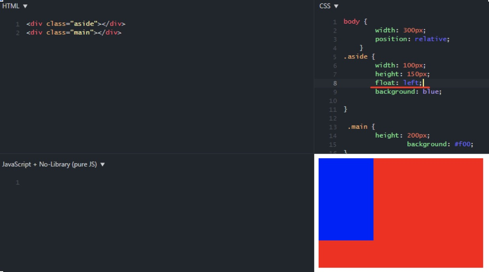
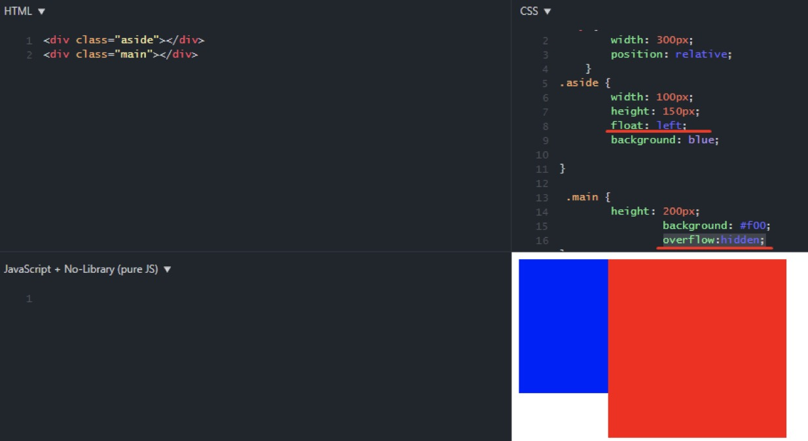
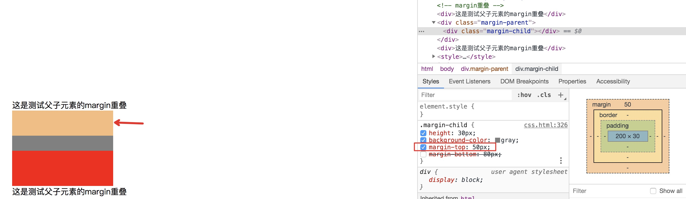
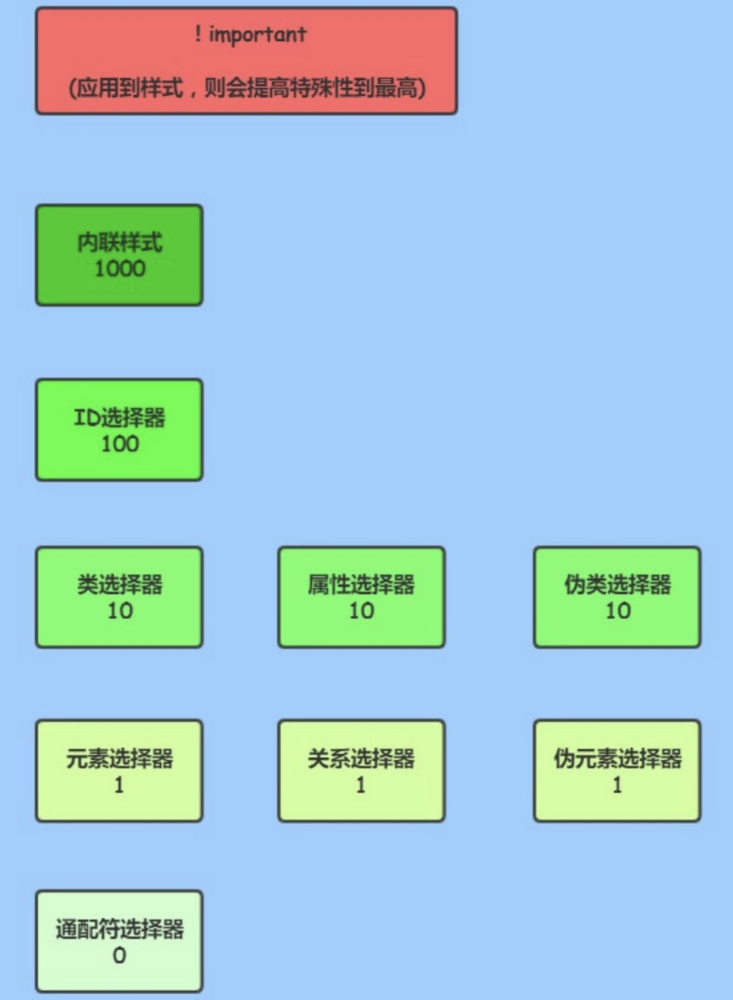
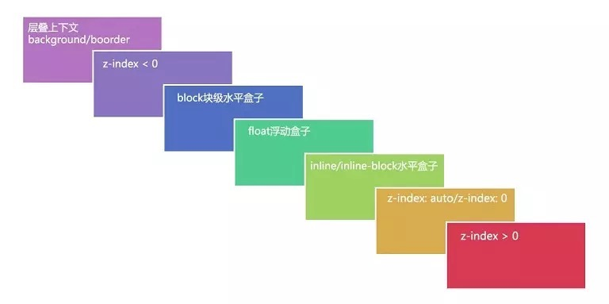
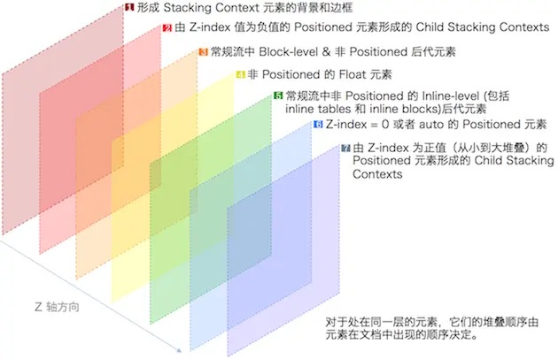
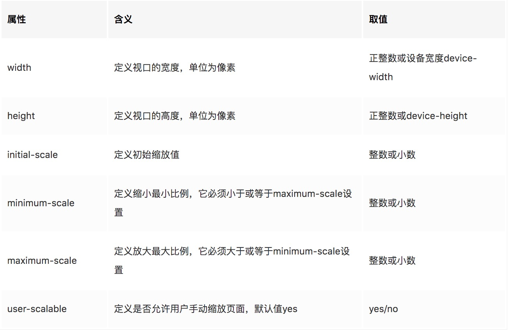

## 实现元素隐藏的方式有哪些？
### `display: none;`
特点：
* 【空间】：隐藏后不占据额外空间，它会产生回流和重绘。检查元素的时候看不到页面上有未显示的元素，但是dom节点还在；
* 【子元素】：不会被子元素继承，但由于父元素都不在了，所以子元素自然也就不会显示了；
* 【事件】：由于元素都已经不在页面存在了，因此也无法触发它上面绑定的事件；
* 【过度动画】：无效；
### `visibility: hidden;`
特点：
* 【空间】：元素虽然隐藏了，但这些元素仍然占据着空间，只会引起页面重绘，不会引起回流。检查元素的时候可以看到页面上有未显示的元素占据着一定的空间，dom节点也在；
* 【子元素】：会被子元素继承，可以通过设置子元素`visibility:visible` 使子元素显示出来；
* 【事件】：元素上绑定的事件也无法触发；
* 【过度动画】：无效；
### `opacity`：0元素不可见，1元素可见。 指定元素的透明度，`opacity`属性指定了一个元素后面的背景的被覆盖程度。如：1表示元素后面的背景被100%覆盖，所以元素直接可以显示出来，背景被覆盖了；0表示元素后面的背景一点都没有被覆盖，背景完全展示，导致背景会把元素遮住不显示。
特点：
* 【空间】：元素虽然隐藏了，但这些元素仍然占据着空间，只会引起页面重绘，不会引起回流。检查元素的时候可以看到页面上有未显示的元素占据着一定的空间，dom节点也在；
* 【子元素】：会被子元素继承，但是`不能`通过设置子元素`opacity: 1`使其重新显示；
* 【事件】：`opacity: 0`元素上面绑定的事件是可以触发的；
* 【过度动画】：有效；
### 定位到某个区域外：如给父容器设置overflow:hidden，然后移动子元素的定位，使其溢出父容器。
```html
<!-- 元素隐藏 -->
<div class="hidden-wrap">
    <div class="hidden-cont"></div>
</div>
<style>
    .hidden-wrap {
        width: 300px;
        height: 200px;
        border: 1px solid red;
        position: relative;
        overflow: hidden;
    }
    .hidden-cont {
        border: 1px solid yellow;
        width: 100px;
        height: 100px;
        position: absolute;
        top: -105px;
    }
</style>
```
### 隐藏文字：使用`text-indent`，定义一个块元素首行文本内容之前的缩进量。可以定义一个较大的负值缩进量，是文本元素溢出容器左侧；或者设置一个较大的正值，使文本溢出容器右侧。
`<p style="text-indent: -999999px;">天下无双</p>`

## BFC（Block Formatting Context，BFC）：是布局过程中生成块级盒子的区域，也是浮动元素与其他元素的交互限定区域。
### BFC的特点
1. BFC内部的Box会在垂直方向，从顶部开始一个接一个地放置。
2. BFC内部的Box垂直方向的距离由margin决定。<font color="red">属于同一个BFC的两个相邻Box的margin会发生叠加，不同的BFC margin不会发生叠加。</font>
3. BFC内部每个元素的margin box的左边， 与包含块border box的左边相接触(对于从左往右的格式化，否则相反)。`即使存在浮动也是如此。`
4. <font color="red">BFC的区域不会与float box叠加。</font>
5. BFC就是页面上的一个隔离的独立容器，容器里面的子元素不会影响到外面的元素，反之亦然。
6. 计算BFC的高度时，<font color="red">浮动元素也参与计算</font>。所以可以设置浮动元素的父元素为BFC来解决父元素高度塌陷的问题。

### 如何触发BFC？
1. <font color="red">给元素设置浮动：float 除了none以外的值，float: left | right 等；</font>
2. overflow 除了visible 以外的值（hidden，auto，scroll ）。<font color="red">常用`overflow:hidden`来触发一个新的BFC；</font>
3. <font color="red">position值为（absolute，fixed）：脱离文档流；</font>
4. <font color="red">弹性元素：`display:flex`;</font>
5. display (table-cell，table-caption，`inline-block`, `flex`, inline-flex)；

### BFC的作用
1. 解决margin叠加问题：特性2：属于不同BFC的margin不会发生叠加；
2. 清除浮动：特性6：计算BFC的高度时，浮动元素也参与计算；
3. 布局：特性3：BFC内部每个元素的margin box的左边， 与包含块border box的左边相接触。特性3对浮动元素也是如此。
   <font color="red">思考：</font>如何解决特性3导致的子元素（这里主要是对浮动子元素）边框和父元素左侧边框的重叠？
   
   <font color="red">解决：</font>根据特性4：BFC的区域不会与float box叠加。
   用`overflow:hidden`触发main元素的BFC之后，效果立马出现了，一个两栏布局就实现了
   

## margin重叠
### 出现margin重叠的场景：https://developer.mozilla.org/zh-CN/docs/Web/CSS/CSS_Box_Model/Mastering_margin_collapsing
1. 垂直方向两个相邻元素的margin重叠（如BFC中的相邻元素）；
2. 父元素和子元素之间的`margin-top`重叠：父元素和子元素的`margin-top`重叠了，即父元素共用了子元素的`margin-top`，即此时子元素的`margin-top`就是父元素的`margin-top`。
    

### 解决margin重叠的方案
1. 外层元素中写`padding`代替子元素中写`margin`；（针对父子元素的margin重叠）
2. 外层元素设置为BFC: `overflow: hidden;`，（其它方式生成的bfc可能会有些负影响，比如浮动或者display:flex）。根据BFC的特点2：不同的BFC margin不会发生叠加；

## 清除浮动
```css
 .float-wrap {
    width: 800px;
    border: 1px solid red;
    /* (1).给浮动元素的父元素添加浮动来清除浮动*/
    /* float: left; */ /* 清除浮动之后高度就不会塌陷了 */
    /* (2).给浮动元素的父元素设置overflow: hidden | auto;通过将父元素变成BFC块级格式化上下文来清除浮动，计算BFC的高度时，浮动元素也会参与计算，所以父元素的高度不会塌陷 */
    /* overflow: hidden;*/
    /* overflow: auto; */
    /* (3).给浮动元素的父元素设置高度（比浮动元素的高度高的高度），但在浮动元素高度不确定的时候不适用(清除浮动有效)*/
    /* height: 300px; */
    /* (4) 给父元素设置display: inline-block; 清除浮动有效。缺点：父级的margin-left:auto,margin-right:auto;时失效，无法使用margin:0 auto;这样会居中*/
    /* display: inline-block;也是为了让父元素变成BFC */
    /* display: inline-block;*/
    /* margin: 0 auto; */ /* 使用display: inline-block时margin: 0 auto水平居中失效 */
}
/* 给每个浮动的子元素后面添加一个元素，设置样式clear:both; 这种不太好，因为需要给每个浮动元素后面新增元素来清除浮动 */
/* (6）伪元素::after控制（最佳推荐）。给父元素添加一个clearfix类,content:""；可以为空，但最好为"."; （清除浮动有效）*/
.clearfix:after{
    display: block; /* diaplay:block 必须 */
    content: ''; /* 或者 content: '.'; */
    height: 0; /* 高度为0 必须*/
    visibility: hidden; /* 不可见 不可少*/
    clear: both;/* 左右都清除浮动 必须*/
    zoom: 1;/* 兼容IE6/7 */
}
```

## 样式选择器的权重？优先级？
!important > 内联样式 > ID选择器 > <font color="red">类选择器</font> = 属性选择器 = 伪类选择器 > <font color="red">元素选择器</font> = 关系选择器 = 伪元素选择器 > 通配符选择器



## 内容超出显示...
```
overflow: hidden;
white-space:nowrap;
text-overflow:ellipsis;
```

## 文本多行超出显示...
```
-webkit-line-clamp: 3;
```

## z轴的层叠上下文，顺序，z-index
什么是层叠上下文：每个元素的位置是三维的，当元素发生层叠，这时它可能覆盖了其他元素或者被其他元素覆盖；排在z轴越靠上的位置，距离屏幕观察者越近。

* 普通元素的层叠等级优先由其所在的层叠上下文决定；
* 层叠等级的比较`只有在同一个层叠上下文元素中`才有意义；
* 在同一个层叠上下文中，层叠等级描述定义的是该层叠上下文中的元素在Z轴上的上下顺序；

**注意：**`层叠等级并不一定由 z-index 决定，只有定位元素的层叠等级才由 z-index 决定`，其他类型元素的层叠等级由层叠顺序、他们在HTML中出现的顺序、他们的父级以上元素的层叠等级一同决定。

### 如何让一个元素变成层叠上下文元素？
1. HTML中的根元素`<html></html>`本身就具有层叠上下文，称为“根层叠上下文”。
2. 普通元素设置`position属性为非static值并设置z-index属性为具体数值`，产生层叠上下文。
3. CSS3中的新属性也可以产生层叠上下文。

### z-index
元素的 z-index 值只在同一个层叠上下文中有意义。如果父级层叠上下文的层叠等级低于另一个层叠上下文的，那么它 z-index 设的再高也没用。所以如果你遇到 z-index 值设了很大，但是不起作用的话，就去看看它的父级层叠上下文是否被其他层叠上下文盖住了。

### 同一层叠上下文中的关系

1. 背景和边框：形成层叠上下文的元素的背景和边框。
2. 负z-index值：层叠上下文内有着负z-index值的定位子元素，负的越大层叠等级越低；
3. 块级盒：文档流中块级、非定位子元素；
4. 浮动盒：非定位浮动元素；
5. 行内盒：文档流中行内、非定位子元素；
6. z-index: 0：z-index为0或auto的定位元素， 这些元素形成了新的层叠上下文；
7. 正z-index值：z-index 为正的定位元素，正的越大层叠等级越高；



判断依据：
1. 首先先看要比较的两个元素是否处于同一个层叠上下文中：
      1.1如果是，谁的层叠等级大，谁在上面（怎么判断层叠等级大小呢？——看“层叠顺序”图）。
      1.2如果两个元素不在统一层叠上下文中，请先比较他们所处的层叠上下文的层叠等级。
2. 当两个元素层叠等级相同、层叠顺序相同时，在DOM结构中后面的元素层叠等级在前面元素之上。

## 可继承的样式
### 常用可继承属性：
1. 字体系列属性：font-family，font-size
2. 文本系列属性：text-indent，line-height，color
3. 元素可见性：visibility
4. 表格布局属性：border-style
5. 列表布局属性：list-style list-style-type
6. 光标属性：cursor

### 常用不可继承属性：
1. 宽高：height，width
2. 最小最大宽高：max-height,min-height,max-width,min-width
3. display
4. 文本阴影：text-shadow
5. 背景属性：background
6. 浮动属性：float
7. 生成内容：content
8. 层级属性：z-index
9. 定位属性：position，left，right，top，bottom
10. 盒模型属性：margin，padding，border

### position定位
`static`（默认值）
没有定位；
`元素出现在正常的流中，不会脱离文档流；`
忽略 top, bottom, left, right 或者 z-index 声明；

`relative`
`生成相对定位元素；`
`相对于其正常位置进行定位；`
`不会脱离文档流；`
通过top right bottom left进行定位；

`absolute`
生成绝对定位元素；
相对于第一个有position（即相对于第一个已定位的父元素），`且position为非static的祖先元素`；没有已定位（position）元素则相对于`body`。
`脱离文档流，重新定位后的元素不占据原来的位置；`
通过top right bottom left进行定位；

`fixed`
生成绝对定位元素；
`相对于浏览器窗口进行定位；`
`脱离文档流；`
通过top right bottom left进行定位；

**注意：**被定位为绝对定位的元素：被绝对定位的元素可以通过指定top和bottom，保留height未指定（即auto），来填充可用的垂直空间。它们同样可以通过指定left 和 right并将width 指定为auto来填充可用的水平空间。

`sticky`：
粘性定位元素；
元素根据正常文档流进行定位，然后相对它的最近滚动祖先，包括table-related元素，基于top, right, bottom, 和 left的值进行偏移。偏移值不会影响任何其他元素的位置。
该值总是创建一个`新的层叠上下文`（stacking context）。注意，一个sticky元素会“固定”在离它最近的一个拥有“滚动机制”的祖先上`（当该祖先的overflow 是 hidden, scroll, auto, 或 overlay时）`，即便这个祖先不是真的滚动祖先。

`粘性定位可以被认为是相对定位和固定定位的混合`。元素在`跨越特定阈值前为相对定位`，`之后为固定定位`。

`#one { position: sticky; top: 10px; }`
在 viewport 视口滚动到元素 `top 距离小于 10px 之前，元素为相对定位`。之后，元素将固定在与顶部距离 10px 的位置，直到 viewport 视口回滚到阈值以下。

### 用css实现一个扇形
在三角形的基础上设置：border-radius: 50%;即可

```css
.triggle-1 {
    width: 0;
    border: 100px solid;
    border-color: transparent transparent red transparent;
    border-radius: 50%;
}
```

## 画圆，画椭圆
画圆形：设置div为正方形  设置border-radius为50%
画椭圆形：设置div为长方形  设置border-radius为50%

## 水平居中&&垂直居中
1. `margin: 0 auto;`实现水平居中
2. `position + margin`（定高）：垂直居中：设置父元素:position: relative; 子元素height: 100px; position:absolute;top: 50%; margin: -50px 0 0 0
3. `position + transform`（不定高）：设置父元素position:relative,子元素：position: absolute;top: 50%;transform: translate(0, -50%);
4. flex布局，设置父元素`display:flex; justify-content:center; align-items: center;`
5. 单行文本：
   垂直居中：`height`和`line-height`设置同一高度。
   水平居中：`text-align:center;`

## 移动端适配：
https://juejin.im/post/5bfa99e0e51d4555557d26c6
rem、em、%、vw、vh、vmax、vmin、vm、rpx

`viewport`：
`<meta name="viewport" content="width=device-width,user-scalable=no,initial-scale=1.0,maximum-scale=1.0,minimum-scale=1.0">`


`媒体查询`：通过媒体查询的方式，编写适应不同分辨率设备的的css样式
```
@media screen and (max-width: 320px){
    ....适配iphone4的css样式
}
@media screen and (max-width: 375px){
     ....适配iphone6/7/8的css样式
}
@media screen and (max-width: 414px){
    ....适配iphone6/7/8 plus的css样式
}
......
```

以下内容参考：https://mp.weixin.qq.com/s/f4h5CUc-H7c8xz6vyk4dYg

1. `rem`适配：rem适配的本质是布局等比例的缩放，通过动态设置html的font-size来改变rem的大小。

## 实现动画的方式有哪些？
1. css animation @keyframes
   ```css
    .circle{
        margin-top: 100px;
        animation: myRotation 5s linear infinite;
    }
    @keyframes myRotation {
        from {
            transform: rotate(0deg);
        }
        to {
            transform: rotate(360deg);
        }
    }
   ```
2. 用js实现：`setInterval 、 setTimeout`
3. 用`requestAnimationFrame`实现一个动画：https://juejin.im/post/5e8c08cd51882573b04739c8?utm_source=gold_browser_extension
   `requestAnimationFrame`的优势：
   a. `requestAnimationFrame` 会把每一帧中的所有DOM操作集中起来，在一次重绘或回流中就完成，并且重绘或回流的时间间隔紧紧跟随浏览器的刷新频率，一般来说，这个频率为`每秒60帧`。
   b. 在隐藏或不可见的元素中，`requestAnimationFrame将不会进行重绘或回流`，这当然就意味着更少的的cpu，gpu和内存使用量。

    如何取消`requestAnimationFrame`动画？
    执行函数返回一个id是回调列表中唯一的标识。是个非零值，没别的意义。可以传这个值给 `window.cancelAnimationFrame()` 以取消回调函数。
    `window.cancelAnimationFrame(a); // 注意这个要写在函数体内部`

## flex布局
https://zhuanlan.zhihu.com/p/25303493
