   ## 基础知识开始表演
   
   ### 1.call和apply的区别是什么，哪个性能好一些?
   call和apply都是Function原型上的方法，都是改变函数的this指向，指向当前绑定的函数。函数会立即执行。
   1. `fn.cal(obj, 10, 20, 30);` // 第一个参数是绑定的对象，后面可以传入多个参数给fn，一个个参数
   2. `fn.apply(obj, [10, 20, 30]);` // 第二个参数是整体传给fn的，数组的形式传递参数
   3. bind也是用来改变this指向，但是bind并没有把函数立即执行，只是预先处理改变this，返回的是一个函数
   4. call要比apply好一些（尤其传入的参数>3个时）
   5. 通过扩展运算符...可以使call实现apply的效果，如:
   ```javascript
   let arr = [1, 2, 3];
   let obj = {};
   function fn(x, y, z) {}
   fn.apply(obj, arr);
   fn.call(obj, arr); // x=[1, 2, 3], y=z=undefined
   fn.call(obj, ...arr); // 给予ES6的扩展运算符也可以实现把数组中的每一项依次传递给函数
   ```
   6. 在非严格模式下，call、apply的第一个参数传递为null或undefined时，函数体内的this会指向默认的宿主对象，在浏览器中则是window，在node中是global
   
   ### 2.性能测试: `console.time()`、` console.timeEnd()`
    `console.time()`：可以测试出一段程序执行的时间
    `console.profile()`：在火狐浏览器中安装FireBug，可以更精准的获取到程序的每一个步骤所消耗的时间

   任何代码的性能测试都是和测试的环境有关系的，例如CPU、内存、GPU等电脑当前性能每个时间点都可能不一样；不同的浏览器也会导致数据不同；
   ```javascript
    console.time() 
    for (let i = 0; i < 10000000; i++) {

    }
    console.timeEnd()
   ```

   ### 3.实现(5).add(3).minus(2)，使其输出结果为：6
   ```javascript
   (function () {
       // 每一个方法执行完，都要返回Number类的实例，这样才可以继续调用Number类中的方法（即链式写法）
       // 检查传入的参数是否是数字（容错性处理）
       function checkNum(n) {
           n = Number(n);
           return isNaN(n) ? 0 : n;
       }
       function add(n) {
           // this就是checkNum调用之后的返回值
           return this + n;
       }
       function minus(n) {
           return this - n;
       }
       Number.prototype.add = add;
       Number.prototype.minus = minus;
        // ['add', 'minus'].forEach(item => {
          //  Number.prototype[item] = eval(item);
        //  });
   })();
   console.log((5).add(3).minus(2));
   ```

### 4.箭头函数与普通函数（function）的区别是什么？构造函数（function）可以用来构造生成实例，那么箭头函数可以么？为什么？

#### 箭头函数和普通函数的区别
1. 箭头函数语法上比普通函数更加简洁（ES6中每一种函数都可以使用形参默认值和剩余运算符）
2. 箭头函数没有自己的this，它里面出现的this是继承函数所处上下文中的this（使用call/apply等任何方式都无法改变this的指向），内部的this就是外部代码块的this；
   普通函数有自己的this，可以通过call/apply来改变this指向。
3. 箭头函数不能被new执行，即不能被当成构造函数执行（因为：箭头函数没有this也没有prototype（重点），因为没有prototype所以也没有原型上的constructor构造函数，故不能new创建实例）
4. 箭头函数中没有arguments(类数组)，只能基于...arg获取传递的参数集合（数组）
```javascript
var obj = {};
let fn = () => {console.log(this)}
fn.call(obj);
// 结果：Window {parent: Window, opener: null, top: Window, length: 0, frames: Window, …}

let fn2 = function() {console.log(this)}

fn2.call(obj)
// 结果：{}
```

```javascript
document.body.onclick = () => {
    // this: window 不是当前操作的body了
    // mm：body绑定的直接就是一个箭头函数，而这个箭头函数产生的上下文就是window，只不过在window上产生该箭头函数之后绑定到body元素上
    console.log(this);
}
// Window {parent: Window, opener: null, top: Window, length: 0, frames: Window, …}
```

```javascript
document.body.onclick = function() {
    // mm：在body上创建并绑定一个function函数
    // this: body
    // sort()方法的this是arr
    arr.sort(function (a, b)) {
        // this: window 回调函数中的this一般都是window
        // this不是sort的原因：sort只是执行传入的已经创建好的function，而这个创建好的function（即回调函数）是在window上创建的函数
        return a - b;
    }
}
```

```javascript
document.body.onclick = function() {
    console.log(this); // body
}

document.body.onclick = function() {
    // sort回调函数的箭头函数是在function上创建的，而function的上下文是body，所以箭头函数的this是body
    arr.sort((a, b) => {
        console.log(this); // body
        // this: body，箭头函数上下文的this
        return a - b;
    }
}

document.body.onclick = () => {
    console.log(this); // window
}

document.body.onclick = () => {
    // sort回调函数的箭头函数是在function上创建的，而function的上下文是body，所以箭头函数的this是body
    arr.sort((a, b) => {
        console.log(this); // window
        // this: body，箭头函数上下文的this
        return a - b;
    }
}

```

* 回调函数：把一个函数B作为实参传递给另一个函数A，函数A在执行的时候，可以把传递进来的函数B去执行（执行N次，可传值，可改this）
```javascript
function each(arr, callback) {
    // callback: function(item, index){}
    for (let i = 0; i < arr.length; i++) {
        let item = arr[i];
        index = i;
        // 接受回调函数返回的结果，如果是false，结束循环
        let flag = callback(item, index);
        if(flag === false) {
            break;
        }
    }
}
each([10, 20, 30], function(item, index){
    // this：原始操作数组
    return false
})
```

* 箭头函数中没有arguments(类数组)，只能基于...agr获取传递的参数集合（数组）
```javascript
let fn = (...arg) => {
    console.log(arguments); // VM9096:2 Uncaught ReferenceError: arguments is not defined
    console.log(arg); // [10, 20, 30]
    console.log(...arg); // 10 20 30
}
fn(10, 20, 30);
```

* 箭头函数不能被new执行（因为：箭头函数没有this（this是函数被创建时的上下文，并不是箭头函数自己的this）也没有prototype（重点），因为没有prototype所以也没有原型上的constructor构造函数，故不能new创建实例）
```javascript
function Fn() {
    this.x = 100;
}
Fn.prototype.getX = function() {};
let f = new Fn(); // {x: 100}
```

```javascript
let Fn = () => {
    this.x = 200;
}
let f = new Fn(); // Uncaught TypeError: Fn is not a constructor
// 如果这样执行的话，x会被绑定到window对象，因为箭头函数的this是window
f = Fn(); // window.x = 100;
```

#### 箭头函数的几个注意点（es6入门）
（1）函数体内的this对象，就是定义时所在的对象，而不是使用时所在的对象。
普通函数的this对象的指向是可变的，但是在箭头函数中，它是固定的，即是定义时所在的对象，使用call/apply/bind都改变不了箭头函数的this指向
e.g:
箭头函数输出 42
```javascript
function foo() {
setTimeout(() => {
    console.log('id:', this.id);
}, 100);
}

var id = 21;

foo.call({ id: 42 }); // id: 42
```
上面代码中，setTimeout的参数是一个箭头函数，这个箭头函数的定义生效是在foo函数生成时，而它的真正执行要等到100ms后。
但是，箭头函数导致this总是指向函数定义生效时所在的对象（本例是{id: 42}，因为普通函数foo被call绑定到了{id: 42}对象上），所以输出的是42。

普通函数输出 21
```javascript
function foo() {
setTimeout(function() {
    console.log('id:', this.id); // this => window，this.id => window.id = 21
}, 100);
}

var id = 21;

foo.call({ id: 42 }); // 21
```
如果是普通函数，执行时this应该指向全局对象window，这时应该输出21。

* 箭头函数可以改变setTimeout里的this：箭头函数可以让setTimeout里面的this，绑定定义时所在的作用域，而不是指向运行时所在的作用域。

（2）不可以当作构造函数，也就是说，不可以使用new命令，否则会抛出一个错误。

（3）不可以使用arguments对象，该对象在函数体内不存在。如果要用，可以用 rest 参数代替，即...arg。

（4）不可以使用yield命令，因此箭头函数不能用作 Generator 函数。

#### 箭头函数不适用的几个场景
* 定义对象的方法，且该方法内部包括this。
```javascript
const cat = {
  lives: 9,
  jumps: () => {
    this.lives--; // 对象函数中的this指向全局，因为对象不构成单独的作用域，所以jumps箭头函数定义时所在的作用域就是全局作用域
  }
}
```
cat.jumps()方法是一个箭头函数，这是错误的。
调用cat.jumps()时，如果是普通函数，该方法内部的this指向cat；

如果写成上面那样的箭头函数，使得this指向全局对象，因此不会得到预期结果。这是因为<font color="red">对象不构成单独的作用域</font>，导致jumps箭头函数定义时的作用域就是全局作用域。

* 需要动态this的时候，也不应使用箭头函数
```javascript
var button = document.getElementById('press');
button.addEventListener('click', () => {
  this.classList.toggle('on');
});
```
点击按钮会报错，因为button的监听函数是一个箭头函数，导致里面的this就是全局对象。如果改成普通函数，this就会动态指向被点击的按钮对象。

* 如果函数体很复杂，有许多行，或者函数内部有大量的读写操作，不单纯是为了计算值，这时也不应该使用箭头函数，而是要使用普通函数，这样可以提高代码可读性。

### 5.如何把一个字符串中的大小写取反（大写变小写，小写变大写），例如'AbC'变'aBc'
思路一：for循环遍历字符串中的每个元素，性能不好
思路二：用正则匹配捕获到想要的内容，如字母，然后进行转换，性能比for循环好

正则匹配实现：
```javascript
let testStr = 'AbC测试！**HaHa';
// 正则匹配字母：/[a-zA-Z]/g
// 注意需要全局匹配g，如果没有g的话只会匹配第一个字符
testStr = testStr.replace(/[a-zA-Z]/g, ele => {
    // ele: 每一项正则匹配的结果
    // 验证是否为大写字母：
    // 1.把字母转换为大写后看和之前是否一样，如果一样，那么该字母是大写的
    // 2.在ASCII表中找到大写字母的取值范围进行判断（65-90）
    // 1.ele.toUpperCase === ele;
    // 2.ele.charCodeAt() >= 65 && ele.charCodeAt() <= 90
    return ele.toUpperCase() === ele ? ele.toLowerCase() : ele.toUpperCase();
})
console.log(testStr);
```

### 6.实现一个字符串匹配算法，从字符串s中，查找是否存在字符串T，若存在则返回所在位置，不存在返回-1!（如果不能基于indexOf/includes等内置的方法，你会如何处理呢？）
方法一：循环遍历
```javascript
/*
 * 循环原始字符串中的每一项，让每一项从当前位置向后截取T.length个字符串，然后和T进行比较，如果不一样，则继续循环；如果一样，则返回当前索引即可（循环结束）
 * 循环到S.length - T.length + 1就可以，不需要循环到最后，因为后面几个字符串个数可以小于T.length，那就不用比较了，直接返回-1就行
*/
function searchIndexOf(T) {
    let lenT = T.length;
    // this就是新建的字符串，也就是S
    let lenS = this.length;
    let res = -1;
    // 如果要找的字符串比字符串还要长，直接返回-1即可，找不到
    if (lenT > lenS) {
        return -1;
    }
    for(let i = 0; i < lenS - lenT + 1; i++) {
        // 判断截取的字符串和传入的字符串是否相等
        // 不用三元运算符，因为找到了就结束了，需要break，减少循环，优化性能，三元运算符不能break
        // res = this.substr(i, lenT) === T ? i : null;
        if (this.substr(i, lenT) === T) {
            res = i;
            break;
        }
    }
    return res;
}

// 放到字符串原型上
String.prototype.searchIndexOf = searchIndexOf;

let s = 'lmmmmyyzyhhgs';
let t = 'zy';
console.log(s.searchIndexOf(t)); // 7
```

方法二：正则
```javascript
function searchIndexOf(T) {
    let reg = new RegExp(T); // 不能用元字符创建正则，/T/这种方式创建的正则就是字母T字符，不是变量T，new RegExp(T)创建的是传入变量T
    let res = reg.exec(this); // 如果正则捕获到，返回结果有个index值，即字符串匹配到的index
    return res == null ? -1 : res.index;
}

// 放到字符串原型上
String.prototype.searchIndexOf = searchIndexOf;

let s = 'lmmmmyyzyhhgs';
let t = 'zy';
console.log(s.searchIndexOf(t)); // 7
```
方法三：自己想的，参考这个地址中的polyfill：https://developer.mozilla.org/zh-CN/docs/Web/JavaScript/Reference/Global_Objects/String/startsWith
```javascript
if (!String.prototype.startsWith) {
    Object.defineProperty(String.prototype, 'startsWith', {
        value: function(search, pos) {
            pos = !pos || pos < 0 ? 0 : +pos;
            return this.substring(pos, pos + search.length) === search; // 参考这段代码，和上述for循环是一样的
        }
    });
}
```

### 7.输出下面代码运行结果
```javascript
// example1
var a = {}, b = '123', c = 123;
a[b]='b';
a[c]='c';
console.log(a[b]); // c a['123'] <=> a[123]

// 举例
let obj = {100: 'mm'}
console.log(obj[100]); // mm
console.log(obj['100']); // mm
// 对象属性只能接收string和symbol类型，如果是其它类型会转成string类型，所以数字100会转成'100'，由于对象属性的key唯一，所以输出的是只有一个属性的对象{'100': 'haha'}
let obj = {100: 'kk', '100': 'haha'};
console.log(obj); // {'100': 'haha'}
```

```javascript
// example2
var a = {}, b = Symbol('123'), c = Symbol('123');
a[b]='b'; // a[Symbol('123')] = 'b'
a[c]='c'; // a[Symbol('123')] = 'c'
console.log(a[b]); //  b，Symbol是ES6中新增的数据类型，typeof Symbol('123') === 'Symbol'，它创建出来的值是唯一值 Symbol('123') === Symbol('123'); // false，所以这是两个不同的键值Symbol('123')、 Symbol('123')，和下面的对象转成字符串之后是相同的键值不同

// Symbol类型会创建一个唯一的值
// 如 Symbol('123') === Symbol('123'); // false
// 同 NaN === NaN; // false
// 举例
let obj = {};
let a = Symbol('1');
let b = Symbol('2');
obj[a]=100;
obj[b]=200;
console.log(obj); // {Symbol(1): 100, Symbol(2): 200}
```

```javascript
// example3
var a = {}, b = {key: '123'}, c = {key: '456'};
a[b]='b'; // a['object Object'] = 'b';
a[c]='c'; // a['object Object'] = 'c';
console.log(a[b]); // 'c' 所以a[b] => a['object Object'] => 'c'

// 1. 对象的属性名不能是一个对象（遇到对象属性名，会默认转换为字符串）
// obj = {} arr = [12, 22] obj[arr]="测试" obj => {'12,22': '测试'}
// 2. 普通对象.toString() 调取的是Object.prototype上的方法（这个方法是用来检测数据类型的），Object.prototype.toString()
obj = {} obj.toString() => "[object Object]"
obj[b]='b' => obj['[object Object]'] = 'b';
```

```javascript
// example4: 构造函数、普通函数、原型
function Foo() {
    Foo.a = function() {
        console.log(1);
    }
    this.a = function() {
        console.log(2);
    }
}
// 把Foo当作类，在原型上设置实例公有的属性方法 => 实例.a();
Foo.prototype.a = function() {
    console.log(3);
}
// 把Foo当作普通对象设置私有的属性方法 => Foo.a();
Foo.a = function() {
    console.log(4);
}

Foo.a(); // 4 调用普通的Foo.a方法，输出4
let obj = new Foo(); // obj可以调取原型上的方法 Foo.a: f => 1 obj.a: f=>2
obj.a(); // 2 私有属性中有a 构造函数构造的对象的私有属性a: 2
Foo.a(); // 1 调用构造函数中的Foo.a，输出1。执行new Foo()之后，创建了Foo.a方法，即改变了Foo.a变量名指向的函数引用，Foo.a指向console.log(1)的函数引用了，所以后续如果再次调用Foo.a()都会是最新的console.log(1)的函数，相当于Foo.a对console.log(4)的函数引用被覆盖了。
```

### 8.在输入框中如何判断输入的是一个正确的网址，例如：用户输入一个字符串，验证是否符合URL网址的格式
```javascript
// 1.协议：// http/https/ftp/...
// 2.域名：www.baidu.com/xxx.cn/xxx.xxx.cn
// 3.请求路径：index.html、stu/index.html
// 4.问号传参：?xxx=xxx&xxx=xxx
// 5.哈希值：#xxx
let str = 'https://www.baidu.com?world=js';
// 协议部分：(?:(http|https|ftp):\/\/)?
// 域名部分：(?:[\w-]+\.)+[a-z0-9]+)
// query部分：((?:\/[^/?#]*)+)?
// hash部分：(\?[^#]+)?(#.+)?
let reg = /^(?:(http|https|ftp):\/\/)?((?:[\w-]+\.)+[a-z0-9]+)((?:\/[^/?#]*)+)?(\?[^#]+)?(#.+)?$/i
console.log(reg.exec(str)); 
0: "https://www.baidu.com?world=js"
1: "https"
2: "www.baidu.com"
3: undefined
4: "?world=js"
5: undefined
index: 0
input: "https://www.baidu.com?world=js"
groups: undefined
length: 6
```

### 9. 编写函数实现图片的懒加载
1. 前端性能优化的重要方案
   * 通过图片或者数据的延迟加载，可以加快页面渲染的速度，让第一次打开页面的速度变快
   * 只有滑动到某个区域，才加载真实的图片，可以节省加载的流量
2. 处理方案
   * 把所有需要延迟加载的图片用一个盒子包起来，设置宽高和默认占位图
   * 开始让所有img的src为空，把真实图片的地址放到img的自定义属性上（如data-img），让img隐藏
   * 等到所有其它资源都加载完成后，再开始加载图片
   * 对于很多图片，需要滚动的时候，当前图片区域完全显示出来后再加载真实图片
   * ......

懒加载的临界点计算：
图片高度 + body顶部距离图片顶部的高度 <= 窗口视图的高度 + 滚动条已滚动的高度

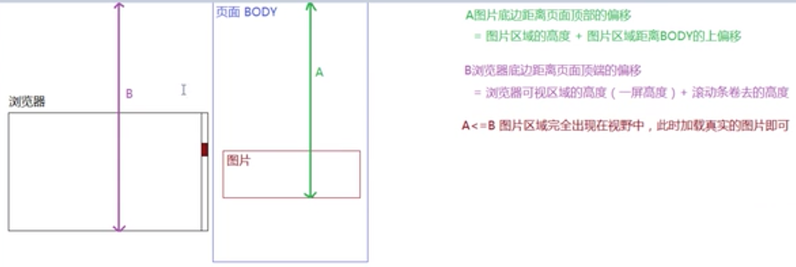

单张图片的延迟加载：
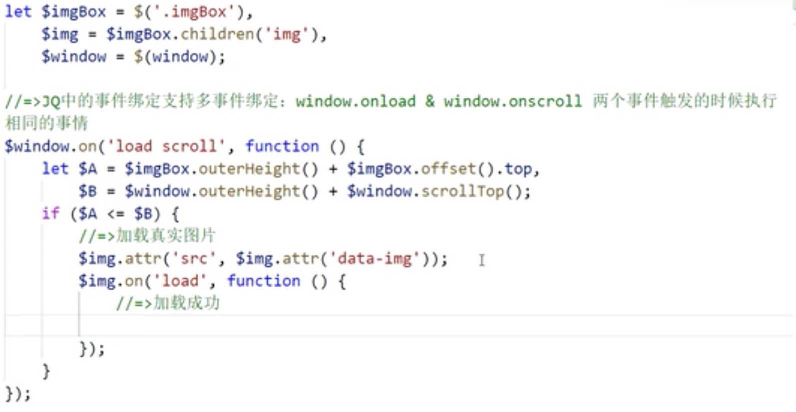
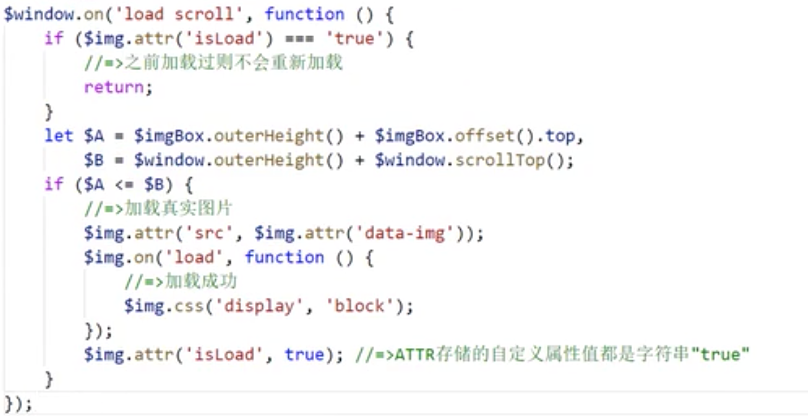
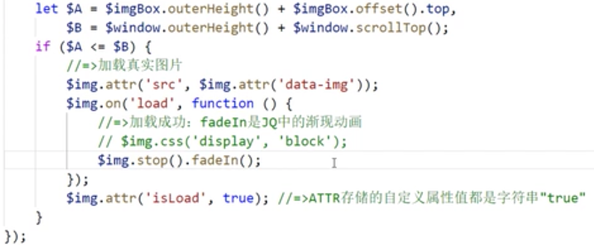
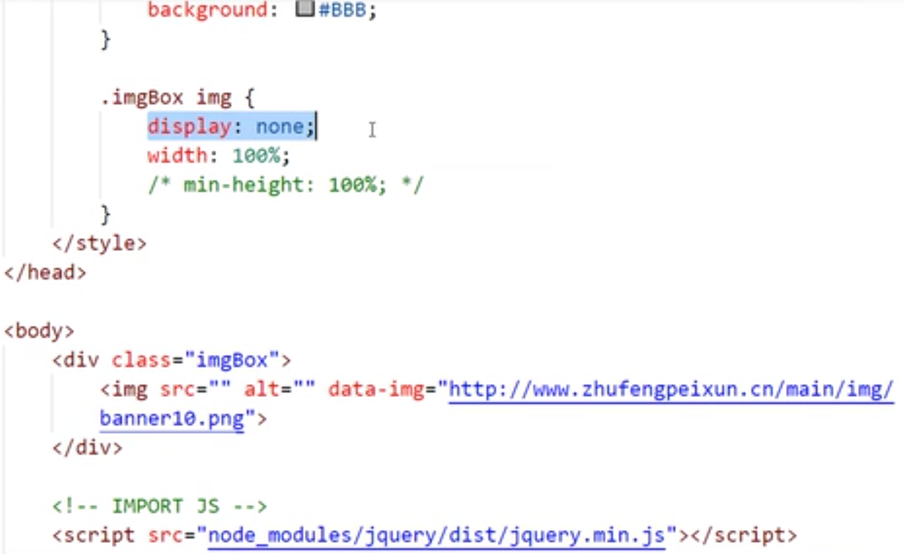

多张图片延迟加载：
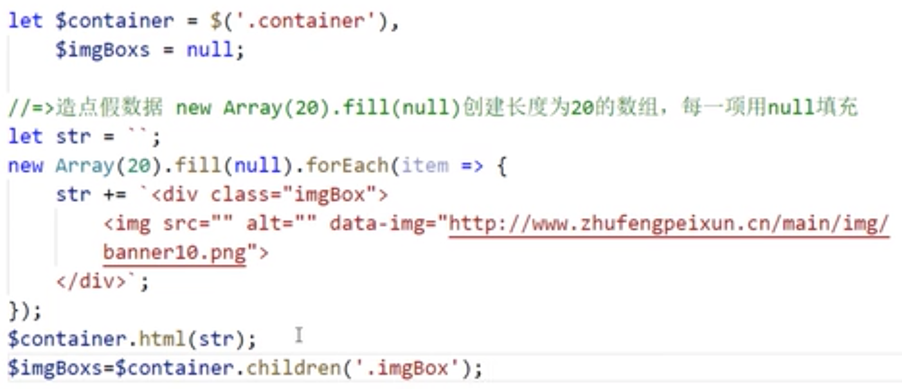
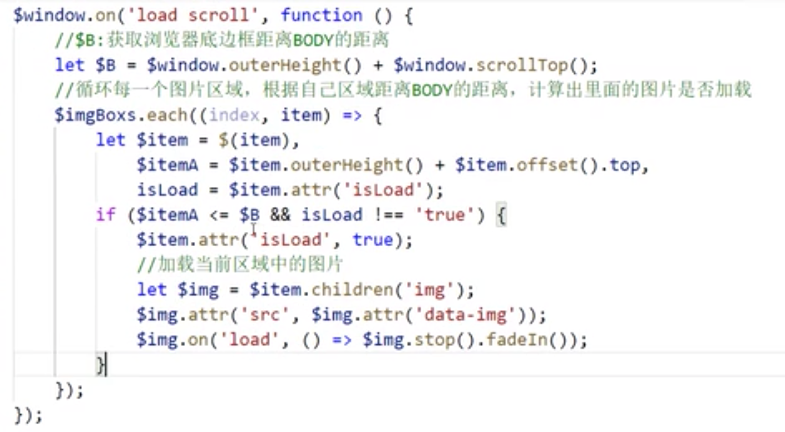

### 10. 编写一条正则，用来验证此规则：一个6～16位的字符串，必须同时包含大小写字母和数字
```javascript
// 不能是纯字母（大小写）、不能是纯小写字母和数字、不能是纯大写字母和数字
// (?!^[a-zA-Z]+$)：不能是纯字母开头和结尾
let reg = /(?!^[a-zA-Z]+$)(?!^[a-z0-9]+$)(?!^[A-Z0-9]+$)^[a-zA-Z0-9]{6,16}$/;
```

正则回顾：
（1）正向预查(?=pattern)：必须符合该正则规则，要匹配的字符串，必须满足pattern这个条件

e.g:
正则表达式/lmm/会匹配lmm，也会匹配lmm2中的lmm，如果只希望lmm只能匹配lmm2中的lmm，则可以这样写：/lmm(?=2)/
```javascript
var reg = /lmm(?=2)/;
var str = 'lmm6';
console.log(reg.exec(str)); // null
var str2 = 'lmm2';
console.log(reg.exec(str)); // lmm [0: "lmm", index: 0, input: "lmm2", groups: undefined, length: 1]
```
**注意**：括号里的内容只是参与匹配的条件，并不参与真正的捕获，只是检查一下后面的字符是否符合要求，如上返回的是lmm，而不是lmm2

（2）负向预查（?!条件）：形式(?!pattern)和(?=pattern)恰好相反，要求做匹配的时候，必须不满足pattern这个条件，还拿上面的例子：
```javascript
var reg = /lmm(?!2)/
var str = 'lmm2';
console.log(reg.exec(str)); // null，因为正则要求，lmm后面不能是2
var str2 = 'lmm6';
console.log(reg.exec(str)); // lmm
```

以下两个正则表达式是等价的：
`var reg1 = /(?=^)\d{2}(?=$)/;` // 正向预查，左边要满足开头，右边要满足结尾
`var reg2 = /^\d{2}$/;`

### 11.实现一个$attr(name, value)遍历，属性为name，值为value的元素集合
```javascript
function getAttr(prop, value) {
    // 获得当前页面中的所有标签
    let eles = document.getElementsByTagName('*');
    let arr = [];
    // [].forEach.call(eles, item => {});
    eles = Array.from(eles);
    eles.forEach(item => {
        // 存储的是当前元素property对应的属性值
        let itemV = item.getAttribute(prop);
        if (prop === 'class') {
            // 样式类属性名要特殊处理，如class="content box"
            new RegExp('\\b' + value + '\\b').test(itemV) ? arr.push(item) : null;
            return;
        }
        // 其它属性可以直接用value对比
        if (itemV === value) {
            // 获取的值和传递的值校验成功：当前就是我们想要的
            arr.push(item);
        }
    });
    return arr;
}
console.log(getAttr('class', 'box'));
```

### 12.英文字母汉字组成的字符串，用正则给引文单词前后加空格
1. 正则实现：
```javascript
let str = 'dc测试aaas+!!dw';
let reg = /\b[a-z]+\b/ig; // \b匹配一个单词的边界
str = str.replace(reg, value => {
    return ' ' + value + ' ';
}).trim(); // String.prototype.trim/.trimLeft/.trimRight 去除字符串首尾空格
console.log(str); // 'dc 测试 aaas +!! dw'
```
2. for循环实现

### 13.编写一个程序，将数组扁平化，并去除其中重复部分数据，最终得到一个升序且不重复的数组

#### reduce实现数组的扁平化，非常简洁
```javascript
// 参数arr默认是[]，否则不能直接用数组的reduce方法
function Flat(arr = []) {
    // 如果v是个数组，则继续递归
    return arr.reduce((t, v) => t.concat(Array.isArray(v) ? Flat(v) : v), [])
}
var arr =[[[1, 'mm', [9, 6]]], [3, false]]
Flat(arr); // (6) [1, "mm", 9, 6, 3, false]
```

```javascript
let arr = [[1, 2, 2], [3, 4, 5, 5], [6, 7, 8, 9, [11, 12, [12, 13, [14]]]], 10];
// 方法一：
// 第一步扁平化: 使用ES6中提供的Array.prototype.flat处理
arr = arr.flat(Infinity); // //使用 Infinity，可展开任意深度的嵌套数组
console.log(arr); // [1, 2, 2, 3, 4, 5, 5, 6, 7, 8, 9, 11, 12, 12, 13, 14, 10]

// 去重排序：基于new Set()去重数组（也可以自己写方法）
// [...new Set(arr)]
// Array.from(new Set(arr));
arr = Array.from(new Set(arr)).sort((a, b) => a - b);
console.log(arr); // [1, 2, 3, 4, 5, 6, 7, 8, 9, 10, 11, 12, 13, 14]

// 整合成一行代码：
arr = Array.from(new Set(arr.flat(Infinity))).sort((a, b) => a - b);

// 方法二：
// 第一步：通过转成字符串进行扁平化处理，把数组直接变为字符串即可（数组toString之后，不管你有多少级，最后都会变成以逗号分割的字符串，没有中括号和所谓的层级了），相当于直接扁平化了
arr = arr.toString(); // "1,2,2,3,4,5,5,6,7,8,9,11,12,12,13,14,10"
// 第二步：将字符串切割成数组
arr.toString.split(','); // ["1", "2", "2", "3", "4", "5", "5", "6", "7", "8", "9", "11", "12", "12", "13", "14", "10"]
// 第三步：将数组元素转成数字类型
arr = arr.map(item => Number(item)); // [1, 2, 2, 3, 4, 5, 5, 6, 7, 8, 9, 11, 12, 12, 13, 14, 10]
// 第四步：同方法一中的去重排序

// 转成字符串可以不用toString，也可以用join，如下：
arr.join('|').split(/?:,|\|/g);
```

以上方法都会一些问题：如map兼容ie 6 7 8；flat是ES6的语法

```javascript
// 方法三：复杂些
// JSON.stringfy()也可以扁平化数组："[[1, 2, 2], [3, 4, 5, 5], [6...."
// replace(/(\[|\])/g, '')："1,2,2,3,4,5,5,6...."
arr = JSON.stringfy(arr).replace(/(\[|\])/g, '').split(',').map(item => Number(item));
```

#### 基于数组的some方法进行判断检测：验证数组中有没有符合规则的
find和some的区别：
1. some返回的是boolean，find找到符合规则的，返回当前这一项，没找到符合规则的，返回undefined。
```javascript
// 举例：判断质数：只能被1和它本身整除
var a = [1, 2, 3, 4, 5];
var b = a.some(item => item%1 === 0 && item%item === 0); // 质数 true
var c = a.some(item => item > 6); // false
console.log(b); // true
```
#### 检测某个值是否是数组：`Array.isArray(arr); // ES6的方法`
`Array.isArray(arr)`比`instanceof`靠谱

```javascript
// 方法四：检测数组的每个元素是否还是数组，如果是数组就用...展开，直到所有的元素都不是数组，即不在嵌套
while (arr.some(item => Array.isArray(item))) {
    arr = [].concat(...arr);
}
```

```javascript
// 方法五：自己递归处理
function ownFlat() {
    let res = [];
    let _this = this;
    // 循环arr中的每一项，把不是数组的存储到新数组中
    let fn = () => {
        for (let i = 0; i< arr.length; i++) {
            let item = arr[i];
            if (Array.isArray(item)) {
                fn(item);
                // continue继续循环，不走后面的res.push
                continue;
            }
            res.push(item);
        }
    }
    fn(_this);
    return res;
}
Array.prototype.ownFlat = ownFlat;
arr = arr.ownFlat();
```

#### reduce实现数组的扁平化，非常简洁
```javascript
function Flat(arr = []) {
    // 如果v是个数组，则继续递归
    return arr.reduce((t, v) => t.concat(Array.isArray(v) ? Flat(v) : v), [])
}
var arr =[[[1, 'mm', [9, 6]]], [3, false]]
Flat(arr); // (6) [1, "mm", 9, 6, 3, false]
```

#### 题目扩展mm：
<font color="red">1.字符串去重</font>

```javascript
[...new Set('ababbc')].join(''); // 'abc'
```

<font color="red">2.数组去重：</font>

方法一：利用JS对象的特性，去除数组中的重复项，利用`Object key`去重
js对象的特性：`在js对象中 key 是永远不会重复的`
利用JS对象的特性，去除数组中的重复项
    js对象的特性：在js对象中 key 是永远不会重复的
    思路：
    1.把数组转成一个js对象
    2.把数组中的值，变成js对象当中的key
    3.把对象再还原成数组

第一种写法：
```javascript
// 利用对象属性唯一的特性实现数组去重
function unique(arr) {
    let obj = {};
    for (let i of arr) {
        obj[i] = true;
    }
    // 注意用Object.keys()返回无重复的数组时会出现元素顺序调整的情况，这个和Object.keys()遍历对象的属性顺序有关系
    // 如果不想改变顺序的话可以用for in遍历对象的可枚举属性，但是需要注意用for in 来判断需要在判断下是否是对象自身的可枚举属性hasOwnProperty()
    // for in遍历对象的可枚举属性，包括继承的可枚举属性
    return Object.keys(obj);
}
console.log(unique(['m', 'm', 4, 8, 6, 4])); // ["4", "6", "8", "m"]
```

```javascript
// 1.把数组转成一个js对象
function toObject(arr){
    var obj = {}; // 私有对象
    for(var i=0; i < arr.length; i++) {
        // 2.将数组中的值等于对象中的key
        obj[arr[i]] = true; //随便给一个变量值为true
    }
    return obj;//将转换后的对象返回
}
// 3.把这个对象转成数组
function key(obj){
    var arr=[];
    // 或者直接用Object.keys(obj)获取obj对象自身可枚举的属性
    for(var attr in obj){
        // 严谨：判断属性是否是obj对象自己的
        if(obj.hasOwnProperty(attr)){
            arr.push(attr);//将对象属性添加到数组中
        }
    }
    return arr;
}
// 综合方法：将上面两个方法合并。去掉数组中的重复项
function unique(newArr){
    return key(toObject(newArr));
}
// 调用去重的方法
var arr=[1,1,2,3,2,5,4,5,6];
console.log(unique(arr)); // [1,2,3,4,5,6]
```

方法2：使用`indexOf`实现数组去重，需要`开辟新的数组空间`
```javascript
function unique(arr){
    // 创建一个空数组来保存去重后的数组元素
    var uniArr = [];
    for(var i=0; i<arr.length;i++){
        if(uniArr.indexOf(arr[i]) == -1){
            uniArr.push(arr[i]);
        }
    }
    return uniArr;
}
var uni = unique([1, 2, 1, 4, 3, 2, 5, 3]);
console.log(uni); // [1, 2, 4, 3, 5]
```

方法3：使用ES6的`Set`结合`扩展运算符...`、`Array.from()`去重
```javascript
function uniSet(arr){
    // 使用new+Set构造器将Array转换成Set; 
    // 用...(展开操作符)操作符将Set转换成Array
    // 下面这条语句等价于：var set = new Set(arr);  return [...set];
    return [...new Set(arr)];
}

// 一行代码
var arr = [1,2,1,4,3,2,5,3];
var un = [...new Set(arr)]; // [1, 2, 4, 3, 5]
// 或者用Array.from展开set
un = Array.from(new Set(arr)); // [1, 2, 4, 3, 5]
```
方法4：使用sort排序，然后for循环单次前后元素比较

<font color="red">3.二维数组扁平化：</font>

方法1：用reduce将二维数组转化成一维数组
  注意：这种方式只能将二维数组转成一维数组，不能将三维、四维等更深层次的数组转为一维数组

```javascript
// 传入[]作为第一次调用回调函数时的第一个参数的值
[[0, 1], [2, 3], [4, 5]].reduce((a, b) => a.concat(b), []);
// [0, 1, 2, 3, 4, 5]
```

### 14.实现一个new
参看MDN：https://developer.mozilla.org/zh-CN/docs/Web/JavaScript/Reference/Operators/new

`let dog = new Dog('欢欢');`
#### new一个实例的过程：
1. 像普通函数执行一样，形成一个私有的作用域；形参赋值；变量提升；
2. 默认创建一个对象（一个继承自 `Dog.prototype` 的新对象被创建），让函数中的this执行这个对象，这个对象就是当前类的一个实例
3. 代码执行
4. 默认把创建的对象返回

#### 《高程》对new过程的解释：
要创建 Person 的新实例，必须使用 new 操作符。以这种方式调用构造函数实际上会经历以下 4 个步骤:
(1) 创建一个新对象;
(2) 将构造函数的作用域赋给新对象(因此 this 就指向了这个新对象);
(3) 执行构造函数中的代码(为这个新对象添加属性);
(4) 返回新对象。

```javascript
function _new(Fn, ...args) {
    // let obj = {}; // 创建一个空对象，让他的原型链指向Fn.prototype(作为Fn的一个实例)
    // obj._proto_ = Fn.prototype;
    // 上面两行或者合并成下面这行代码
    // Object.created(A)：创建一个空对象obj，并且让空对象obj作为A对象所属构造函数的实例（obj._proto_=A），即将A作为obj对象的原型对象
    let obj = Object.create(Fn.prototype);
    // Fn.call(obj, ...args); // 代码执行
    // return obj; // 默认把创建的对象返回
    // 注意对函数执行的结果需要单独处理，进行异常处理，比如函数执行结果返回的不是一个对象，如果是个字符串、数字应该返回什么？
    let res = Fn.call(obj, ...args); // 代码执行
    // 或者用 res instanceof Object ? res : obj;来判断也行
    return typeof res === 'object' ? res : obj; // 如果函数的执行结果是一个对象，则直接把这个对象返回，否则返回构造的空对象。 
}
```

终版
```javascript
function _new(){
    // 获取到构造函数，即传入的第一个参数就是构造函数，其它都是传入构造函数中执行的参数，所以通过shift获取构造函数，且剩下的arguments就是需要传入构造函数的参数
    let fn = [].shift.call(arguments);
    let obj = Object.create(fn.prototype);
    // 由于shift删掉了低于个参数fn，改变了arguments，所以arguments剩下的参数都是需要传入构造函数中执行的。
    let res = fn.apply(obj, arguments);
    // 注意对函数执行的结果需要单独处理，进行异常处理，比如函数执行结果返回的不是一个对象，如果是个字符串、数字应该返回什么？
    // return typeof res === 'object' ? res : obj;
    return res instanceof Object ? res : obj;
}
```

以下摘自《高程》：
构造函数存在的问题：构造函数中的每个方法都要在每个实例上重新创建一遍
解决方法：
1.通过把函数定义转移到构造函数外部来解决这个问题，将函数放到全局对象window或global上这种处理方式不是很优雅。在全局作用域中定义的函数实际上只能被某个对象调用，这让全局作用域有点名不副实。
2.通过原型的方法解决，构造函数只构造实例对象的属性，方法都放到原型对象上。

### 15. 数组合并、排序
let arr1 = ['A1', 'A2', 'B1', 'B2', 'C1', 'C2', 'D1', 'D2'];
let arr2 = ['A', 'B', 'C', 'D'];
// 合并后的数组为： ['A1', 'A2', 'A', 'B1', 'B2', 'B', 'C1', 'C2', 'C', 'D1', 'D2', 'D']

```javascript
// 方法1：在需要合并的arr2的每个元素中都加一个比1，2大的值，如3，Z
arr2 = arr2.map(item => item + '3');
let arr = arr1.concat(arr2);
arr = arr.sort(
    (a, b) => a.localeCompare(b)
).map(
    item => item.replace('3', '')
);
console.log(arr); // [ 'A1', 'A2', 'A', 'B1', 'B2', 'B', 'C1', 'C2', 'C', 'D1', 'D2', 'D' ]
```

let arr1 = ['D1', 'D2', 'A1', 'A2', 'C1', 'C2', 'B1', 'B2'];
let arr2 = ['B', 'A', 'D', 'C'];
// 合并后的数组为： ['D1', 'D2', 'D', 'A1', 'A2', 'A', 'C1', 'C2', 'C', 'B1', 'B2', 'B']

```javascript
// 思路：在arr1中找到包含arr2中元素的元素下标，记录为n，然后插入arr1
// 注意：在arr1中找包含arr2中元素的元素，所以外层的for循环是以arr2为循环，内层循环才是arr1
// 思考问题可以根据问题本身的特征来思考，如本题中B、A、D、C和arr1中的B1\B2、A1\A2、C1\C2、D1\D2之间直接存在包含关系，故可以从找到包含的元素下标思路开始
let n = 0;
for (let i = 0; i < arr2.length; i++) {
    let item2 = arr2[i];
    for (let k = 0; k <arr1.length; k++) {
        let item1 = arr1[k];
        if (item1.includes(item2)) {
            // 如果包含就记录一下当前这一项的索引位置（后面如果还有包含的会重新记录这个下标值，即会更新下标值）
            n = k;
        }
    }
    // 把当前item2这一项插入到arr1中n的后面
    arr1.splice(n + 1, 0, item2);
}
console.log(arr1);
```

### 16. 经典的for循环、let、var、闭包
定时器是异步编程：每一轮循环设置定时器，无需等定时器触发指向，继续下一轮循环(定时器触发的时候，循环已经结束了)
```javascript
// 所以最后会输出10个10，因为在最后一轮循环结束后i=10，开始执行10个异步console
// 重点：因为i是全局变量，所以每轮循环都会覆盖上一次的i值，故最后的i是10，然后10个异步调用输出10个10
// 为什么循环结束之后i变成10，因为最后一轮循环是跳出循环，当i=9这轮循环结束后，i变成10，然后不满足条件，跳出循环，所以最后全局变量var i为10
for (var i = 0; i < 10; i++) {
    setTimeout(() => {
        // 执行异步的时候，输出的i不是异步的私有变量，会继续往外层找，找到var全局的i，即循环结束后变成10的i
        console.log(i);
    }, 1000);
}
// 10， 10， 10......
```

**其它类似题目扩散mm**：如果是下面这个写法的话不会输出10, 10, 10, 10....，因为是直接同步输出，而不是异步输出，每次输出的都是当前循环轮的i值，而不会被下次循环的i更新值，而setTimeout异步的话是会改变上一轮的全局变量i的值。

```javascript
var arr = [1, 2, 3, 4, 5];
var i = 0;
var len = arr.length;
var a;
for (i = 0; i < len; i++) {
    console.log(i); // 0 1 2 3 4
}

var arr = [1, 2, 3, 4, 5];
var i = 0;
var len = arr.length;
var a;
for (i = 0; i < len; i++) {
  setTimeout(() => { console.log(i)}, 0); // 5 5 5 5 5 
}
```

```javascript
for (var i = 0; i < 10; i++) {
    console.log(i);
}
```

如果要输出1，2，3，4...应该怎么修改？

```javascript
// 方法1：利用let的块级作用域
for (let i = 0; i < 10; i++) {
    // let存在块级作用域，每一次循环都会在当前块级作用域中形成一个私有变量i存储0～9
    // 当定时器执行的时候，所使用的i就是所处块级作用域中的i
    setTimeout(() => {
        console.log(i);
    }, 1000);
}
// 0,1,2,3,4, 5,6,7,8,9
```

```javascript
// 方法二：闭包解决：利用闭包自执行函数形成私有作用域
// 每次将循环中的i传入闭包，形成私有作用域中的私有变量
// 第一种写法：将闭包放在异步外层
for (var i = 0; i < 10; i++) {
    (function(i) {
        setTimeout(() => {
            console.log(i);
        }, 1000);
    })(i)
}
// 0,1,2,3,4, 5,6,7,8,9
```
```javascript
// 第二种写法：将闭包放在异步箭头函数里
for (var i = 0; i < 10; i++) {
    setTimeout((i => () => {
        console.log(i);
    })(i), 1000); // 外层的i是传入的实参，箭头函数中的i是形参
}
// 0,1,2,3,4, 5,6,7,8,9
```
注意第二种写法如果写成以下形式是错误的：
因为setTimeout里面必须是传入一个函数，如果按下面这种写法，传入setTimeout的是一个函数的执行结果，而且是一个undefined的结果，因为该函数没有return
解决：需要将闭包函数自执行结果以一个函数的形式返回，即:
```javascript
() => {
    console.log(i);
}
```
这种是返回一个函数传入setTimeout
```javascript
// 测试
> let res2 = (i => () => console.log(i))(2)
undefined
> res2
[Function]
>
```

`i => console.log(i);`这种是返回一个函数的执行结果undefined给setTimeout
```javascript
// 测试1
> let res = (i => console.log(i))(2)
2
undefined
> res
undefined
>
```

```javascript
// 测试2
for (var i = 0; i < 10; i++) {
    setTimeout(
        (i => console.log(i))(i),
    1000); // 外层的i是传入的实参，箭头函数中的i是形参
}
// TypeError [ERR_INVALID_CALLBACK]: Callback must be a function
    at setTimeout (timers.js:425:11)
```

方法3：可以基于bind的预先处理机制：在循环的时候把每次执行函数需要输出的结果，预先传给函数即可
```javascript
var fn = function(i) {
    console.log(i);
}
for (var i = 0; i < 10; i++) {
    setTimeout(fn.bind(null, i), 1000);
}
// 0,1,2,3,4, 5,6,7,8,9
```

### 17. 匿名函数
知识点铺垫：
1. 本应匿名的函数如果设置了函数名，在外面还是无法调用，但是在函数里面是可以使用的
```javascript
let fn = function test() {
    console.log(test);
}
// 在外面还是无法调用
test(); // ReferenceError: test is not defined
// 但是在函数里面是可以使用的，输出的是当前的函数
fn(); // [Function: test]
```
2. 而且类似于创建常量一样，这个名字存储的值不能再被修改（非严格模式下不会报错，但是不会有任何的效果，严格模式下直接报错，可以把test理解为是用const创建出来的，即是常量，不可改变）
```javascript
// 非严格模式下没有任何效果
let fn = function test() {
    test = 89;
    console.log(test);
}
fn(); // [Function: test]
```

```javascript
// 严格模式下报错
let fn = function test() {
    'use strict';
    test = 89;
    console.log(test);
}
fn(); // TypeError: Assignment to constant variable.
    at test (repl:3:10)
```

题目：
```javascript
var b = 18;
(
    function b() {
        b = 20; // 匿名函数类似于创建常量一样，这个名字存储的值不能再被修改，如b是一个函数之后就不能再被改变，除非是另外声明一个变量也叫b，但这是两个不同作用域下的变量，所以不会相互影响
        console.log(b); // 函数，输出的是匿名函数b
    }
)();
console.log(b); // 18 输出的是全局变量b
```
如果想要闭包中输出b=20可以怎么处理？
方法一：
```javascript
var b = 18;
(
    function b() {
        // 声明该变量b=20
        var b = 20;
        console.log(b); // 20 里面的b一定需要是私有的，不能是全局的（可以通过声明该变量b=20）
    }
)();
console.log(b); // 18 输出的是全局变量b
```

方法二：
```javascript
// 将输出的b改为形参第一种
var b = 18;
(
    function b(b) { // 传入一个形参，然后改变形参的值
        b = 20; // 相当于改变形参的值，也是将b私有化了，不是全局的
        console.log(b); // 20 里面的b一定需要是私有的，不能是全局的（将输出的b改为形参）
    }
)();
console.log(b); // 18 输出的是全局变量b
```

方法三：
```javascript
// 将输出的b改为形参第二种
var b = 18;
(
    function b(b) {
        console.log(b); // 20 里面的b一定需要是私有的，不能是全局的（将输出的b改为形参）
    }
)(20); // 直接实参传入需要输出的值
console.log(b); // 18 输出的是全局变量b
```

### 18.
题目：
```javascript
var a = ?;
if (a == 1 && a == 2 && a == 3) {
    console.log(1);
}
```
知识点铺垫：
    `==` 进行比较的时候，如果左右两边数据类型不一样，则先转换为相同的数据类型，然后再进行比较
    1. `{} == {}`两个对象进行比较，比较的是堆内存的地址 
    2. `null == undefined // true`：Boolean(null) === false; Boolean(undefined) === false => null == undefined
       `null === undefined // false`
    3. `NaN == NaN // false` NaN和谁都不相等
    4. `[12] == '12'` 对象(数组也是对象)和字符串比较，是把对象toString()转换为字符串后再进行比较的
    5. 剩余所有情况在进行比较的时候，都是转换为数字（前提：数据类型不一样）
        （1）对象转数字：先转换为字符串，然后再转换为数字；对象转成字符串是`'[object Object]'` -> 转成数字`NaN`
        （2）字符串转数字：只要出现一个非数字字符，结果就是NaN;
        （3）布尔转数字：`true -> 1 false -> 0`
        （4）null转数字0； `Number(null) => 0;`
        （5）undefined转数字NaN; `Number(undefined) => NaN;`
        （6）`[12]==true => Number([12].toString()) == 1` // false [12]转换成字符串'12'，再转换成数字12，true转成数字1，所以12 == 1为false
        （7）[] == false => 0 == 0 // true []空数组转换成数字0 (`Number([]) = 0`)
        （8）[] == 1 => 0 == 1 // false
        （9）'1' == 1 => 1 == 1 // true
        （10）true == 2 => 1 == 2 // false
        ......

解答：
方法一：对象和数字比较：先调用`对象.toString()`变为字符串，然后再转换为数字，一次可以从改造对象的`toString()`入手，直接返回一个`number`类型的值
```javascript
var a = {
    n: 0,
    // 私有的属性方法
    toString: function() {
        // 执行前改变值
        return ++this.n;
    }
};
// a.toString(); // 此时调取的就不再是Object.prototype.toString了，调用的是自己私有的toString，即返回的是number类型的值；如果对象直接调用Object.prototype.toString会返回'[object Object]'
// 每一次 == 比较的时候都会改变a的值，第一次用a判断a会变成1；第二次会变成2；第三次会变成3
if (a == 1 && a == 2 && a == 3) {
    console.log('yes');
}
```

方法二：删除数组第一项，把删除的内容返回，原有数组改变
```javascript
let a = [1, 2, 3];
// 改变数组a原有的toString方法，等同于数组的shift方法
a.toString = a.shift;
// ==每比较一次就会改变a的值，第一次用toString(shift)返回的是1，第二次是2，第三次是3
if (a == 1 && a == 2 && a == 3) {
    console.log('yes');
}
```

方法三：Object.defineProperty()
知识点：
ES6中新增的一些方法：
    1. String.fromCharCode(n) <=> 'z'.charCodeAt() //  String.fromCharCode(122) <=> 'z'.charCodeAt()
    2. Array.from()
    3. Array.isArray()
    4. Object.create(obj); // 创建一个对象，并把该创建的对象的`_proto_`绑定到`obj`，new构造的核心
    5. Object.defineProperty()，vue的双向数据绑定就是用Object.defineProperty()实现的

```javascript
let obj = {};
Object.defineProperty(obj, 'name', {
    get: function() {
        console.log('haha');
        return this.value; // this是当前操作的属性，this.value是当前操作属性的value值
    },
    set: function(value) {
        console.log('hehe');
        this.name = value;
    }
});
obj.name = '羊羊'; // hehe
obj.name; // haha
```

```javascript
// 调试还有点问题
Object.defineProperty(window, a, {
    get: function() {
        // this就是window.a
        this.value ? this.value += 1 : this.value = 1;
        return this.value;
    }
});
if (a == 1 && a == 2 && a == 3) {
    console.log('yes');
}
```

### 19.
题目：
```javascript
let obj = {
    2: 3,
    3: 4,
    length: 2,
    push: Array.prototype.push
};
obj.push(1);
obj.push(2);
console.log(obj);
```

解答：
知识点：
```javascript
// 手动实现Array.prototype.push
Array.prototype.push = function @@(val) {
    this[this.length] = val;
    // this.length在原来的基础上加1
    return this.length;
}
```

```javascript
let obj = {
    2: 3, // obj.push(1)之后obj[2] = 1，即改变了2: 3 => 2: 1，obj.length初始是2，执行push操作之后length变为3，obj[0], obj[1], obj[2] = 1，所以：2: 3 => 2: 1
    3: 4, // obj.push(2)之后obj[3] = 2，即改变了3: 4 => 3: 2
    length: 2, // obj.push(1)之后，在原来的基础上+1，即obj.length = 3，length: 3；obj.push(2)之后，在原来obj.push(1)基础上的length = 3加1，即length: 4
    push: Array.prototype.push
};
// 过程：this: obj =>即 obj[obj.length] = 1 =>即 obj[2] = 1 =>即 obj.length = 3 (obj.length在原来2的基础上加1)
obj.push(1);
// 在obj.push(1)的基础上，过程：this: obj =>即 obj[obj.length] = 2 => 即 obj[3] = 2 =>即 obj.length = 4 (obj.length在原来3的基础上加1)
obj.push(2); // obj.length变为4，obj[0], obj[1], obj[2], obj[3]=2
console.log(obj); // {2: 1, 3: 2, length: 4, push: Array.prototype.push}
```
### 20.
题目：
某公司1到12月份的销售额存在一个对象里面，如下：
{
    1: 222,
    2: 123,
    5: 888
},
请把数据处理为如下结构：[222, 123, null, null, 888, null, null, null, null, null, null, null]

方法一：
```javascript
let obj = {
    1: 222,
    2: 123,
    5: 888
}
let arr = new Array(12).fill(null).map((item, index) => obj[index+1] || null);
console.log(arr); // [ 222, 123, null, null, 888, null, null, null, null, null, null, null ]
```

方法二：利用类数组转成真正的数组
```javascript
let obj = {
    1: 222,
    2: 123,
    5: 888
}
obj.length = 13;
let arr = Array.from(obj).slice(1).map(item => typeof item === 'undefined' ? null : item);
console.log(arr); // [ 222, 123, null, null, 888, null, null, null, null, null, null, null ]
```

方法三：
```javascript
let obj = {
    1: 222,
    2: 123,
    5: 888
}
// Object.keys(obj): 获取obj中所有的属性名，以数组的方式返回
// console.log(Object.keys(obj)); // ['1', '2', '5']
let arr = new Array(12).fill(null);
Object.key(obj).forEach(
    item => {
        arr[item - 1] = obj[item];
    }
)
console.log(arr); // [ 222, 123, null, null, 888, null, null, null, null, null, null, null ]
```

### 21.
题目：给定两个数组，写一个方法来计算它们的交集
```javascript
let num1 = [1, 2, 2, 1];
let num2 = [2, 2];
// 输出结果[2]
```

```javascript
let arr = [];
for (let i = 0; i < num1.length; i++) {
    let item1 = num1[i];
    for (let k = 0; k < num2.length; k++) {
        let item2 = num2[i];
        if (item1 == item2) {
            arr.push(item1);
            break;
        }
    }
}
console.log(arr); // [2]
```

```javascript
// 交集
num1.forEach(item => nums2.includes(item) ? arr.push(item) : null);
// 差集
num1.forEach(item => !nums2.includes(item) ? arr.push(item) : null);
```

```javascript
num1.forEach((item, index) => {
    // index是第一个数组当前项的索引
    // n当前项在第二个数组中找到相同的那一项的索引
    let n = num2.indexOf(item);
    if (n >= 0) {
        arr.push(item);
        // 如果找到了，则nums1和nums2中都需要剔除该重复元素，进行下一轮比较
        nums1.splice(index, 1);
        nums2.splice(n, 1);
    }
});
```

### 22.旋转数组
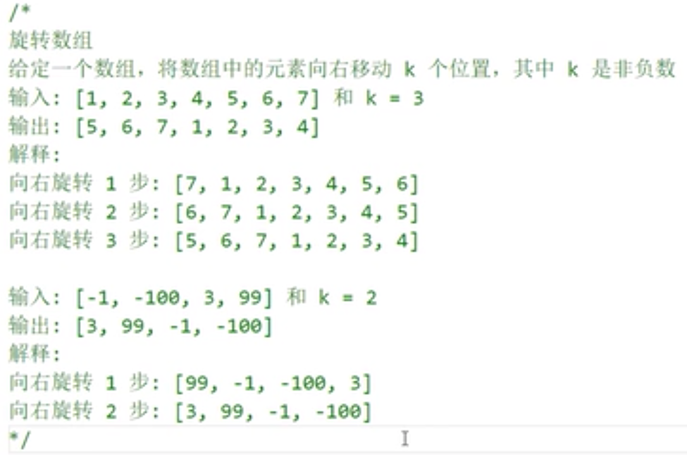

方法一：
```javascript
function rotate(k) {
    // 当k为0或者k为数组长度，直接返回数组即可
    if (k <= 0 || k === this.length) {
        return this;
    }
    // 当k值大于数组长度，取余s
    if (k > this.length) {
        k = k % this.length;
    }
    // 截取后面k位元素，然后拼接0-k位置的元素
    return this.slice(-k).concat(this.slice(0, this.length - k));
}

// 放到数组的原型上
Array.prototype.rotate = rotate;
// 测试
let arr = [1, 2, 3, 4, 5, 6, 7, 8];
> console.log(arr.rotate(3));
[ 6, 7, 8, 1, 2, 3, 4, 5 ]
> console.log(arr.rotate(8));
[ 1, 2, 3, 4, 5, 6, 7, 8 ]
> console.log(arr.rotate(10));
[ 7, 8, 1, 2, 3, 4, 5, 6 ]
```

方法二：
```javascript
// splice会改变原数组，且返回的是被切割掉的数组元素，将k～this.length - 1的元素切割后原数组arr，再与被切割掉的数组(splice的返回值)重组就行
return [...this.splice(this.length - k), ...this];
```

方法三：旋转最初的思路
```javascript
for (let i = 0; i < k; i++>) {
    this.unshift(this.pop());
}
return this;
```

for循环的代码优化
```javascript
// 只创建一个长度为k的数组是不能循环的，需要用fill把元素的内容补充上
new Array(k).fill('').forEach(() => this.unshift(this.pop()))；
return this;
```

```javascript
> new Array(6)
[ <6 empty items> ]
> new Array(6).fill(null)
[ null, null, null, null, null, null ]
>
```

### 23.柯里化：闭包
函数柯里化：预先处理的思想（利用闭包的机制，保存一些值便于后续使用），即`将多参数的函数转换成单参数的形式`

柯里化 => 闭包：闭包的两大作用：保护；保存；(mm理解：保护内部的变量不被外层作用域访问到，保存外层作用域的变量和方法)

柯里化：将多参数的函数转换成单参数的形式。

简单的柯里化函数思想（参看MDN中的例子：https://developer.mozilla.org/zh-CN/docs/Web/JavaScript/Closures）
```javascript
function fn(x) {
    // 预先在闭包中把x存储起来
    return function(y) {
        return x + y;
    }
}
console.log(fn(100)(200)); // 300
// 函数第一次执行时fn(100)当前作用域没有被销毁，因为形成了一个闭包，把传入的100先存起来了，当第二次执行的时候，寻找x直接往上一次未被销毁的闭包中寻找x即可
```

几个改变this指向的函数对比：
* bind：预先把this和函数中要传的参数处理好，但是不执行，返回一个函数；传参也是一个一个传入
* call：函数会执行，返回函数执行的结果，传参数一个一个传；
* apply：函数会执行，返回函数执行的结果，传参数以数组的形式传入；

```javascript
let obj = {
    name: 'mm'
};
function fn(...arg) {
    console.log(this, arg);
}
// 点击的时候fn中的this => obj arg => [100, 200, 事件对象]
// document.body.onclick = fn.bind(obj, 100, 200);
// document.body.onclick = function(e) {
//     fn.call(obj, 100, 200, e)
// }
// 执行bind方法，会返回一个匿名函数，当事件触发，匿名函数执行，我们再处理fn即可

document.body.onclick = fn; // this: body arg:[事件对象]
document.body.onclick = function (e) {
    // e事件对象：给元素的某个事件绑定方法，当事件触发会执行这个方法，并且会把当前事件的相关信息传递给这个函数“事件对象”
    console.log(e);
}
```
**以下是重写bind方法: 柯里化预先处理思想**
用call或者apply实现bind

```javascript
// 函数执行形成一个闭包，把一些信息先预先存储起来，当返回的函数用到这些信息时直接从闭包形成的私有作用域中获取即可。
(function() {
    // this: 需要改变this的函数
    // context: 需要改变的this指向
    // outerArg: 其余需要传递给函数的实参信息
    function myBind(context = window, ...outerArg) {
        let that = this;
        return function(...innerArg) {
            // that.apply(context, outerArg.concat(innerArg));
            that.call(context, ...outerArg.concat(innerArg));
        }
    }
    Function.prototype.myBind = myBind;
})();
// 测试结果
let obj = {
    name: 'mm'
};
document.body.onclick = fn.myBind(obj, 100, 200);
```

柯里化函数
```javascript
function curry(fn) {
    // 获取外部函数的参数
    let outerArgs = Array.prototype.call(arguments, 1);
    return function() {
        // 将外部函数和内部函数结合传参
        fn.apply(null, outerArgs.concat(...args));
    }
}
```

题目：实现函数柯里化

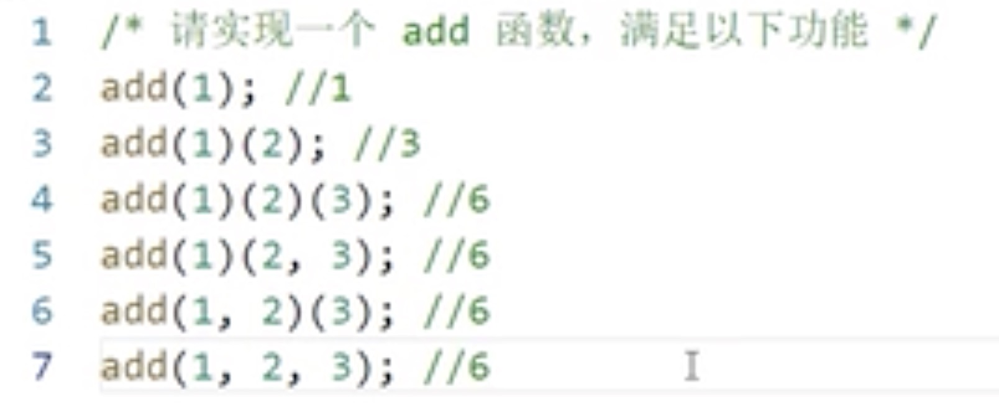

```javascript
function currying(fn, length) {
    length = length || fn.length;
    return function (...args) {
        if (args.length >= length) {
            return fn(...args);
        }
        return currying(fn.bind(null, ...args), length - args.length);
    }
}

function add(n1, n2, n3, n4) {
    return n1 + n2 + n3 + n4;
}

add = currying(add, 3);
console.log(add(1)(2)(3)(4));
console.log(add(1, 2)(3, 4));
```
上面方法的分析过程如下：
四个的情况：`console.log(add(1)(2)(3)(4));`

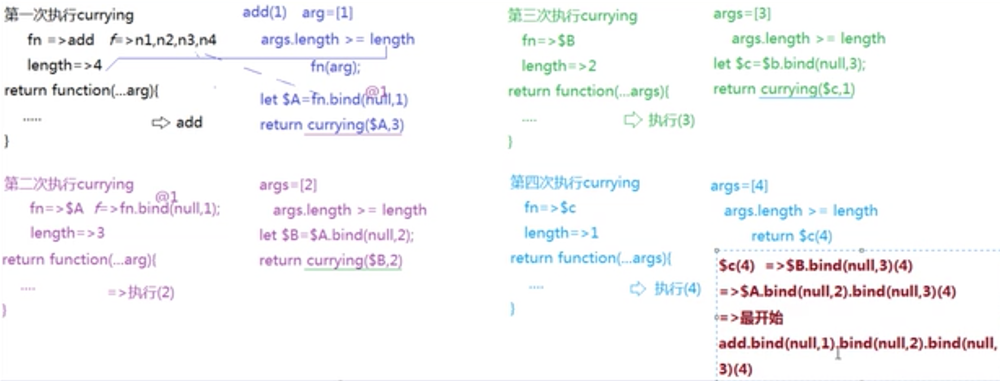


anonymous函数就是柯里化（闭包，bind）返回的匿名函数
第一次bind，返回一个匿名函数anonymous1；
第二次bind，返回一个匿名函数anonymous2；
第三次bind，返回一个匿名函数anonymous3；
第四次bind，返回一个匿名函数anonymous4；

```javascript
function $add(n1, n2, n3, n4) {
    return n1 + n2 + n3 + n4;
}
add = currying($add, 3);
console.log(add(1)(2)(3)(4)); // $add.bind(null, 1).bind(null, 2).bind(null, 3)(4)
// $add.bind(null, 1).bind(null, 2).bind(null, 3)(4)
```

两个的情况：console.log(add(1, 2)(3, 4));
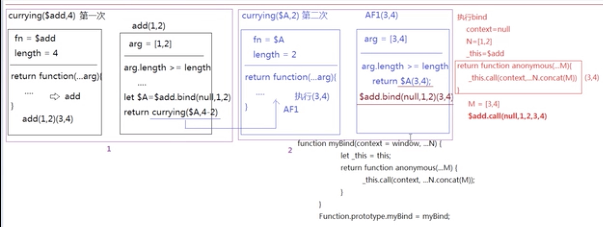

add方法还可以直接按如下实现：
`eval(arg.join('+'))`直接求和

```javascript
let add = cruuying((...arg) => eval(arg.join('+')), 5);
console.log(add(1,2,3,4,5));
console.log(add(1,2)(3,4,5));
console.log(add(1,2)(3,4)(5));
console.log(add(1,2)(3)(4)(5));
console.log(add(1)(2)(3)(4)(5));
```

### 24.输出下列结果
```javascript
const obj = {
    a: 100
}
const obj1 = obj;
let a1 = obj.a;
obj1.a = 200;
console.log(obj.a); // 200
console.log(a1); // 100 因为a1先被赋值obj.a 100，然后才改变obj1.a的值
a1 = 300;
console.log(obj.a); // 200
console.log(obj1.a); // 200
```

### 25.按属性对object分类
用数组的`reduce`方法，参考链接：https://developer.mozilla.org/zh-CN/docs/Web/JavaScript/Reference/Global_Objects/Array/Reduce
```javascript
var people = [
  { name: 'Alice', age: 21 },
  { name: 'Max', age: 20 },
  { name: 'Jane', age: 20 }
];

function groupBy(objectArray, property) {
  return objectArray.reduce(function (acc, obj) {
    var key = obj[property];
    if (!acc[key]) {
      acc[key] = [];
    }
    acc[key].push(obj);
    return acc;
  }, {});
}

var groupedPeople = groupBy(people, 'age');
// groupedPeople is:
// { 
//   20: [
//     { name: 'Max', age: 20 }, 
//     { name: 'Jane', age: 20 }
//   ], 
//   21: [{ name: 'Alice', age: 21 }] 
// }
```

### 26. 关于函数执行顺序的经典题目
```javascript
function f(){return 1;}
// 返回4，第四个f函数覆盖了第一个f函数（即第一个函数不存在了），因为js解释器会优先解释function语句式定义的函数
f();
var f=new Function("return 2;");
// 返回2，顺序执行第二个f函数
f();
var f=function(){return 3;}
// 返回3，顺序执行
f();
function f(){return 4;}
// 返回值为3，因为第四个f函数在最开始就被优先解释了，并在第一次函数调用中被调用，因此，此处调用的f仍然为第三个f函数
f();
var f=new Function("return 5;");
// 返回5，顺序执行
f();
var f=function(){return 6};
// 返回6，顺序执行
f();
```

以下升级版参考：https://mp.weixin.qq.com/s/X40KEH37cRj01a_AuTzKrw
升级版1
```javascript
function Foo() {
    getName = function () { alert (1); };
    return this;
}
Foo.getName = function () { alert (2);};
Foo.prototype.getName = function () { alert (3);};
var getName = function () { alert (4);};
function getName() { alert (5);}
 
//请写出以下输出结果：
Foo.getName(); // 2
getName(); // 4
Foo().getName(); // 1
getName(); // 1
new Foo.getName(); // 2
new Foo().getName(); // 3
new new Foo().getName(); // 3
```

升级版2
```javascript
function Foo() {
	this.getName = function() {
		console.log(3);
		return {
			getName: getName //这个就是第六问中涉及的构造函数的返回值问题
		}
	}; //这个就是第六问中涉及到的，JS构造函数公有方法和原型链方法的优先级
	getName = function() {
		console.log(1);
	};
	return this
}
Foo.getName = function() {
	console.log(2);
};
Foo.prototype.getName = function() {
	console.log(6);
};
var getName = function() {
	console.log(4);
};

function getName() {
	console.log(5);
} //答案：
Foo.getName(); //2
getName(); //4
console.log(Foo())
Foo().getName(); //1
getName(); //1
new Foo.getName(); //2
new Foo().getName(); //3
//多了一问
new Foo().getName().getName(); //3 1
new new Foo().getName(); //3
```
