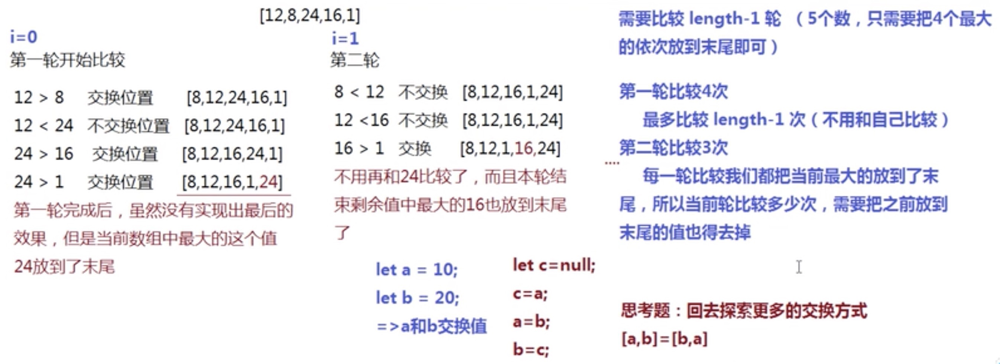
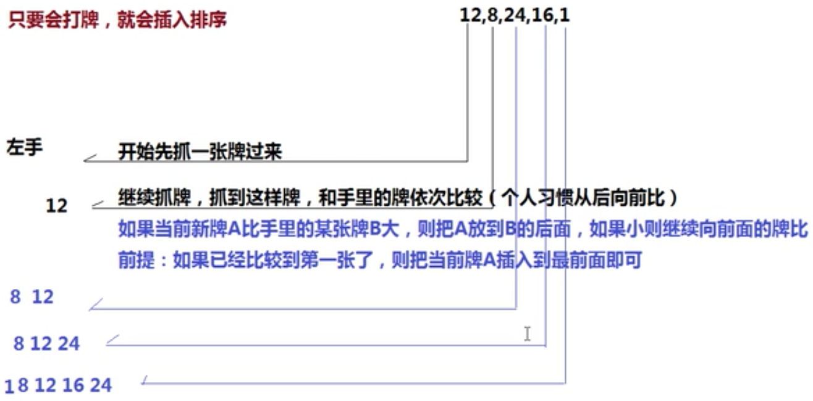
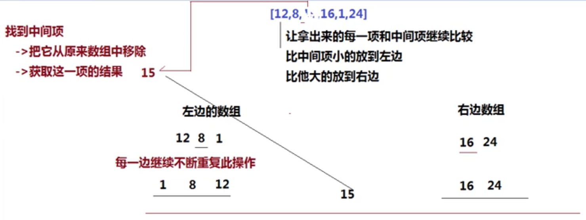

   ## 基础知识开始表演
   
   ### 1.call和apply的区别是什么，哪个性能好一些?
   call和apply都是Function原型上的方法，都是改变函数的this指向，指向当前绑定的函数。
   1. `fn.cal(obj, 10, 20, 30);` // 第一个参数是绑定的对象，后面可以传入多个参数给fn，一个个参数
   2. `fn.apply(obj, [10, 20, 30]);` // 第二个参数是整体传给fn的，数组的形式传递参数
   3. bind也是用来改变this指向，但是bind并没有把函数立即执行，只是预先处理改变this，返回的是一个函数
   4. call要比apply好一些（尤其传入的参数>3个时）
   5. 通过扩展运算符...可以使call实现apply的效果，如:
   ```
   let arr = [1, 2, 3];
   let obj = {};
   function fn(x, y, z) {}
   fn.apply(obj, arr);
   fn.call(obj, arr); // x=[1, 2, 3], y=z=undefined
   fn.call(obj, ...arr); // 给予ES6的扩展运算符也可以实现把数组中的每一项依次传递给函数
   ```

   ### 2.性能测试: `console.time()`、` console.timeEnd()`
    `console.time()`：可以测试出一段程序执行的时间
    `console.profile()`：在火狐浏览器中安装FireBug，可以更精准的获取到程序的每一个步骤所消耗的时间

   任何代码的性能测试都是和测试的环境有关系的，例如CPU、内存、GPU等电脑当前性能每个时间点都可能不一样；不同的浏览器也会导致数据不同；
   ```
    console.time() 
    for (let i = 0; i < 10000000; i++) {

    }
    console.timeEnd()
   ```

   ### 3.实现(5).add(3).minus(2)，使其输出结果为：6
   ```
   (function () {
       // 每一个方法执行完，都要返回Number类的实例，这样才可以继续调用Number类中的方法（即链式写法）
       // 检查传入的参数是否是数字（容错性处理）
       function checkNum(n) {
           n = Number(n);
           return isNaN(n) ? 0 : n;
       }
       function add(n) {
           return this + n;
       }
       function minus(n) {
           return this - n;
       }
       Number.prototype.add = add;
       Number.prototype.minus = minus;
       // ['add', 'minus'].forEach(item => {
          //  Number.prototype[item] = eval(item);
      //  });
   })();
   console.log((5).add(3).minus(2));
   ```

### 4.箭头函数与普通函数（function）的区别是什么？构造函数（function）可以使用生成实例，那么箭头函数可以么？为什么？

#### 箭头函数和普通函数的区别
1. 箭头函数语法上比普通函数更加简洁（ES6中每一种函数都可以使用形参默认值和剩余运算符）
2. 箭头函数没有自己的this，它里面出现的this是继承函数所处上下文中的this（使用call/apply等任何方式都无法改变this的指向）；普通函数有自己的this，可以通过call/apply来改变this指向。
3. 箭头函数中没有arguments(类数组)，只能基于...agr获取传递的参数集合（数组）
4. 箭头函数不能被new执行（因为：箭头函数没有this也没有prototype（重点），因为没有prototype所以也没有原型上的constructor构造函数，故不能new创建实例）
```
var obj = {};
let fn = () => {console.log(this)}
fn.call(obj);
// 结果：Window {parent: Window, opener: null, top: Window, length: 0, frames: Window, …}

let fn2 = function() {console.log(this)}

fn2.call(obj)
// 结果：{}
```

```
document.body.onclick = () => {
    // this: window 不是当前操作的body了
}
```

```
document.body.onclick = function() {
    // this: body
    // sort()方法的this是arr
    arr.sort(function (a, b)) {
        // this: window 回调函数中的this一般都是window
        // this不是sort的原因：sort只是执行传入的已经创建好的function，而这个创建好的function是在window上创建的函数
        return a - b;
    }
}
```

```
document.body.onclick = function() {
    arr.sort((a, b) => {
        // this: body，箭头函数上下文的this
        return a - b;
    }
}
```

* 回调函数：把一个函数B作为实参传递给另一个函数A，函数A在执行的时候，可以把传递进来的函数B去执行（执行N次，可传值，可改this）
```
function each(arr, callback) {
    // callback: function(item, index){}
    for (let i = 0; i < arr.length; i++) {
        let item = arr[i];
        index = i;
        // 接受回调函数返回的结果，如果是false，结束循环
        let flag = callback(item, index);
        if(flag === false) {
            break;
        }
    }
}
each([10, 20, 30], function(item, index){
    // this：原始操作数组
    return false
})
```

箭头函数中没有arguments(类数组)，只能基于...agr获取传递的参数集合（数组）
```
let fn = (...arg) => {
    console.log(arguments); // VM9096:2 Uncaught ReferenceError: arguments is not defined
    console.log(arg); // [10, 20, 30]
}
fn(10, 20, 30);
```

箭头函数不能被new执行（因为：箭头函数没有this也没有prototype（重点），因为没有prototype所以也没有原型上的constructor构造函数，故不能new创建实例）
```
function Fn() {
    this.x = 100;
}
Fn.prototype.getX = function() {};
let f = new Fn(); // {x: 100}
```

```
let Fn = () => {
    this.x = 200;
}
let f = new Fn(); // Uncaught TypeError: Fn is not a constructor
```

### 5.如何把一个字符串中的大小写取反（大写变小写，小写变大写），例如'AbC'变'aBc'
思路一：for循环遍历字符串中的每个元素，性能不好
思路二：用正则匹配捕获到想要的内容，如字母，然后进行转换，性能比for循环好

正则匹配实现：
```
let testStr = 'AbC测试！**HaHa';
// 正则匹配字母：/[a-zA-Z]/g
testStr = testStr.replace(/[a-zA-Z]/g, ele => {
    // ele: 每一项正则匹配的结果
    // 验证是否为大写字母：
    // 1.把字母转换为大写后看和之前是否一样，如果一样，那么该字母是大写的
    // 2.在ASCII表中找到大写字母的取值范围进行判断（65-90）
    // 1.ele.toUpperCase === ele;
    // 2.ele.charCodeAt() >= 65 && ele.charCodeAt() <= 90
    return ele.toUpperCase() === ele ? ele.toLowerCase() : ele.toUpperCase();
})
console.log(testStr);
```

### 6.实现一个字符串匹配算法，从字符串s中，查找是否存在字符串T，若存在则返回所在位置，不存在返回-1!（如果不能基于indexOf/includes等内置的方法，你会如何处理呢？）
方法一：循环遍历
```
/*
 * 循环原始字符串中的每一项，让每一项从当前位置向后截取T.length个字符串，然后和T进行比较，如果不一样，则继续循环；如果一样，则返回当前索引即可（循环结束）
 * 循环到S.length - T.length + 1就可以，不需要循环到最后，因为后面几个字符串个数可以小于T.length，那就不用比较了，直接返回-1就行
*/
function searchIndexOf(T) {
    let lenT = T.length;
    // this就是新建的字符串，也就是S
    let lenS = this.length;
    let res = -1;
    // 如果要找的字符串比字符串还要长，直接返回-1即可，找不到
    if (lenT > lenS) {
        return -1;
    }
    for(let i = 0; i < lenS - lenT + 1; i++) {
        let char = this[i];
        // 判断截取的字符串和传入的字符串是否相等
        // 不用三元运算符，因为找到了就结束了，需要break，减少循环，优化性能，三元运算符不能break
        // res = this.substr(i, lenT) === T ? i : null;
        if (this.substr(i, lenT) == T) {
            res = i;
            break;
        }
    }
    return res;
}

// 放到字符串原型上
String.prototype.searchIndexOf = searchIndexOf;

let s = 'lmmmmyyzyhhgs';
let t = 'zy';
consolelog(s.searchIndexOf(t)); // 7
```

方法二：正则
```
function searchIndexOf(T) {
    let reg = new RegExp(T); // 不能用元字符创建正则，/T/这种方式创建的正则就是字母T字符，不是变量T，new RegExp(T)创建的是传入变量T
    let res = reg.exec(this); // 如果正则捕获到，返回结果有个index值，即字符串匹配到的index
    return res == null ? -1 : res.index;
}

// 放到字符串原型上
String.prototype.searchIndexOf = searchIndexOf;

let s = 'lmmmmyyzyhhgs';
let t = 'zy';
consolelog(s.searchIndexOf(t)); // 7
```

### 7.输出下面代码运行结果
```
// example1
var a = {}, b = '123', c = 123;
a[b]='b';
a[c]='c';
console.log(a[b]); // c a['123'] <=> a[123]

// 举例
let obj = {100: 'mm'}
console.log(obj[100]); // mm
console.log(obj['100']); // mm
let obj = {100: 'kk', '100': 'haha'};
console.log(obj); // {'100': 'haha'}
```

```
// example2
var a = {}, b = Symbol('123'), c = Symbol('123');
a[b]='b';
a[c]='c';
console.log(a[b]); // Symbol是ES6中新增的数据类型，typeof Symbol('123') === 'Symbol'，它创建出来的值是唯一值 Symbol('123') === Symbol('123'); // false

// Symbol类型会创建一个唯一的值
// 如 Symbol('123') === Symbol('123'); // false
// 同 NaN === NaN; // false
// 举例
let obj = {};
let a = Symbol('1');
let b = Symbol('2');
obj[a]=100;
obj[b]=200;
console.log(obj); // {Symbol(1): 100, Symbol(2): 200}
```

```
// example3
var a = {}, b = {key: '123'}, c = {key: '456'};
a[b]='b';
a[c]='c';
console.log(a[b]); // c

// 1. 对象的属性名不能是一个对象（遇到对象属性名，会默认转换为字符串）
// obj = {} arr = [12, 22] obj[arr]="测试" obj => {'12,22': '测试'}
// 2. 普通对象.toString() 调取的是Object.prototype上的方法（这个方法是用来检测数据类型的）
obj = {} obj.toString() => "[object object]"
obj[b]='b' => obj['[object object]'] = 'b';
```

```
example4: 构造函数、普通函数、原型
function Foo() {
    Foo.a = function() {
        console.log(1);
    }
    this.a = function() {
        console.log(2);
    }
}
// 把Foo当作类，在原型上设置实例公有的属性方法 => 实例.a();
Foo.prototype.a = function() {
    console.log(3);
}
// 把Foo当作普通对象设置私有的属性方法 => Foo.a();
Foo.a = function() {
    console.log(4);
}

Foo.a(); // 4 调用普通的Foo.a方法，输出4
let obj = new Foo(); // obj可以调取原型上的方法 Foo.a: f => 1 obj.a: f=>2
obj.a(); // 2 私有属性中有a 构造函数构造的对象的私有属性a: 2
Foo.a(); // 1 调用构造函数中的Foo.a，输出1
```

### 8.在输入框中如何判断输入的是一个正确的网址，例如：用户输入一个字符串，验证是否符合URL网址的格式
```
// 1.协议：// http/https/ftp/...
// 2.域名：www.baidu.com/xxx.cn/xxx.xxx.cn
// 3.请求路径：index.html、stu/index.html
// 4.问好传参：?xxx=xxx&xxx=xxx
// 5.哈希值：#xxx
let str = 'https://www.baidu.com?world=js';
// 协议部分：(?:(http|https|ftp):\/\/)?
// 域名部分：(?:[\w-]+\.)+[a-z0-9]+)
// query部分：((?:\/[^/?#]*)+)?
// hash部分：(\?[^#]+)?(#.+)?
let reg = /^(?:(http|https|ftp):\/\/)?((?:[\w-]+\.)+[a-z0-9]+)((?:\/[^/?#]*)+)?(\?[^#]+)?(#.+)?$/i
console.log(reg.exec(str)); 
0: "https://www.baidu.com?world=js"
1: "https"
2: "www.baidu.com"
3: undefined
4: "?world=js"
5: undefined
index: 0
input: "https://www.baidu.com?world=js"
groups: undefined
length: 6
```

### 9. 编写函数实现图片的懒加载

### 10. 编写一条正则，用来验证此规则：一个6～16位的字符串，必须同时包含大小写字母和数字
```
// 不能是纯字母（大小写）、不能是纯小写字母和数字、不能是纯大写字母和数字
// (?!^[a-zA-Z]+$)：不能是纯字母开头和结尾
let reg = /(?!^[a-zA-Z]+$)(?!^[a-z0-9]+$)(?!^[A-Z0-9]+$)^[a-zA-Z0-9]{6,16}$/;
```

正则回顾：
（1）正向预查(?=pattern)：必须符合该正则规则，要匹配的字符串，必须满足pattern这个条件
e.g:
正则表达式/lmm/会匹配lmm，也会匹配lmm2中的lmm，如果只希望lmm只能匹配lmm2中的lmm，则可以这样写：/lmm(?=2)/
```
var reg = /lmm(?=2)/;
var str = 'lmm6';
console.log(reg.exec(str)); // null
var str2 = 'lmm2';
console.log(reg.exec(str)); // lmm [0: "lmm", index: 0, input: "lmm2", groups: undefined, length: 1]
```
**注意**：括号里的内容只是参与匹配的条件，并不参与真正的捕获，只是检查一下后面的字符是否符合要求，如上返回的是lmm，而不是lmm2

（2）负向预查（?!条件）：形式(?!pattern)和(?=pattern)恰好相反，要求做匹配的时候，必须不满足pattern这个条件，还拿上面的例子：
```
var reg = /lmm(?!2)/
var str = 'lmm2';
console.log(reg.exec(str)); // null，因为正则要求，lmm后面不能是2
var str2 = 'lmm6';
console.log(reg.exec(str)); // lmm
```

以下两个正则表达式是等价的：
`var reg1 = /(?=^)\d{2}(?=$)/;` // 正向预查，左边要满足开头，右边要满足结尾
`var reg2 = /^\d{2}$/;`

### 11.实现一个$attr(name, value)遍历，属性为name，值为value的元素集合
```
function getAttr(prop, value) {
    // 获得当前页面中的所有标签
    let eles = document.getElementsByTagName('*');
    let arr = [];
    // [].forEach.call(eles, item => {});
    eles = Array.from(eles);
    eles.forEach(item => {
        // 存储的是当前元素property对应的属性值
        let itemV = item.getAttribute(prop);
        if (prop === 'class') {
            // 样式类属性名要特殊处理，如class="content box"
            new RegExp('\\b' + value + '\\b').test(itemV) ? arr.push(item) : null;
            return;
        }
        // 其它属性可以直接用value对比
        if (itemV === value) {
            // 获取的值和传递的值校验成功：当前就是我们想要的
            arr.push(item);
        }
    });
    return arr;
}
console.log(getAttr('class', 'box'));
```

### 12.英文字母汉子组成的字符串，用正则给引文单词前后加空格
1. 正则实现：
```
let str = 'dc测试aaas+!!dw';
let reg = /\b[a-z]+\b/ig;
str = str.replace(reg, value => {
    return ' ' + value + ' ';
}).trim(); // String.prototype.trim/.trimLeft/.trimRight 去除字符串首尾空格
console.log(str); // 'dc 测试 aaas +!! dw'
```
2. for循环实现

### 13.编写一个程序，将数组扁平化，并去除其中重复部分数据，最终得到一个升序且不重复的数组
```
let arr = [[1, 2, 2], [3, 4, 5, 5], [6, 7, 8, 9, [11, 12, [12, 13, [14]]]], 10];
// 方法一：
// 第一步扁平化: 使用ES6中提供的Array.prototype.flat处理
arr = arr.flat(Infinity); // //使用 Infinity，可展开任意深度的嵌套数组
console.log(arr); // [1, 2, 2, 3, 4, 5, 5, 6, 7, 8, 9, 11, 12, 12, 13, 14, 10]

// 去重排序：基于new Set()去重数组（也可以自己写方法）
// [...new Set(arr)]
// Array.from(new Set(arr));
arr = Array.from(new Set(arr)).sort((a, b) => a - b);
console.log(arr); // [1, 2, 3, 4, 5, 6, 7, 8, 9, 10, 11, 12, 13, 14]

// 整合成一行代码：
arr = Array.from(new Set(arr.flat(Infinity))).sort((a, b) => a - b);

// 方法二：
// 第一步：通过转成字符串进行扁平化处理，把数组直接变为字符串即可（数组toString之后，不管你有多少级，最后都会变成以逗号分割的字符串，没有中括号和所谓的层级了），相当于直接扁平化了
arr = arr.toString(); // "1,2,2,3,4,5,5,6,7,8,9,11,12,12,13,14,10"
// 第二步：将字符串切割成数组
arr.toString.split(','); // ["1", "2", "2", "3", "4", "5", "5", "6", "7", "8", "9", "11", "12", "12", "13", "14", "10"]
// 第三步：将数组元素转成数字类型
arr = arr.map(item => Number(item)); // [1, 2, 2, 3, 4, 5, 5, 6, 7, 8, 9, 11, 12, 12, 13, 14, 10]
// 第四步：同方法一中的去重排序

// 转成字符串可以不用toString，也可以用join，如下：
arr.join('|').split(/?:,|\|/g);
```

以上方法都会一些问题：如map兼容ie 6 7 8；flat是ES6的语法

```
// 方法三：复杂些
// JSON.stringfy()也可以扁平化数组："[[1, 2, 2], [3, 4, 5, 5], [6...."
// replace(/(\[|\])/g, '')："1,2,2,3,4,5,5,6...."
arr = JSON.stringfy(arr).replace(/(\[|\])/g, '').split(',').map(item => Number(item));
```

#### 基于数组的some方法进行判断检测：验证数组中有没有符合规则的
find和some的区别：
1. some返回的是boolean，find找到符合规则的，返回当前这一项，没找到符合规则的，返回undefined。
```
// 举例：判断质数：只能被1和它本身整除
var a = [1, 2, 3, 4, 5];
var b = a.some(item => item%1 === 0 && item%item === 0); // 质数 true
var c = a.some(item => item > 6); // false
console.log(b);
```
#### 检测某个值是否是数组：Array.isArray(arr); // ES6的方法
比instanceOf靠谱

```
// 方法四：检测数组的每个元素是否还是数组，如果是数组就用...展开，直到所有的元素都不是数组，即不在嵌套
while (arr.some(item => Array.isArray(item))) {
    arr = [].concat(...arr);
}
```

```
// 方法五：自己递归处理
function ownFlat() {
    let res = [];
    let _this = this;
    // 循环arr中的每一项，把不是数组的存储到新数组中
    let fn = () => {
        for (let i = 0; i< arr.length; i++) {
            let item = arr[i];
            if (Array.isArray(item)) {
                fn(item);
                continue;
            }
            res.push(item);
        }
    }
    fn(_this);
    return res;
}
Array.prototype.ownFlat = ownFlat;
arr = arr.ownFlat();
```

### 14.实现一个new
`let dog = new Dog('欢欢');`
new一个实例的过程：
1. 像普通函数执行一样，形成一个私有的作用域；形参赋值；变量提升；
2. 默认创建一个对象，让函数中的this执行这个对象，这个对象就是当前类的一个实例
3. 代码执行
4. 默认把创建的对象返回

```
function _new(Fn, ...arg) {
    // let obj = {}; // 创建一个空对象，让他的原型链指向Fn.prototype(作为Fn的一个实例)
    // obj._proto_ = Fn.prototype;
    // 上面两行或者合并成下面这行代码
    // Object.created(A)：创建一个空对象obj，并且让空对象obj作为A对象所属构造函数的实例（obj._proto_=A）
    let obj = Object.created(Fn.prototype);
    Fn.call(obj, ...arg); // 代码执行
    return obj; // 默认把创建的对象返回
    
}
```

### 15. 数组合并、排序
let arr1 = ['A1', 'A2', 'B1', 'B2', 'C1', 'C2', 'D1', 'D2'];
let arr2 = ['A', 'B', 'C', 'D'];
// 合并后的数组为： ['A1', 'A2', 'A', 'B1', 'B2', 'B', 'C1', 'C2', 'C', 'D1', 'D2', 'D']

```
// 方法1：在需要合并的arr2的每个元素中都加一个比1，2大的值，如3，Z
arr2 = arr2.map(item => item + '3');
let arr = arr1.concat(arr2);
arr = arr.sort(
    (a, b) => a.localeCompare(b)
).map(
    item => item.replace('3', '')
);
console.log(arr); // [ 'A1', 'A2', 'A', 'B1', 'B2', 'B', 'C1', 'C2', 'C', 'D1', 'D2', 'D' ]
```

let arr1 = ['D1', 'D2', 'A1', 'A2', 'C1', 'C2', 'B1', 'B2'];
let arr2 = ['B', 'A', 'D', 'C'];
// 合并后的数组为： ['D1', 'D2', 'D', 'A1', 'A2', 'A', 'C1', 'C2', 'C', 'B1', 'B2', 'B']

```
// 思路：在arr1中找到包含arr2中元素的元素下标，记录为n，然后插入arr1
// 注意：在arr1中找包含arr2中元素的元素，所以外层的for循环是以arr2为循环，内层循环才是arr1
// 思考问题可以根据问题本身的特征来思考，如本题中B、A、D、C和arr1中的B1\B2、A1\A2、C1\C2、D1\D2之间直接存在包含关系，故可以从找到包含的元素下标思路开始
let n = 0;
for (let i = 0; i < arr2.length; i++) {
    let item2 = arr2[i];
    for (let k = 0; k <arr1.length; k++) {
        let item1 = arr1[k];
        if (item1.includes(item2)) {
            // 如果包含就记录一下当前这一项的索引位置（后面如果还有包含的会重新记录这个下标值，即会更新下标值）
            n = k;
        }
    }
    // 把当前item2这一项插入到arr1中n的后面
    arr1.splice(n + 1, 0, item2);
}
console.log(arr1);
```

### 16. 经典的for循环、let、var、闭包
定时器是异步编程：每一轮循环设置定时器，无需等定时器触发指向，继续下一轮循环(定时器触发的时候，循环已经结束了)
```
// 所以最后会输出10个10，因为在最后一轮循环结束后i=10，开始执行10个异步console
// 重点：因为i是全局变量，所以每轮循环都会覆盖上一次的i值，故最后的i是10，然后10个异步调用输出10个10
// 为什么循环结束之后i变成10，因为最后一轮循环是跳出循环，当i=9这轮循环结束后，i变成10，然后不满足条件，跳出循环，所以最后全局变量var i为10
for (var i = 0; i < 10; i++) {
    setTimeout(() => {
        // 执行异步的时候，输出的i不是异步的私有变量，会继续往外层找，找到var全局的i，即循环结束后变成10的i
        console.log(i);
    }, 1000);
}
// 10， 10， 10......
```

如果要输出1，2，3，4...

```
// 方法1：利用let的块级作用域
for (let i = 0; i < 10; i++) {
    // let存在块级作用域，每一次循环都会在当前块级作用域中形成一个私有变量i存储0～9
    // 当定时器执行的时候，所使用的i就是所处块级作用域中的i
    setTimeout(() => {
        console.log(i);
    }, 1000);
}
// 0,1,2,3,4, 5,6,7,8,9
```

```
// 方法二：闭包解决：利用闭包自执行函数形成私有作用域
// 每次将循环中的i传入闭包，形成私有作用域中的私有变量
// 第一种写法：将闭包放在异步外层
for (var i = 0; i < 10; i++) {
    (function(i) {
        setTimeout(() => {
            console.log(i);
        }, 1000);
    })(i)
}
// 0,1,2,3,4, 5,6,7,8,9
```
```
// 第二种写法：将闭包放在异步箭头函数里
for (var i = 0; i < 10; i++) {
    setTimeout((i => () => {
        console.log(i);
    })(i), 1000); // 外层的i是传入的实参，箭头函数中的i是形参
}
// 0,1,2,3,4, 5,6,7,8,9
```
注意第二种写法如果写成以下形式是错误的：
因为setTimeout里面必须是传入一个函数，如果按下面这种写法，传入setTimeout的是一个函数的执行结果，而且是一个undefined的结果，因为该函数没有return
解决：需要将闭包函数自执行结果以一个函数的形式返回，即:
```
() => {
    console.log(i);
}
```
这种是返回一个函数传入setTimeout
```
// 测试
> let res2 = (i => () => console.log(i))(2)
undefined
> res2
[Function]
>
```

`i => console.log(i);`这种是返回一个函数的执行结果undefined给setTimeout
```
// 测试1
> let res = (i => console.log(i))(2)
2
undefined
> res
undefined
>
```

```
// 测试2
for (var i = 0; i < 10; i++) {
    setTimeout(
        (i => console.log(i))(i),
    1000); // 外层的i是传入的实参，箭头函数中的i是形参
}
// TypeError [ERR_INVALID_CALLBACK]: Callback must be a function
    at setTimeout (timers.js:425:11)
```

方法3：可以基于bind的预先处理机制：在循环的时候把每次执行函数需要输出的结果，预先传给函数即可
```
var fn = function(i) {
    console.log(i);
}
for (var i = 0; i < 10; i++) {
    setTimeout(fn.bind(null, i), 1000);
}
// 0,1,2,3,4, 5,6,7,8,9
```

### 17. 匿名函数
知识点铺垫：
1. 本应匿名的函数如果设置了函数名，在外面还是无法调用，但是在函数里面是可以使用的
```
let fn = function test() {
    console.log(test);
}
// 在外面还是无法调用
test(); // ReferenceError: test is not defined
// 但是在函数里面是可以使用的，输出的是当前的函数
fn(); // [Function: test]
```
2. 而且类似于创建常量一样，这个名字存储的值不能再被修改（非严格模式下不会报错，但是不会有任何的效果，严格模式下直接报错，可以把test理解为是用const创建出来的，即是常量，不可改变）
```
// 非严格模式下没有任何效果
let fn = function test() {
    test = 89;
    console.log(test);
}
fn(); // [Function: test]
```

```
// 严格模式下报错
let fn = function test() {
    'use strict';
    test = 89;
    console.log(test);
}
fn(); // TypeError: Assignment to constant variable.
    at test (repl:3:10)
```

题目：
```
var b = 18;
(
    function b() {
        b = 20;
        console.log(b); // 函数，输出的是匿名函数b
    }
)();
console.log(b); // 18 输出的是全局变量b
```
如果想要闭包中输出b=20可以怎么处理？
```
var b = 18;
(
    function b() {
        // 声明该变量b=20
        var b = 20;
        console.log(b); // 20 里面的b一定需要是私有的，不能是全局的（可以通过声明该变量b=20）
    }
)();
console.log(b); // 18 输出的是全局变量b
```

```
// 将输出的b改为形参第一种
var b = 18;
(
    function b(b) {
        b = 20; // 相当于改变形参的值，也是将b私有化了，不是全局的
        console.log(b); // 20 里面的b一定需要是私有的，不能是全局的（将输出的b改为形参）
    }
)();
console.log(b); // 18 输出的是全局变量b
```

```
// 将输出的b改为形参第二种
var b = 18;
(
    function b(b) {
        console.log(b); // 20 里面的b一定需要是私有的，不能是全局的（将输出的b改为形参）
    }
)(20);
console.log(b); // 18 输出的是全局变量b
```

### 18.
题目：
```
var a = ?;
if (a == 1 && a == 2 && a == 3) {
    console.log(1);
}
```
知识点铺垫：
    ==进行比较的时候，如果左右两边数据类型不一样，则先转换为相同的数据类型，然后再进行比较
    1. {} == {}两个对象进行比较，比较的是堆内存的地址 
    2. null == undefined // true;null === undefined // false
    3. NaN == NaN // false NaN和谁都不想等
    4. [12] == '12' 对象(数组也是对象)和字符串比较，是把对象toString()转换为字符串后再进行比较的
    5. 剩余所有情况在进行比较的时候，都是转换为数字（前提：数据类型不一样）
        （1）对象转数字：先转换为字符串，然后再转换为数字；
        （2）字符串转数字：只要出现一个非数字字符，结果就是NaN;
        （3）布尔转数字：true -> 1 false -> 0
        （4）null转数字0；
        （5）undefined转数字NaN;
        （6）[12]==true => Number([12].toString()) == 1 // false [12]转换成字符串'12'，再转换成数字12
        （7）[] == false => 0 == 0 // true []空数组转换成数字0
        （8）[] == 1 => 0 == 1 // false
        （9）'1' == 1 => 1 == 1 // true
        （10）true == 2 => 1 == 2 // false
        ......

解答：
方法一：对象和数字比较：先把对象.toString()变为字符串，然后再转换为数字
```
var a = {
    n: 0,
    // 私有的属性方法
    toString: function() {
        // 执行前改变值
        return ++this.n;
    }
};
// a.toString(); // 此时调取的就不再是Object.prototype.toString了，调用的是自己私有的toString，即返回的是number类型的值；如果对象直接调用Object.prototype.toString会返回'[object Object]'
// 每一次==比较的时候都会改变a的值，第一次用a判断a会变成1；第二次会变成2；第三次会变成3
if (a == 1 && a == 2 && a == 3) {
    console.log('yes');
}
```

方法二：删除数组第一项，把删除的内容返回，原有数组改变
```
let a = [1, 2, 3];
// 改变数组a原有的toString方法，等同于数组的shift方法
a.toString = a.shift;
// ==每比较一次就会改变a的值，第一次用toString(shift)返回的是1，第二次是2，第三次是3
if (a == 1 && a == 2 && a == 3) {
    console.log('yes');
}
```

方法三：Object.defineProperty()
知识点：
ES6中新增的一些方法：
    1. String.fromCharCode(n) <=> 'z'.charCodeAt() //  String.fromCharCode(122) <=> 'z'.charCodeAt()
    2. Array.from()
    3. Array.isArray()
    4. Object.create(obj)
    5. Object.defineProperty()，vue的双向数据绑定就是用Object.defineProperty()实现的
    ```
    let obj = {};
    Object.defineProperty(obj, 'name', {
        get: function() {
            console.log('haha');
            return this.value; // this是当前操作的属性，this.value是当前操作属性的value值
        },
        set: function(value) {
            console.log('hehe');
            this.name = value;
        }
    });
    obj.name = '羊羊'; // hehe
    obj.name; // haha
    ```
```
let n = 0;
Object.defineProperty(window, a, {
    get: function() {
        // this就是window.a
        this.value ? this.value += 1 : this.value = 1;
        return this.value;
    }
});
if (a == 1 && a == 2 && a == 3) {
    console.log('yes');
}
```

### 19.
题目：
```
let obj = {
    2: 3,
    3: 4,
    length: 2,
    push: Array.prototype.push
};
obj.push(1);
obj.push(2);
console.log(obj);
```

解答：
知识点：
```
// 手动实现Array.prototype.push
Array.prototype.push = function @@(val) {
    this[this.length] = val;
    // this.length在原来的基础上加1
    return this.length;
}
```

```
let obj = {
    2: 3, // obj.push(1)之后obj[2] = 1，即改变了2: 3 => 2: 1
    3: 4, // obj.push(2)之后obj[3] = 2，即改变了3: 4 => 3: 2
    length: 2, // obj.push(1)之后，在原来的基础上+1，即obj.length = 3，length: 3；obj.push(2)之后，在原来obj.push(1)基础上的length = 3加1，即length: 4
    push: Array.prototype.push
};
// 过程：this: obj =>即 obj[obj.length] = 1 =>即 obj[2] = 1 =>即 obj.length = 3 (obj.length在原来2的基础上加1)
obj.push(1);
// 在obj.push(1)的基础上，过程：this: obj =>即 obj[obj.length] = 2 => 即 obj[3] = 2 =>即 obj.length = 4 (obj.length在原来3的基础上加1)
obj.push(2);
console.log(obj); // {2: 1, 3: 2, length: 4, push: Array.prototype.push}
```

## 算法开始表演

### 1.冒泡排序：for循环
最好的时间复杂度：o(n^2)
最差的时间复杂度：o(n^2)
冒泡思想：让数组中的当前项和最后一项进行比较，如果当前项比后一项大，则两项交换位置（让大的考后）即可


代码实现：
```
function bubble(arr) {
    let tmp = null;
    // 外层循环i控制比较的轮数
    for (let i = 0; i < arr.length - 1; i++) {
        // i = 0 第一轮：一个都没有放到排序好的数组里
        // i = 1 第二轮：经过第一轮，排序好的数组已经在数组里放了1个值
        // i = 2 第三轮：经过第一、二轮，排序好的数组已经在数组里放了2个值
        // ....
        // 里层循环控制每一轮比较的次数j
        // arr.length - 1 - i 每循环一轮之后剩余要比较的元素个数就少一个，所以经过i轮循环后需要比较的元素就只有arr.length - 1 - i个
        for (let j = 0; j < arr.length - 1 - i; j++) {
            if (arr[j] > arr[j+1]) {
                // 当前项大于后一项
                tmp = arr[j];
                arr[j] = arr[j+1];
                arr[j+1] = tmp;
            }
        }
    }
    return arr;
}

// 测试结果
let arr = [2, 1, 5, 3, 9, 4];
arr = bubble(arr);
console.log(arr); // [1, 2, 3, 4, 5, 9]
```

### 2.插入排序：for循环

思想：开辟一个新的数组，存放从要排序的数组中取到的值，然后再一个一个从未排序的数组中取值，再和新数组中的各个元素比较（可以从后往前（从新数组最后一项比较）也可以从前往后（从新数组第一项开始比较）），直到新元素插入到新数组中
```
function insertSort(arr) {
    // 1.准备一个新数组，用来存储从数组中取到的元素（类似抓到手里的牌），开始先取一个元素（类似先抓一张牌进来）
    let newArr = [];
    // 先存放第一个元素到新数组
    newArr.push(arr[0]);
    // 2.从第二项开始依次取元素（类似依次抓牌），一直到所有的元素都取完（一直到所有的牌都抓光）
    for (let i = 0; i < arr.length; i++) {
        // a是新取的元素（新抓的牌）
        let a = arr[i];
        // 和newArr中的元素依次比较（和newArr手里的牌依次比较（从后往前比较））
        for (let j = newArr.length - 1; j > 0; j--) {
            // 每一次都要比较newArr中的元素（手里的牌）
            let b = newArr[j];
            // 如果当前新元素a（新牌a）比要比较的元素b（牌b）大，则把a放到b的后面
            if (a > b) {
                // 把a放到b的后面
                newArr.splice(j+1, 0, a);
                // 结束此轮新牌和手里的牌比较
                break;
            }
            // 已经比较到第一项，把新牌放到手中最前面即可
            // 如果新牌已经和手里的牌比较到了第一项，则直接把新牌放到手里的最前面即可
            if (j === 0) {
                newArr.unshift(a);
            }
        }
    }
    return newArr;
}
// 测试结果
let arr = [2, 1, 5, 3, 9, 4];
arr = insertSort(arr);
console.log(arr); // [1, 2, 3, 4, 5, 9]
```

### 3.快速排序：递归
思路：



基础知识：
递归：函数执行的时候自己调用自己
```
function fn() {
    fn(); // Uncaught RangeError: Maximum call stack size exceeded 这种死递归会导致栈溢出
}
fn();
```

```
function fn() {
    setTimeout(fn, 0); // 这种看似死递归的方法不会导致栈溢出错误
}
fn();
```

```
// 递归实现1-10累加的和
function sum(n) {
    if(n > 10) {
        // 递归的出口
        return 0;
    }
    return n + sum(n + 1);
    // return 1 + sum(2)
    // return 1 + 2 + sum(3)
    // return 1 + 2 + 3 + sum(4)
    // ......
    // return 1 + 2 + 3 + 4 + ... + 10 + sum(11)
    // return 1 + 2 + 3 + 4 + ... + 10 + 0
}
let total = sum(1);
console.log(total); // 55
```

快排的代码实现
```
function quickSort(arr) {
    // 4.结束递归，找到递归的出口（当arr中小于等于1项时，则不用再继续处理）
    if (arr.length <= 1) {
        return arr;
    }

    // 1.找到数组的中间项，在原有的数组中把它移除
    let midIndex = Math.flor(arr.length / 2);
    // 基础知识细节：因为splice会返回被删除元素组成的数组，所以要通过取数组元素的下标获取到元素值，如：[1, 2, 3, 4, 5, 9].splice(2, 1)返回的是[3]，所以要通过[3][0]获取到3这个元素值
    let midValue = arr.splice(midIndex, 1)[0];

    // 2.准备左右两个数组，循环剩下数组中的每一项，比当前项小的放到左边数组中，反之放到右边数组中
    let arrLeft = [];
    let arrRight = [];
    for(let i = 0; i < arr.length - 1; i ++) {
        arr[i] < midValue ? arrLeft.push(arr[i]) : arrRight.push(arr[i]);
    }

    // 3.递归方式让左右两边的数组持续这样处理，一直到左右两边都排好序为止（最后让左边 + 中间值 + 右边拼接成为最后的结果）
    // concat可以将值连接到数组，参考mdn：https://developer.mozilla.org/zh-CN/docs/Web/JavaScript/Reference/Global_Objects/Array/concat
    return quickSort(arrLeft).concat(midValue, quickSort(arrRight));

}
// 测试结果
let arr = [2, 1, 5, 3, 9, 4];
arr = quickSort(arr);
console.log(arr); // [1, 2, 3, 4, 5, 9]
```

### 4.
题目：
某公司1到12月份的销售额存在一个对象里面，如下：
{
    1: 222,
    2: 123,
    5: 888
},
请把数据处理为如下结构：[222, 123, null, null, 888, null, null, null, null, null, null, null]

方法一：
```
let obj = {
    1: 222,
    2: 123,
    5: 888
}
let arr = new Array(12).fill(null).map((item, index) => obj[index+1] || null);
console.log(arr); // [ 222, 123, null, null, 888, null, null, null, null, null, null, null ]
```

方法二：
```
let obj = {
    1: 222,
    2: 123,
    5: 888
}
obj.length = 13;
let arr = Array.from(obj).slice(1).map(item => typeof item === 'undefined' ? null : item);
console.log(arr); // [ 222, 123, null, null, 888, null, null, null, null, null, null, null ]
```

方法三：
```
let obj = {
    1: 222,
    2: 123,
    5: 888
}
// Object.keys(obj): 获取obj中所有的属性名，以数组的方式返回
// console.log(Object.keys(obj)); // ['1', '2', '3']
let arr = new Array(12).fill(null);
Object.key(obj).forEach(
    item => {
        arr[item - 1] = obj[item];
    }
)
console.log(arr); // [ 222, 123, null, null, 888, null, null, null, null, null, null, null ]
```

### 5.
题目：给的两个数组，写一个方法来计算它们的交集
let num1 = [1, 2, 2, 1];
let num2 = [2, 2];
// 输出结果[2]

```
let arr = [];
for (let i = 0; i < num1.length; i++) {
    let item1 = num1[i];
    for (let k = 0; k < num2.length; k++) {
        let item2 = num2[i];
        if (item1 == item2) {
            arr.push(item1);
            break;
        }
    }
}
console.log(arr); // [2]
```

```
// 交集
num1.forEach(item => nums2.includes(item) ? arr.push(item) : null);
// 差集
num1.forEach(item => !nums2.includes(item) ? arr.push(item) : null);
```

```
num1.forEach((item, index) => {
    // index是第一个数组当前项的索引
    // n当前项在第二个数组中找到相同的那一项的索引
    let n = num2.indexOf(item);
    if (n >= 0) {
        arr.push(item);
        // 如果找到了，则nums1和nums2中都需要剔除该重复元素，进行下一轮比较
        nums1.splice(index, 1);
        nums2.splice(n, 1);
    }
});
```


### 6.旋转数组


方法一：
```
function rotate(k) {
    if (k <= 0 || k === this.length) {
        return this;
    }
    if (k > this.length) {
        k = k % this.length;
    }
    return this.slice(-k).concat(this.slice(0, this.length - k));
}

// 放到数组的原型上
Array.prototype.rotate = rotate;
// 测试
let arr = [1, 2, 3, 4, 5, 6, 7, 8];
> console.log(arr.rotate(3));
[ 6, 7, 8, 1, 2, 3, 4, 5 ]
> console.log(arr.rotate(8));
[ 1, 2, 3, 4, 5, 6, 7, 8 ]
> console.log(arr.rotate(10));
[ 7, 8, 1, 2, 3, 4, 5, 6 ]
```

方法二：
```
// splice会改变原数组，且返回的是被切割掉的数组元素，将k～this.length - 1的元素切割后原数组arr，再与被切割掉的数组(splice的返回值)重组就行
return [...this.splice(this.length - k), ...this];
```

方法三：旋转最初的思路
```
for (let i = 0; i < k; i++>) {
    this.unshift(this.pop());
}
return this;
```

for循环的代码优化
```
// 只创建一个长度为k的数组是不能循环的，需要用fill把元素的内容补充上
new Array(k).fill('').forEach(() => this.unshift(this.pop()))；
return this;
```

### 7.柯里化：闭包
函数柯里化：预先处理的思想（利用闭包的机制，保存一些值便于后续使用）
柯里化 => 闭包：闭包的两大作用：保护；保存

简单的柯里化函数思想
```
function fn(x) {
    // 预先再闭包中把x存储起来
    return function(y) {
        return x + y;
    }
}
console.log(fn(100)(200)); // 300
// 函数第一次执行时fn(100)当前作用域没有被销毁，因为形成了一个闭包，把传入的100先存起来了，当第二次执行的时候，寻找x直接往上一次未被销毁的闭包中寻找x即可
```

几个改变this指向的函数对比：
* bind：预先把this和函数中要传的参数处理好，但是不执行，返回一个函数；传参也是一个一个传入
* call：函数会执行，返回函数执行的结果，传参数一个一个传；
* apply：函数会执行，返回函数执行的结果，传参数以数组的形式传入；

```
let obj = {
    name: 'mm'
};
function fn(...arg) {
    console.log(this, arg);
}
// 点击的时候fn中的this => obj arg => [100, 200, 事件对象]
// document.body.onclick = fn.bind(obj, 100, 200);
// document.body.onclick = function(e) {
//     fn.call(obj, 100, 200, e)
// }
// 执行bind方法，会返回一个匿名函数，当事件触发，匿名函数执行，我们再处理fn即可

document.body.onclick = fn; // this: body arg:[事件对象]
document.body.onclick = function (e) {
    // e事件对象：给元素的某个事件绑定方法，当事件触发会执行这个方法，并且会把当前事件的相关信息传递给这个函数“事件对象”
    console.log(e);
}
```
**以下是重写bind方法: 柯里化预先处理思想**
用call或者apply实现bind

```
// 函数执行形成一个闭包，把一些信息先预先存储起来，当返回的函数用到这些信息时直接从闭包形成的私有作用域中获取即可。
(function() {
    // this: 需要改变this的函数
    // context: 需要改变的this指向
    // outerArg: 其余需要传递给函数的实参信息
    function myBind(context = window, ...outerArg) {
        let that = this;
        return function(...innerArg) {
            that.apply(context, outerArg.concat(innerArg));
            that.call(context, ...outerArg.concat(innerArg));
        }
    }
    Function.prototype.myBind = myBind;
})();
// 测试结果
let obj = {
    name: 'mm'
};
document.body.onclick = fn.myBind(obj, 100, 200);
```

题目：


```
function currying(fn, length) {
    length = length || fn.length;
    return function (...args) {
        if (args.length >= length) {
            return fn(...args);
        }
        return currying(fn.bind(null, ...args), length - args.length);
    }
}

function add(n1, n2, n3, n4) {
    return n1 + n2 + n3 + n4;
}

add = currying(add, 3);
console.log(add(1)(2)(3)(4));
console.log(add(1, 2)(3, 4));
```
上面方法的分析过程如下：
四个的情况：`console.log(add(1)(2)(3)(4));`


anonymous函数就是柯里化（闭包，bind）返回的匿名函数
第一次bind，返回一个匿名函数anonymous1；
第二次bind，返回一个匿名函数anonymous2；
第三次bind，返回一个匿名函数anonymous3；
第四次bind，返回一个匿名函数anonymous4；

```
function $add(n1, n2, n3, n4) {
    return n1 + n2 + n3 + n4;
}
add = currying($add, 3);
console.log(add(1)(2)(3)(4)); // $add.bind(null, 1).bind(null, 2).bind(null, 3)(4)
// $add.bind(null, 1).bind(null, 2).bind(null, 3)(4)
```

两个的情况：console.log(add(1, 2)(3, 4));


add方法还可以直接按如下实现：
`eval(arg.join('+'))`直接求和

```
let add = cruuying((...arg) => eval(arg.join('+')), 5);
console.log(add(1,2,3,4,5));
console.log(add(1,2)(3,4,5));
console.log(add(1,2)(3,4)(5));
console.log(add(1,2)(3)(4)(5));
console.log(add(1)(2)(3)(4)(5));
```
