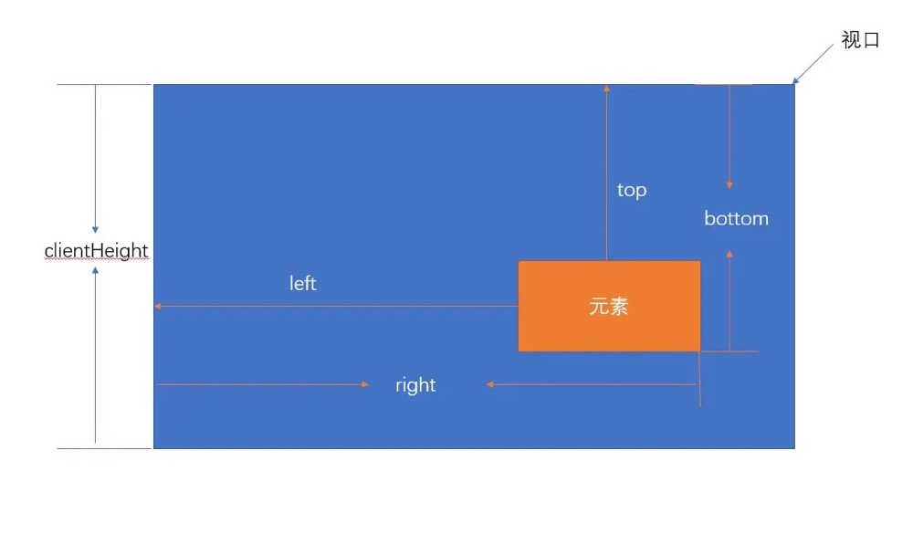

## 异步Promise
(1) 第一小题
```javascript
new Promise(() => {
  throw new Error();
}).then(() => {
	console.log(1);
}).catch(
() => {
	console.log(2);
});
// 2
```

参考：https://es6.ruanyifeng.com/#docs/promise#Promise-prototype-then

```javascript
new Promise(() => {
  throw new Error();
}).then(() => {
  console.log('resolved', 1);
}, () => {
  console.log('reject', 2);
}).catch(() => {
  console.log(3);
}).then(() => {
  console.log(4);
});
// reject 2
// 4
```
上面代码中，第一个promise返回了reject，所以第一个then()调用中会调用第二个回调函数，输出2；如果第一个promise返回了正常的resolved，那么then()调用中会调用第一个回调函数，输出1。
注意then回调里面如果有两个参数，那么不会再调用catch的回调。

```javascript
p.then((val) => console.log('fulfilled:', val))
  .catch((err) => console.log('rejected', err));

// 等同于
p.then((val) => console.log('fulfilled:', val))
  .then(null, (err) => console.log("rejected:", err));
```

一般来说，不要在then方法里面定义 Reject 状态的回调函数（即then的第二个参数），总是使用catch方法。

```javascript
// bad
promise
  .then(function(data) {
    // success
  }, function(err) {
    // error
  });

// good
promise
  .then(function(data) { //cb
    // success
  })
  .catch(function(err) {
    // error
  });
```
(2) 第二小题，文章来源：https://mp.weixin.qq.com/s/zcZwMRg9nymQrp4n6FEldA
```javascript
let p1 = new Promise(()=>{
    setTimeout(()=>{
      console.log(1)
    },1000)
    console.log(2)
  })
console.log(3) // 2 3 1
```

同步任务 -> 微任务 -> 宏任务
```javascript
let p1 = new Promise((resolve,reject)=>{
  console.log(1);
  resolve('浪里行舟')
  console.log(2)
})
// then:设置成功或者失败后处理的方法
p1.then(result=>{
 //p1延迟绑定回调函数
  console.log('成功 '+result)
},reason=>{
  console.log('失败 '+reason)
})
console.log(3)
// 1
// 2
// 3
// 成功 浪里行舟
```

```javascript
let p1=new Promise((resolve,reject)=>{
    resolve(100) // 决定了下个then中成功方法会被执行
})
// 连接p1
let p2=p1.then(result=>{
    console.log('成功1 '+result)
    return Promise.reject(1) 
// 返回一个新的Promise实例，决定了当前实例是失败的，所以决定下一个then中失败方法会被执行
},reason=>{
    console.log('失败1 '+reason)
    return 200
})
// 连接p2 
let p3=p2.then(result=>{
    console.log('成功2 '+result)
},reason=>{
    console.log('失败2 '+reason)
})
// 成功1 100
// 失败2 1
```

```javascript
new Promise(resolve=>{
    resolve(a) // 报错 
// 这个executor函数执行发生异常错误，决定下个then失败方法会被执行
}).then(result=>{
    console.log(`成功：${result}`)
    return result*10
},reason=>{
    console.log(`失败：${reason}`)
// 执行这句时候，没有发生异常或者返回一个失败的Promise实例，所以下个then成功方法会被执行
// 这里没有return，最后会返回 undefined
}).then(result=>{
    console.log(`成功：${result}`)
},reason=>{
    console.log(`失败：${reason}`)
})
// 失败：ReferenceError: a is not defined
// 成功：undefined
```

```javascript
let p1 = Promise.resolve(1)
let p2 = new Promise(resolve => {
  setTimeout(() => {
    resolve(2)
  }, 1000)
})
async function fn() {
  console.log(1); // 同步任务
  // 当代码执行到此行（先把此行），构建一个异步的微任务
  // 等待promise返回结果，并且await下面的代码也都被列到任务队列中
  let result1 = await p2;
  console.log(3); // 等微任务p2 -> 宏任务setTimeout()执行之后才会执行
  let result2 = await p1; // 等微任务p1执行之后才会执行
  console.log(4);
}
fn();
console.log(2); // 同步任务
// 1 2 3 4
```
如果 await 右侧表达逻辑是个 promise，await会等待这个promise的返回结果，只有返回的状态是resolve的情况，才会把结果返回，如果promise是失败状态，则await不会接收其返回结果，await下面的代码也不会在继续执行。

```javascript
let p1 = Promise.reject(100);
async function fn1() {
  let result = await p1;
  console.log(1); //这行代码不会执行
}
```

```javascript

console.log(1); // 同步任务
setTimeout(()=>{console.log(2)},1000); // 宏任务1
async function fn(){
    console.log(3); // 同步任务
    setTimeout(()=>{console.log(4)},20); // 这是20ms，宏任务2
    return Promise.reject();
}
async function run(){
    console.log(5); // 同步任务
    await fn();
    console.log(6); // 不会执行，因为fn最终reject了
}
run()
//需要执行150ms左右
for(let i = 0; i < 90000000; i++){}
// 150ms之后宏任务2已经到点可执行了，所以会先输出4
setTimeout(()=>{
    console.log(7);
    new Promise(resolve=>{
        console.log(8);
        resolve();
    }).then(()=>{console.log(9);})
},0)
console.log(10); // 同步任务
// 1 5 3 10 4 7 8 9 2
```
做这道题之前，读者需明白：
* 基于微任务的技术有 MutationObserver、Promise 以及以 Promise 为基础开发出来的很多其他的技术，本题中resolve()、await fn()都是微任务。
* 不管宏任务是否到达时间，以及放置的先后顺序，每次主线程执行栈为空的时候，引擎会优先处理微任务队列，处理完微任务队列里的所有任务，再去处理宏任务。

接下来，我们一步一步分析：
* 首先执行同步代码，输出 1，遇见第一个setTimeout，将其回调放入任务队列（宏任务）当中，继续往下执行
* 运行run(),打印出 5，并往下执行，遇见 await fn()，将其放入任务队列（微任务）
* await fn() 当前这一行代码执行时，fn函数会立即执行的,打印出3，遇见第二个setTimeout，将其回调放入任务队列（宏任务），await fn() 下面的代码需要等待返回Promise成功状态才会执行，所以6是不会被打印的。
* 继续往下执行，遇到for循环同步代码，需要等150ms,虽然第二个setTimeout已经到达时间，但不会执行，遇见第三个setTimeout，将其回调放入任务队列（宏任务），然后打印出10。值得注意的是，这个定时器 推迟时间0毫秒实际上达不到的。根据HTML5标准，setTimeOut推迟执行的时间，最少是4毫秒。
* 同步代码执行完毕，此时没有微任务，就去执行宏任务，上面提到已经到点的setTimeout先执行，打印出4
* 然后执行下一个setTimeout的宏任务，所以先打印出7，new Promise的时候会立即把executor函数执行，打印出8，然后在执行resolve时，触发微任务，于是打印出9
* 最后执行第一个setTimeout的宏任务，打印出2

```javascript
Promise.resolve(1)
  .then(2)
  .then(Promise.resolve(3))
  .then(console.log);
```
以上代码片段输出结果是什么？
答案：1

解析：`Promise.resolve` 方法的参数如果是一个原始值，或者是一个不具有 `then` 方法的对象，则 `Promise.resolve` 方法返回一个新的 `Promise` 对象，状态为`resolved`，`Promise.resolve` 方法的参数，会同时传给回调函数。
`then` 方法接受的参数是函数，而如果传递的并非是一个函数，它实际上会将其解释为 `then(null)`，这就会导致前一个 `Promise` 的结果会穿透下面。即`resolve(1)`的1会透传到后面的`then`中。

### 手写Promise实现
1. 实现一个Promise类声明
```javascript
class MyPromise(){
  // 构造器
  constructor(executor){
    // 成功
    let resolve = () => {};
    // 失败
    let reject = () => {};
    // 立即执行
    executor(resolve, reject);
  }
}
```
2. 解决基本状态
```javascript
class MyPromise(){
  // 构造器
  constructor(executor){
    // 初始化state为等待状态
    this.state = 'pending';
    // 成功的值
    this.value = undefined;
    // 失败的原因
    this.reason = undefined;
    // 成功
    let resolve = value => {
      // state改变，resolve调用就会失败
      if(this.state === 'pending'){
        // resolve调用之后，state转化为fulfilled成功状态
        this.state = 'fulfilled';
        // 存储成功的值
        this.value = value;
      }
    };
    // 失败
    let reject = reason => {
      // state改变，reject调用就会失败
      if(this.state === 'pending'){
        // reject调用之后，state转化为rejected失败状态
        this.state = 'rejected';
        // 存储失败的原因
        this.reason = reason;
      }
    };
    // 如果executor执行报错，直接reject
    try{
      // 立即执行
      executor(resolve, reject);
    }
    catch(err){
      reject(err);
    }
  }
}
```

3. then方法
```javascript
class MyPromise(){
  constructor(executor){
    // ......同上
  }
  // then方法有两个参数onFulfilled、onRejected
  then(onFulfilled, onRejected){
    // 状态为fulfilled，执行onFulfilled，传入成功的值
    if(this.state === 'fulfilled'){
      onFulfilled(this.value);
    }
    // 状态为rejected，执行onRejected，传入失败的原因
    if(this.state === 'rejected'){
      onRejected(this.reason);
    }
  }
}
```

4. 解决异步实现：类似于发布订阅，先将then里面的两个函数存储起来，由于一个promise可以有多个then，所以存在同一个数组内
成功或失败的时候，forEach调用这些函数
```javascript
class MyPromise(){
  constructor(){
    this.state = 'pending';
    this.value = undefined;
    this.reason = undefined;
    // 成功存放的数组
    this.onResolvedCbs = [];
    // 失败存放的数组
    this.onRejectedCbs = [];
    let resolve = value => {
      if(this.state === 'pending'){
        this.state = 'resolved';
        this.value = value;
        // 一旦resolve执行，调用成功数组的函数
        this.onResolvedCbs.forEach(fn => fn());
      }
    };
    let reject = reason => {
      if(this.state = 'pending'){
        this.state = 'rejected';
        this.reason = reason;
        // 一旦reject执行，调用失败数组的函数
        this.onRejectedCbs.forEach(fn => fn());
      }
    };
    try{
      executor(resolve, reject);
    }
    catch(err){
      reject(err);
    }
  }
  then(onFulfilled, onRejected){
    if(this.state === 'fulfilled'){
      onFulfilled(this.value);
    }
    if(this.state === 'rejected'){
      onRejected(this.reason);
    }
    // 当状态state为pending时
    if(this.state === 'pending'){
      // onFulfilled传入到成功数组
      this.onResolvedCbs.push(() => {
        onFulfilled(this.value);
      });
      // onRejected传入到失败数组
      this.onRejectedCbs.push(() => {
        onRejected(this.reason);
      });
    }
  }
}
```

5. 解决链式调用：
```javascript
class MyPromise(){
  constructor(executor){
    this.state = 'pending';
    this.value = undefined;
    this.reason = undefined;
    this.onResolvedCbs = [];
    this.onRejectedCbs = [];
    let resolve = value => {
      if(this.state === 'pending'){
        this.state = 'fulfilled';
        this.value = value;
        this.onResolvedCbs.forEach(fn => fn);
      }
    };
    let reject = reason => {
      if(this.state === 'pending'){
        this.state = 'rejected';
        this.reason = reason;
        this.onRejectedCbs.forEach(fn => fn);
      }
    };
    try{
      executor(resolve, reject);
    }
    catch(err){
      reject(err);
    }
  }
  then(onFulfilled, onRejected){
    // 声明返回的promise2
    let promise2 = new Promise((resolve, reject) => {
      if(this.state === 'fulfilled'){
        let x = onFulfilled(this.value);
        // resolvePromise函数，处理自己return的promise和默认的promise2的关系，让不同的promise相互套用
        resolvePromise(promise2, x, resolve, reject);
      }
      if(this.state === 'rejected'){
        let x = onRejected(this.reason);
        resolvePromise(promise2, x, resolve, reject);
      }
      if(this.state === 'pending'){
        this.onResolvedCbs.push(() => {
          let x = onFulfilled(this.value);
          resolvePromise(promise2, x, resolve, reject);
        });
        this.onRejectedCbs.push(() => {
          let x = onRejected(this.reason);
          resolvePromise(promise2, x, resolve, reject);
        });
      }
    });
    // 返回promise，完成链式
    return promise2;
  }
}
```

6. 解决其他问题
```javascript
class MyPromise(){
  constructor(executor){
    this.state = 'pending';
    this.value = undefined;
    this.reason = undefined;
    this.onResolvedCbs = [];
    this.onRejectedCbs = [];
    let resolve = value => {
      if(this.state === 'pending'){
        this.state = 'fulfilled';
        this.value = value;
        this.onResolvedCbs.forEach(fn => fn());
      }
    };
    let reject = reason => {
      if(this.state === 'pending'){
        this.state = 'rejected';
        this.reason = reason;
        this.onRejectedCbs.forEach(fn => fn());
      }
    };
    try{
      executor(resolve, reject);
    }
    catch(err){
      reject(err);
    }
  }
  then(onFulfilled, onRejected){
    // onFulfilled如果不是函数，则忽略onFulfilled，直接返回value
    onFulfilled = typeof onFulfilled === 'function' ? onFulfilled : value => value;
    // onRejected如果不是函数，则忽略onRejected，直接抛出错误
    onRejected = typeof onRejected === 'function' ? onRejected : err => {
      throw err;
    };

    let promise2 = new Promise((resolve, reject) => {
      if(this.state === 'fulfilled'){
        // 异步
        setTimeout(() => {
          // try catch处理报错异常
          try{
            let x = onFulfilled(this.value);
            resolvePromise(promise2, x, resolve, reject);
          }
          catch(err){
            reject(err);
          }
        }, 0);
      }
      if(this.state === 'rejected'){
        // 异步
        setTimeout(() => {
          // try catch处理报错异常
          try{
            let x = onRejected(this.reason);
            resolvePromise(promise2, x, resolve, reject);
          }
          catch(err){
            reject(err);
          }
        }, 0);
      }
      if(this.state === 'pending'){
        this.onResolvedCbs.push(() => {
          // 异步
          setTimeout(() => {
            try {
              let x = onFulfilled(this.value);
              resolvePromise(promise2, x, resolve, reject);
            }
            catch(err){
              reject(err);
            }
          }, 0);
        });
        this.onRejectedCbs.push(() => {
          // 异步
          setTimeout(() => {
            try {
              let x = onRejected(this.reason);
              resolvePromise(promise2, x, resolve, reject);
            }
            catch(err){
              reject(err);
            }
          }, 0);
        });
      }
    });
    // 返回promise，完成链式
    return promise2;
  }
}
```

实现`resolvePromise`:

```javascript
function resolvePromise(promise2, x, resolve, reject){
  // 循环引用报错
  if(x === promise2){
    // reject报错
    return reject(new TypeError('Chaining cycle detected for promise'));
  }
  // 防止多次调用
  let called;
  // x不是null 且x是对象或者函数
  if (x != null && (typeof x === 'object' || typeof x === 'function')) {
    try {
      // A+规定，声明then = x的then方法
      let then = x.then;
      // 如果then是函数，就默认是promise了
      if (typeof then === 'function') { 
        // 就让then执行 第一个参数是this   后面是成功的回调 和 失败的回调
        then.call(x, y => {
          // 成功和失败只能调用一个
          if (called) return;
          called = true;
          // resolve的结果依旧是promise 那就继续解析
          resolvePromise(promise2, y, resolve, reject);
        }, err => {
          // 成功和失败只能调用一个
          if (called) return;
          called = true;
          // 失败了就失败了
          reject(err);
        })
      }
      else {
        // 直接成功即可
        resolve(x);
      }
    }
    catch (e) {
      // 也属于失败
      if (called) return;
      called = true;
      // 取then出错了那就不要在继续执行了
      reject(e); 
    }
  }
  else {
    // 如果x是一个普通值，则直接resolve(x)即可
    resolve(x);
  }
}
```

### Promise场景应用题：红绿灯交通重复亮灯
假设有这样一个需求：红灯 3s 亮一次，绿灯 1s 亮一次，黄灯 2s 亮一次；如何让三个灯不断交替重复亮灯？三个亮灯函数已经存在：
```javascript
function red() {
    console.log('red');
}
function green() {
    console.log('green');
}
function yellow() {
    console.log('yellow');
}
```
这道题复杂的地方在于需要“交替重复”亮灯，而不是亮完一遍就结束的一锤子买卖，我们可以通过递归来实现：
```javascript
// 用 promise 实现
let task = (timer, light) => {
  return new Promise((resolve, reject) => {
    setTimeout(() => {
      if (light === 'red') {
        red();
      }
      if (light === 'green') {
        green();
      }
      if (light === 'yellow') {
        yellow();
      }
      // 一定要记得resolve()，否则无法用then()链式调用获取到结果继续调用。
      resolve();
    }, timer);
  })
}
let step = () => {
  task(3000, 'red')
    .then(() => task(1000, 'green'))
    .then(() => task(2000, 'yellow'))
    .then(step)
};
step();
```

同样也可以通过async/await 的实现：
```javascript
let task = (timer, light) => {
  return new Promise((resolve, reject) => {
    setTimeout(() => {
      if (light === 'red') {
        red();
      }
      if (light === 'green') {
        green();
      }
      if (light === 'yellow') {
        yellow();
      }
      resolve();
    }, timer);
  })
}
//  async/await 实现
let step = async () => {
  await task(3000, 'red');
  await task(1000, 'green');
  await task(2000, 'yellow');
  step();
};
step();
```
用 async/await 可以实现用同步代码的风格来编写异步代码

## 和Promise相关的场景题
https://juejin.im/post/5bd697cfe51d454c791cd1d5#heading-21
题目四、五、七，其它题目也多看看

题目：实现 mergePromise 函数，把传进去的数组按顺序先后执行，并且把返回的数据先后放到数组 data 中。
```javascript
const timeout = ms => new Promise((resolve, reject) => {
    setTimeout(() => {
        resolve();
    }, ms);
});

const ajax1 = () => timeout(2000).then(() => {
    console.log('1');
    return 1;
});

const ajax2 = () => timeout(1000).then(() => {
    console.log('2');
    return 2;
});

const ajax3 = () => timeout(2000).then(() => {
    console.log('3');
    return 3;
});

const mergePromise = ajaxArray => {
    // 在这里实现你的代码

};

mergePromise([ajax1, ajax2, ajax3]).then(data => {
    console.log('done');
    console.log(data); // data 为 [1, 2, 3]
});

// 要求分别输出
// 1
// 2
// 3
// done
// [1, 2, 3]
```

解析：首先 ajax1 、ajax2、ajax3 都是函数，只是这些函数执行后会返回一个 Promise，按题目的要求我们只要顺序执行这三个函数就好了，然后把结果放到 data 中，但是这些函数里都是异步操作，想要按顺序执行，然后输出 1，2，3并没有那么简单，看个例子。

```javascript
function A() {
    setTimeout(function () {
        console.log('a');
    }, 3000);
}

function B() {
    setTimeout(function () {
        console.log('b');
    }, 1000);
}

A();
B();

// b
// a
```

例子中我们是按顺序执行的 A，B 但是输出的结果却是 b，a 对于这些异步函数来说，并不会按顺序执行完一个，再执行后一个。 这道题就是考用 Promise 控制异步流程，我们要想办法，让这些函数，一个执行完之后，再执行下一个，看答案吧。

```javascript
// 保存数组中的函数执行后的结果
var data = [];
// Promise.resolve方法调用时不带参数，直接返回一个resolved状态的 Promise 对象。
var sequence = Promise.resolve();
ajaxArray.forEach(item => {
    // 第一次的 then 方法用来执行数组中的每个函数，
    // 第二次的 then 方法接受数组中的函数执行后返回的结果，
    // 并把结果添加到 data 中，然后把 data 返回。
    // 这里对 sequence 的重新赋值，其实是相当于延长了 Promise 链
    sequence = sequence.then(item).then(res => {
        data.push(res);
        return data;
    });
})
// 遍历结束后，返回一个 Promise，也就是 sequence， 他的 [[PromiseValue]] 值就是 data，
// 而 data（保存数组中的函数执行后的结果） 也会作为参数，传入下次调用的 then 方法中。
return sequence;
```
捋完思路自己代码实现的：
```javascript
const mergePromise = ajaxArray => {
    // 在这里实现你的代码
    // dataArr保存ajax执行的结果
    let dataArr = [];
    // 核心思想：使用Promise的链式调用保证执行顺序，用Promise.resolve()模拟链式调用中的第一个链，然后.then.then来保证链式调用。
    // 直接不停的给初始化的第一个链赋值，延长Promise链，保证是：
    // Promise.resolve()
    // .then(ajax1)
    // .then(ajax1的结果 => {})
    // .then(ajax2)
    // .then(ajax2的结果 => {})
    // .then(ajax3)
    // .then(ajax3的结果 => {});
    // 因为ajax返回的直接是一个Promise所以可以创建这样连续的顺序的链式调用
    let chain = Promise.resolve();
    ajaxArray.forEach(fn => {
        chain = chain.then(fn).then(res => {
            dataArr.push(res);
            // return结果之后可以继续链式调用，如果没有return的话，下一个then就会收到null，.then(null)，会导致这个chain执行的结果直接透传到后面 ？？？
            // Promise.resolve(1)
            //   .then(2)
            //   .then(Promise.resolve(3))
            //   .then(console.log); // 输出是1，不是3，因为第一个.then()
            return dataArr;
        });
    });
    // 直接Promise.resolve封装结果返回，保证返回结果也是一个Promise
    // return Promise.resolve(dataArr);
    // 或者直接把链chain返回也行，这样后续还可以在这个链上继续.then延长链式调用
    return chain;
};
```

学习内容参考：6. 实例：按顺序完成异步操作：https://es6.ruanyifeng.com/#docs/async

```javascript
function logInOrder(urls) {
  // 远程读取所有URL
  const textPromises = urls.map(url => {
    return fetch(url).then(response => response.text());
  });

  // 按次序输出
  textPromises.reduce((chain, textPromise) => {
    return chain.then(() => textPromise)
      .then(text => console.log(text));
  }, Promise.resolve());
}
```

```javascript
// async/await的写法
async function logInOrder(urls) {
  // 并发读取远程URL
  const textPromises = urls.map(async url => {
    const response = await fetch(url);
    return response.text();
  });

  // 按次序输出
  for (const textPromise of textPromises) {
    console.log(await textPromise);
  }
}
```

https://www.cnblogs.com/xuning/p/8045946.html
同链接1的第七题

题目：有 8 个图片资源的 url，已经存储在数组 urls 中（即urls = ['http://example.com/1.jpg', ...., 'http://example.com/8.jpg']），而且已经有一个函数 function loadImg，输入一个 url 链接，返回一个 Promise，该 Promise 在图片下载完成的时候 resolve，下载失败则 reject。
但是我们要求，任意时刻，同时下载的链接数量不可以超过 3 个。
请写一段代码实现这个需求，要求尽可能快速地将所有图片下载完成。
```javascript
var urls = [
    'https://www.kkkk1000.com/images/getImgData/getImgDatadata.jpg',
    'https://www.kkkk1000.com/images/getImgData/gray.gif',
    'https://www.kkkk1000.com/images/getImgData/Particle.gif',
    'https://www.kkkk1000.com/images/getImgData/arithmetic.png',
    'https://www.kkkk1000.com/images/getImgData/arithmetic2.gif',
    'https://www.kkkk1000.com/images/getImgData/getImgDataError.jpg',
    'https://www.kkkk1000.com/images/getImgData/arithmetic.gif',
    'https://user-gold-cdn.xitu.io/2018/10/29/166be40ccc434be0?w=600&h=342&f=png&s=122185'
];

function loadImg(url) {
    return new Promise((resolve, reject) => {
        const img = new Image();
        img.onload = function () {
            console.log('一张图片加载完成');
            resolve();
        };
        img.onerror = reject;
        img.src = url;
    });
}
```

解析：
（1）题目的意思是需要我们这么做，先并发请求 3 张图片，当一张图片加载完成后，又会继续发起一张图片的请求，让并发数保持在 3 个，直到需要加载的图片都全部发起请求。
（2）用 Promise 来实现就是，先并发请求3个图片资源，这样可以得到 3 个 Promise，组成一个数组，就叫promises 吧，
（3）然后不断的调用 `Promise.race` 来返回最快改变状态的 Promise，然后从数组（promises）中删掉这个 Promise 对象，再加入一个新的 Promise，直到全部的 url 被取完，
（4）最后再使用 `Promise.all` 来处理一遍数组（promises）中没有改变状态的 Promise。

```javascript
var urls = [
    'https://www.kkkk1000.com/images/getImgData/getImgDatadata.jpg',
    'https://www.kkkk1000.com/images/getImgData/gray.gif',
    'https://www.kkkk1000.com/images/getImgData/Particle.gif',
    'https://www.kkkk1000.com/images/getImgData/arithmetic.png',
    'https://www.kkkk1000.com/images/getImgData/arithmetic2.gif',
    'https://www.kkkk1000.com/images/getImgData/getImgDataError.jpg',
    'https://www.kkkk1000.com/images/getImgData/arithmetic.gif',
    'https://user-gold-cdn.xitu.io/2018/10/29/166be40ccc434be0?w=600&h=342&f=png&s=122185'
];

function loadImg(url) {
    return new Promise((resolve, reject) => {
        const img = new Image();
        img.onload = function () {
            console.log('一张图片加载完成');
            resolve();
        };
        img.onerror = reject;
        img.src = url;
    });
}

// 开始实现
function limitLoad(urls, handler, limit) {
    // 对数组做一个拷贝
    const sequence = [].concat(urls);
    let promises = [];

    //并发请求到最大数
    promises = sequence.splice(0, limit).map((url, index) => {
        // 这里返回的 index 是任务在 promises 的脚标，用于在 Promise.race 之后找到完成的任务脚标，删除当前promise并替换成新的promise
        return handler(url).then(() => {
            return index
        }); 
    });

    // 利用数组的 reduce 方法来以队列的形式执行
    return sequence.reduce((last, url, currentIndex) => {
        return last.then(() => {
            // 返回最快改变状态的 Promise
            return Promise.race(promises)
        }).catch(err => {
            // 这里的 catch 不仅用来捕获 前面 then 方法抛出的错误
            // 更重要的是防止中断整个链式调用
            console.error(err)
        }).then((res) => {
            // 用新的 Promise 替换掉最快改变状态的 Promise
            // return res，直接返回promises中被替换的下标索引res，比如，下标是1，则下一次Promise.race的时候还有可能最快回来的是1，所以一定要把res索引返回出去，否则下一次Promise.race返回的res可能没有1，只有2，3，因为promises[1]函数执行的下标并没有返回。
            promises[res] = handler(sequence[currentIndex]).then(() => { return res });
        })
        // reduce初始化
    }, Promise.resolve())
    .then(() => {
      // 最后再使用 `Promise.all` 来处理一遍数组（promises）中没有改变状态的 Promise。 
        return Promise.all(promises)
    });

}
limitLoad(urls, loadImg, 3)

/*
因为 limitLoad 函数也返回一个 Promise，所以当 所有图片加载完成后，可以继续链式调用

limitLoad(urls, loadImg, 3).then(() => {
    console.log('所有图片加载完成');
}).catch(err => {
    console.error(err);
})
*/
```

捋完思路自己写的代码实现：
```javascript
function limtLoad(urls, fn, limitNum) {
    let cpUrls = urls.slice();
    // 用splice是为了改变原数组cpUrls，如cpUrls初始是8个，limit限制3个，先将3个放入promiseFnArr，剩余的5个等paomiseFnArr中最先回来的替换调已加载完成的，所以后面reduce的时候其实是对后5个的reduce。
    let promiseFnArr = cpUrls.splice(0, limitNum).map((url, index) => {
        fn(url);
        return index;
    });

    return cpUrls.reduce(
        (last, url, index) => {
            return last.then(() => {
                return Promise.race(promiseFnArr);
            })
            .catch(err => {
                console.log(err);
            })
            .then(doneIndex => {
                promiseFnArr[doneIndex] = fn(url).then(doneIndex => doneIndex);
                console.log('三个中最先下载完成的链接索引：', doneIndex);
                console.log('promiseFnArr:', promiseFnArr);
            });
        },
        Promise.resolve()
        )
        .then(() => {
            Promise.all(promiseFnArr);
        });
}
```

同上题，学习内容参考：6. 实例：按顺序完成异步操作：https://es6.ruanyifeng.com/#docs/async

```javascript
function logInOrder(urls) {
  // 远程读取所有URL
  const textPromises = urls.map(url => {
    return fetch(url).then(response => response.text());
  });

  // 按次序输出
  textPromises.reduce((chain, textPromise) => {
    return chain.then(() => textPromise)
      .then(text => console.log(text));
  }, Promise.resolve());
}
```

题目：实现`cacheRequest()`，相同资源ajax只发一次请求。
请实现一个`cacheRequest`方法，保证当前`ajax`（请求相同资源时，此题中相同资源的判断是以`url`为依据），真实网络层中，实际只发出一次请求（假设已经存在`request`方法用于封装`ajax`请求，请求的调用格式为：`request(url, successCallback, failCallback)`）

比如调用方代码（并行请求）如下：
```javascript
// a.js
cacheRequest('/user', data => {
  console.log('我是从A请求中的user，数据为' + data);
})
// b.js
cacheRequest('/user', data => {
  console.log('我是从B请求中的user，数据为' + data);
})
```

解析：核心思路：定义缓存的数据结构；定义设置缓存的方法；真正处理请求的函数，缓存内容在这里设置；缓存请求的回调处理notify；编写缓存请求函数处理请求缓存
```javascript
// 定义缓存数据的结构
// key: {
//     status: '',
//     response: {},
//     promiseCbs: []
// }
function request(url) {console.log(url);}

// Map存储数据结构
let cacheMap = new Map();

// 设置缓存
const setCache = (cacheKey, info) => {
    let objMerge = Object.assign(cacheMap.get(cacheKey) || {}, info);
    cacheMap.set(cacheKey, objMerge);
};

// 缓存请求函数，主要处理请求缓存
function cacheRequest(url) {
    let cacheInfo = cacheMap.get(url);
    if (!cacheInfo) {
        return handleReq(url, cacheKey);
    }
    let status = cacheInfo.status;
    if(status === 'pending'){
        return new Promise((resolves, reject) => {
            cacheInfo.promiseCbs.push(resolves);
            cacheInfo.promiseCbs.push(reject);
        });
    }
    // 缓存的请求失败时，重新发起真实请求
    return handleReq(url, cacheKey)
}

// 真实发请求的函数
function handleReq (url, cacheKey) {
    setCache(cacheKey, {
        status: 'pending',
        response: {},
        promiseCbs: []
    });
    request(url).then(res => {
        setCache(cacheKey, {
            status: 'success',
            response: res
        });
        // 成功之后执行回调
        notify(cacheKey, res);
        return Promise.resolve(res);
    })
    .catch(err) {
        setCache(cacheKey, {
            status: 'fail'
        });
        // 失败也执行回调
        notify(cacheKey, err);
        return Promise.resolve(err);
    }
}

function notify (cacheKey, value) {
    const info = cacheMap.get(cacheKey);
    while(info.promiseCbs.length) {
        const cb = info.promiseCbs.shift()
        // 执行promise回调
        cb(value);
    }
    // 清空resolves和rejects的回调函数
    // 注意status的状态和response无需重置，只需重置请求成功的回调函数数组
    setCache(cacheKey, {promiseCbs: []});
}
```


## 如何将浮点数点数左边的每三位添加一个逗号, 如123456778.123 => 123,456,778.123
https://www.zhuwenlong.com/blog/article/5937f6c85bc74f66e8fc9a53
正则匹配，replace
```javascript
// 将金额转换成千分位表示
milleMoney(element) {
    let milleNum;
    let reg = /(\d{1,3})(?=(\d{3})+$)/g;
    if (element.toString().indexOf('.') !== -1) {
        // 金额是否为小数，如果是小数则根据小数点.来分割整数部分和小数部分
        let elementArr = element.toString().split('.');
        // 如果有小数点需要将整数变成千分位后拼接上“.小数位”
        milleNum = elementArr[0].toString().replace(reg, '$1,') + '.' + elementArr[1];
    }
    else {
        // 如果没有小数点，则直接将数字转成千分位表示
        milleNum = element.toString().replace(reg, '$1,');
    }
    return milleNum;
}
```

```javascript
// 正则解释：整个正则匹配的内容是''，捕获的第二个分组表达式是每三位的数字，且每三位数字不是字符串的开头，所以直接将每三位数字之前的空字符替换成 ","
num.toString().replace(/(?!^)(?=(\d{3})+\.)/g, ",");
```

### 防抖和节流
参考：
https://mp.weixin.qq.com/s/Vkshf-nEDwo2ODUJhxgzVA
https://juejin.im/post/5b7b88d46fb9a019e9767405

#### 防抖（debounce）：
防抖：`debounce`会合并事件且不会去触发事件，当一定时间内没有触发再这个事件时，才真正去触发事件。即将几次操作合并为一次操作。
原理：维护一个计时器，规定在delay时间后触发函数，在delay时间内再次触发就会取消之前的计时器而重新设置，这样保证只有最后一次操作能被触发。
通俗解释：短时间内多次触发同一个事件，只执行最后一次，或者只在开始时执行，中间不执行。
栗子：乘坐公交车，不停地上人，连续上人的过程中司机师傅是不会开车的，只有当最后一个人上车了，公交司机才会开车。如果上一个人启动下，下一个人上车又停车，这样车就会抖得厉害啦，等最后一个人上完车之后再启动，这样就能平稳行驶啦。
应用场景：
1. bjt表单类页面的步骤条的横滑，横滑需要计算向左滚动的距离，使用防抖，在最后停止滑动的时候执行滑动间距计算函数即可，而不需要再每次触发滑动事件监听的时候都执行滑动间距计算函数。减少不必要的、无效的计算，节省资源。
2. bjt表单提交也可以通过防抖处理，保证在一定时间内只触发一次提交请求，防止短时间内多次发送请求，增加服务端压力。
#### 节流（throttle）：
节流：一定时间内只触发一次函数。
原理：通过判断是否到达一定时间来触发函数。
通俗解释：节流是连续触发事件的过程中以一定时间间隔执行函数。节流会稀释你的执行频率，比如每间隔1秒钟，只会执行一次函数，无论这1秒钟内触发了多少次事件。
栗子：
应用场景：
#### 防抖和节流：
<font color="red">函数防抖：</font>只在最后一次事件后才触发一次函数；
<font color="red">函数节流：</font>不管事件触发有多频繁，都会保证在规定时间内一定会执行一次真正的事件处理函数；如：在页面的无限加载场景下，需要用户在滚动页面时，每隔一段时间发一次 Ajax 请求，而不是在用户停下滚动页面操作时才去请求数据。这样的场景，就适合用节流技术来实现。

#### 防抖函数实现：
* 非立即执行版本：非立即执行版的意思是触发事件后函数不会立即执行，而是在 n 秒后执行，如果在 n 秒内又触发了事件，则会重新计算函数执行时间。
* 立即执行版本：立即执行版的意思是触发事件后函数会立即执行，然后 n 秒内不触发事件才能继续执行函数的效果。
* 非立即执行和立即执行结合版：bjt
```javascript
/**
 * @desc 函数防抖
 * @param fn 函数
 * @param delay 延迟执行毫秒数
 * @param imme true 表立即执行，false 表非立即执行
 */
function debounce(fn, delay, imme) => {
    let timer = null;
    return (...args) => {
        if (imme && timer == null) {
            fn(...args);
        }
        clearTimeout(timer);
        timer = setTimeout(args => {
            fn(...args);
            timer = null;
        }, delay, args);
    };
};
```

#### 节流函数的实现
1. 时间戳方式实现节流：时间戳版会在开始时立即执行一次，最后时间间隔内不再执行；
```javascript
function throttle(func, delay) {
    let prev = Date.now();
    let that = this;
    return (...args) => {
        let now = Date.now();
        // 节流函数执行和真正的函数执行时间间隔大于延迟执行的时间，则执行函数
        let remaining = delay - (now - pre);
        if (remaining <= 0) {
            func.apply(that, ...args);
            prev = Date.now();
        }
    }
}
```

2. 定时器方式实现节流：定时器版开始时不执行，最后时间间隔内再执行一次。
```javascript
function throttle(func, delay) {
    let timer = null;
    let that = this;
    return (...args) {
        if (!timer) {
            timer = setTimeout(function(args) {
                func.apply(that, args);
                // 真正的执行函数在执行完成，将计时器timer计时器清空
                timer = null;
            }, delay, args);
        }
    }
}
```

3. 时间戳 + 定时器实现节流
```javascript
function throttle(func, delay) {
    let startTime = Date.now();
    let timer = null;
    let that = this;
    return (...args) {
        let curTime = Date.now();
        let remaining = delay - (curTime - startTime);
        clearTimeout(timer);
        timer = null;
        if (remaining <= 0) {
            func.apply(that, args);
            startTime = Date.now();
        } else {
            timer = setTimeout(func, remaining);
        }
    }
}
```

## 实现瀑布流

## 实现懒加载、预加载
https://juejin.im/post/5b0c3b53f265da09253cbed0
https://juejin.im/post/5bbc60e8f265da0af609cd04

实现懒加载的思路：
1. html中需要懒加载的`img标签`的`src设置缩略图或者不设置src（如src=''）`；
   然后自定义一个属性如下面例子的`data-url`，值为真正的图片或者原图的地址，取值时通过`img元素节点ele.dataset.url`获取；
   并且定义一个类名（比如下面例子的`class="lazy-load"`），表示该图片是需要懒加载的，这有两个作用：
   （1）为以后获取需要懒加载图片的img元素 
   （2）可以给这个类名设置背景图片，作为图片未加载前的过度图片，比如显示为loading的图片。
   注意：设置`img`的class样式时需要给img设置一个高度，否则通过后面的`BoundingClientRect`无法获取判断是否出现在可是区域
   ```css
   .lazy-load {
      background: #666;
      display: block;
      margin-bottom: 50px;
      /* 一定记得设置图片的高度 */
      height: 200px;
   }
   ```

2. 页面加载完后，需要获取所有需要懒加载的图片的元素集合，判断是否在可视区域，如果是在可视区域的话，`设置元素的src属性值为真正图片的地址`。
    关于判断是否出现在可是区域：
    判断是否出现在可视区域内，是通过元素的`getBoundingClientRect`方法获取的`top`值和页面的`clientHeight`进行对比，如果`top`值小于`clientHeight`，则说明元素出现在可视区域了。
`BoundingClientRect`是获取某个元素相对于视窗的位置集合，见下图，注意`bottom`和`right`和我们平时的`bottom`和`right`不一样。


```javascript
// 视口高度，也就是窗口的高度。
const clientHeight = document.documentElement.clientHeight;
// 滚动条偏移文档顶部的高度（也就是文档从顶部开始到可视区域被抹去的高度） + 视口高度
// const scrollHeight = document.documentElement.scrollTop + clientHeight;
```
3. 当用户滚动窗口的时候，遍历所有需要懒加载的元素，通过每个元素的`BoundingClientRect`属性来判断元素是否出现在可视区域内，判断方法同第二步一样。
   `document.addEventListener('scroll', lazyLoad);`
4. 加入防抖、节流函数优化加载性能和体验。
懒加载的实现：以下代码亲测可懒加载
```html
<!DOCTYPE html>
<html lang='en'>
    <head>
        <meta charset='UTF-8'>
        <title>图片的延迟加载（懒加载）</title>
    <head>
    <body>
        <!-- lazyload属性不能少-->
        <!-- 为啥用百度链接的图作为data-url值不会加载图片，是因为请求参数的原因么？ -->
        
        
        
        
        
        
        
        
        
        
        
        
        
        
    </body>
    <style>
        .lazy-load {
            background: #666;
            display: block;
            margin-bottom: 50px;
            /* 一定记得设置图片的高度 */
            height: 200px;
        }
    </style>
    <script>
        function lazyLoad() {
            // 测试懒加载demo也可以用如下方式获取需要懒加载的元素，但实际项目中最好不要这样获取，因为可能不需要懒加载的元素也会用lazy-load作为class名称
            // let imgNodes = document.querySelectorAll('.lazy-load');
            // 通过这种方式获取哪些需要实现懒加载的元素更可靠，因为有lazyload属性和data-url属性
            let imgNodes = document.querySelectorAll('img[lazyload][data-url]');
            // 获取视口的高度
            let viewH = document.documentElement.clientHeight;
            [].slice.call(imgNodes).forEach(ele => {
                if (!ele.dataset.url) {
                    return;
                }
                // 用于获得页面中某个元素的左上，右下分别相对浏览器视窗顶部的位置（距离）
                let eleH = ele.getBoundingClientRect();
                if (eleH.top <= viewH) {
                  let imgUrl = ele.dataset.url;
                  // 如果直接设置ele.src = imgUrl;src的地址会是和data-url一样的相对路径
                  // ele.src = imgUrl;
                  let img = new Image();
                  img.src = imgUrl;
                  img.onload = function () {
                      // 用img.src赋值给ele.src可以生成绝对路径
                      ele.src = img.src;
                      console.log('图片懒加载成功！');
                  };
                  // 移除属性，下次不再遍历
                  ele.removeAttribute('lazyload');
                  ele.removeAttribute('data-url');
                }
            });
        }
        // 开始还没滚动屏幕时，要先触发一次函数，初始化首页的页面图片
        lazyLoad();
        // 这里可以添加防抖和节流，优化性能
        document.addEventListener('scroll', lazyLoad);
    </script>
<html>
```

### 预加载：
通过rel="preload"进行内容预加载：
https://developer.mozilla.org/zh-CN/docs/Web/HTML/Preloading_content
https://juejin.im/post/5a7fb09bf265da4e8e785c38

`<link>`标签的 `rel` 属性的属性值`preload`能够在HTML页面（`当前页面`）中 `<head>`元素内部书写一些声明式的资源获取请求，可以指明`哪些资源是在页面加载完成后即刻需要的`。`对于这种即刻需要的资源，你可能希望在页面加载的生命周期的早期阶段就开始获取，在浏览器的主渲染机制介入前就进行预加载`。这一机制`使得资源可以更早的得到加载并可用，且更不易阻塞页面的初步渲染，进而提升性能`。
`<link>`标签关于预加载的配置：
`href`属性：指定需要被预加载资源的`资源路径`。
`as`属性：指定需要被预加载资源的`资源类型`。如音频文件`viedo`、视频文件`audio`、`js`文件、`style`样式文件等。
`crossorigin`属性：跨域预加载资源，`anonymous`\\`use-credentials`

`preload` 还有许多其他好处。
使用 as 来指定将要预加载的内容的类型，将使得浏览器能够：
* 更精确地优化资源加载优先级。
* 匹配未来的加载需求，在适当的情况下，重复利用同一资源。
* 为资源应用正确的内容安全策略。
* 为资源设置正确的 Accept 请求头。

其它预加载机制：
`<link rel="prefetch">`：预获取一些资源，以备下一个导航/页面使用（比如，当你去到`下一个页面`时）。`但对当前的页面并没有什么助益`。此外，浏览器会给使用prefetch的资源一个相对较低的优先级——与使用preload的资源相比。

## 实现postMessage跨域

## 加载一个很长的列表怎么性能优化？

## 场景题，考察事件代理，事件监听，DOM自定义属性等
### 题目描述：
网页中有一个元素A，它有个data-href属性，里面存放一个链接地址
实现一个函数，当任意点击时，如果点击的元素就是A或其上层节点中找到A，则进行链接跳转

实现思路：
首先给window添加点击事件的监听，然后先声明一个中间变量targetNode记录节点
然后循环判断当前节点targetNode是否存在data-href属性
如果存在则进行跳转，break。不存在则将该节点的父节点赋值给targetNode
一直循环到判断targetNode是最外层节点为止

```javascript
window.addEventListener('click', (e) => {
    let targetNode = e.target
    while (targetNode !== document) { // 只要当前节点不是最外层document
        console.log(targetNode)
        if (targetNode.hasAttributes('data-href')) {
            window.open(targetNode.dataset.href)
            break
        } else { // 没找到就继续往上找
            targetNode = targetNode.parentNode
        }
    }
})
```

### 题目描述：实现点击li弹出内容，并且动态添加li元素之后有效 ——> 事件委托

## 如何实现对一个DOM元素的深拷贝，包括元素的绑定事件？
```javascript
// 方法1：
//使用cloneNode，但是在元素上绑定的事件不会拷贝
function clone(origin) {
    return Object.assign({}, origin);
}

// 方法2：
//实现了对原始对象的克隆，但是只能克隆原始对象自身的值，不能克隆她继承的值，如果想要保持继承链，可以采用如下方法：
function clone(origin) {
    // 获取源节点的原型
    let originProto = Object.getPrototypeOf(origin);
    // Object.created(A)：创建一个空对象obj，并且让空对象obj作为A对象所属构造函数的实例（obj._proto_=A），即将A作为obj对象的原型对象
    return Object.assign(Object.create(originProto), origin);
}
```

