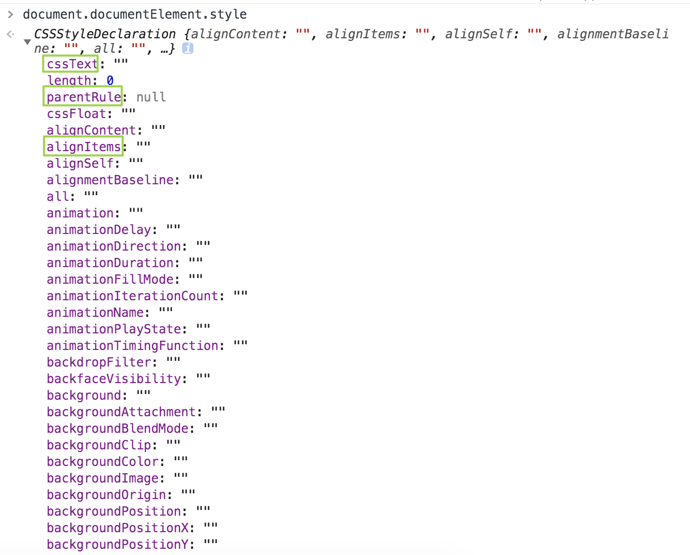

## 1. 获得查询字符串中的每一项
```javascript
 function getQueryStringArgs(){
    //取得查询字符串并去掉开头的问好
    var qs = (location.search.length > 0 ? location.search.substring(1) : ""), // 'name=mm&id=123&q=word'
    //保存数据的对象
    args = {},
    //取得每一项
    items = qs.length ? qs.length("&") : [], // ['name=mm', 'id=123', 'q=word']
    item = null,
    name = null,
    value = null,
    //逐个将每一项添加到args对象中
    for(let i=0; i<items.length; i++){
        item = item[i].split("="); // [name, mm]
        name = decodeURIComponent(item[0]); // name = name
        value = decodeURIComponent(item[1]); // value = mm
        //聪明的条件判断
        if (name.length){
            args[name] = value; // {name: mm}
        }
    }
    return args;
}
```

## 2. js模拟map
map结构：key => value

```javascript
// 用JS模拟JAVA中的map
function Map(){
    // this是map的实例对象
    // 将K-V对存入容器
    this.put = function(key, value) {
        var obj = {}; // 用空对象作为容器来存放K-P对
        obj[key] = value; // 把键值K-V绑定到obj对象上
    };
    // 获得map容器的个数
    this.size = function() {
        var count = 0;
        for(attr in obj){ // 为了严谨起见，还应该判断一下attr是不是obj自己的属性obj.hasOwnProperty(attr)
            count++;
        }
        return count;
    };
    // get方法，根据key取得value
    this.get = function(key) {
        // 要考虑自动转换的情况，作严谨的判断，对于属性值为特殊0和false特殊情况也需要兼容处理，return返回
        if(obj[key] || obj[key] === 0 || obj[key === false]){
            return obj[key];
        } else {
            return null;
        }
    };
    // remove删除方法
    this.remove = function(key) {
        if(obj[key] || obj[key] === 0 || obj[key === false]){
            delete obj[key];
        }
    };
    // eachMap 遍历map容器方法,遍历key:value。参数是回调函数函数
    this.eachMap = function(fn){
        for(var attr in obj){
            fn(attr, obj[attr]); // 直接执行一下回调函数
        }
    };
}

var m = new Map();
m.put('01','mm');
m.put('02','zz');
console.log(m.size());
console.log(m.get('01'));
m.remove('01');
m.get('01');
m.eachMap(
    // 传入一个函数
    function(key, value) {
        console.log(key + ':' + value)
    }
);
```

## 3. 写一个实现继承的方法
如果一个对象本身部署了__proto__属性，该属性的值就是对象的原型。
实例对象有一个__proto__属性，指向该实例对象对应的原型对象。
### 继承（一）：采用原型链的概念实现继承
```javascript
    /*
     * 构造函数 原型对象 实例对象
     * 1.构造函数.prototype = 原型对象
     * 2.原型对象.constructor = 构造函数模板
     * 3.原型对象.isPrototypeOf(实例对象)  判断实例对象的原型是不是当前对象
     * 4.构造函数 实例对象 （类和实例）
     * 5.Object.getPrototypeOf(实例对象)  获取实例对象上的方法
     */

    // 父类构造函数 sup
    function Sup(name) {
        this.name = name;
    }

    // 父类的原型对象
    // 构造函数.prototype = 原型对象
    Sup.prototype = {
        constructor: Sup, // 注意这里要指明constructor是Sup，将原型对象.constructor = 构造函数关联起来
        sayName : function(){
            console.log(this.name);
        }
    }

    // 子类的构造函数sub
    function Sub(age){
        this.age = age;
    }

    /* 
     * 如果我们让原型对象等于另一个类型的实例，结果会怎么样呢？
     * 如果我们让子类的原型对象等于父类的实例，结果会怎么样呢？（实现了js的继承）
     * 1.显然此时的原型对象将包含一个指向另一个原型的指针
     *   Sup的实例对象 和 Sup的原型对象 有一个关系
     * 2.相应的另一个原型中也包含着一个指向另一个构造函数的指针
     *   Sub.prototype = new Sup('张三')；语句可以理解成：可以把子类的原型对象看成是父类的一个实例对象,而父类的实例对象与父类的原型对象有一个关联关系，从而产生了继承和链的抽象关系，即原型链的关系
     * console.log(Sub.prototype.constructor); // 子类构造函数本身Sub() 
     *   子类的原型对象的构造器变成了父类的构造器
     */
    Sub.prototype = new Sup('张三');
    // console.log(Sub.prototype.constructor); // 父类的构造函数Sup()
    
    //原型链寻找的过程：子类的实例——>子类的原型对象——>父类的实例对象——>父类的原型对象
    var sub1 = new Sub();
    console.log(sub1.name); // 张三 子类的对象继承了父类的属性
    sub1.sayName(); // 张三 子类对象继承了父类原型上的方法
```

### 继承（二）：
#### 1）原型继承（父类构造函数new一个实例对象赋值给子类的原型对象）
原型继承的特点：即继承了父类的构造函数（模板）（父类实例对象的所有属性如name、age、sayName()方法等），又继承了父类的原型对象。
继承已经实现了(可以把`子类的原型对象`看成是`父类的一个实例对象`，而`父类的实例对象`与`父类的原型对象`有一个关联关系，从而产生了继承和链的抽象关系)

```javascript
// 父类
function Person(name, age) {
    this.name = name;
    this.age = age;
}

// 父类的原型对象属性
Person.prototype.id = 10;

// 子类
function Boy(sex){
    this.sex = sex;
}

// 父类构造函数传递参数的情况
Boy.prototype = new Person('z3');

var b = new Boy();
console.log(b.age); // undefined 因为将父类实例赋值给子类原型对象的时候没有传age
console.log(b.name); // z3 Boy子类的实例对象已经拥有父类中的name属性，因为已经继承了
console.log(b.id); // 10 原型链的寻找过程：子类的实例——>子类的原型对象——>父类的实例对象——>父类的原型对象
for (attr in b){
    console.log(attr); // name age sex id
}
```
### 2）类继承（借用构造函数的方式继承）（借用`call` 、`apply`的方式继承）：只继承模板（即构造函数），不继承原型对象。
缺点：不会继承父类构造函数的原型对象

父类构造函数不传递参数，在子类构造函数new一个对象的时候传递参数

```javascript
// 父类
function Person(name, age) {
    this.name = name;
    this.age = age;
}

// 父类的原型对象属性
Person.prototype.id = 10;

//子类
function Boy(name, age, sex){
    // call  apply 
    Person.call(this, name, age); // 接收父类的name 和 age属性  但是原型对象的属性没有继承。
    this.sex = sex;
}

var b = new Boy("张三", 20, "男");
console.log(b.name); // 张三
console.log(b.age); // 20
console.log(b.sex); // 男

console.log(b.id); // undefined  此时父类的原型对象没有继承  只是把父类的构造函数绑定到子类的构造函数中。

for (attr in b){
    console.log(attr); // name age sex
}
```

### 3）原型继承 + 借用构造函数式继承 = 混合继承
混合继承共做了三件事：继承了 2次 父类的模板（即构造函数），继承了一次父类的原型对象
缺点：继承了两次父类的模板，降低了执行效率
```javascript
// 父类
function Person(name, age) {
    this.name = name;
    this.age = age;
}

// 父类的原型对象属性
Person.prototype.id = 10;
Person.prototype.sayName = function(){
    console.log(this.name);
}

// 子类
function Boy(name, age, sex){
    // call  apply 
    // 第一步：借用构造函数继承————只继承父类的模板
    Person.call(this, name, age); // 接收父类的name 和 age属性  但是原型对象的属性没有继承   注意：如果把这句话注释掉，然后执行console.log(b.name);//undefined
    this.sex = sex;
}

// 第二步： 原型继承————继承父类的原型
// 不传递参数：（只产生了一个关联关系）只剩下 父类的实例 和 父类的原型对象的关系了
Boy.prototype = new Person(); // 这行代码的目的就是为了继承父类的原型对象  说明这里还是继承了一遍父类的模板，并没有因为没传递参数就完全屏蔽掉父类的模板，b.name为undefined是因为子类构造函数中没有接收父类传递过来的name属性

var b = new Boy("张三", 20, "男");
console.log(b.name); // 张三
console.log(b.sex); // 男
console.log(b.id); // 10 
b.sayName(); // 张三
for (attr in b){
    console.log(attr); // name age sex id sayName
}
```

## 4. 实现一个闭包
参考mdn、closure.md
```javascript
function makeAdder(x) {
  return function(y) {
    return x + y;
  };
}

var add5 = makeAdder(5);
var add10 = makeAdder(10);

console.log(add5(2));  // 7
console.log(add10(2)); // 12
```

## 5. 找出数组中的最大值
方法一：`Math.max.apply(null, arr)`
```javascript
var arr = [6, 4, 1, 8, 2, 11, 3];
console.log(Math.max.apply(null, arr)); // 11
```

方法二：`Math.max(...arr)`
```javascript
var arr = [6, 4, 1, 8, 2, 11, 3];
console.log(Math.max(...arr)); // 11
```

方法三：利用数组的`reduce`方法
```javascript
var arr = [6, 4, 1, 8, 2, 11, 3];
console.log(arr.reduce((max, item) => Math.max(max, item))); // 11
```

## 6. 驼峰命名和下划线的转换
### 1） 驼峰命名转下划线
```javascript
var str = 'javaScriptStudy';
str = str.replace(/([A-Z])/g, '-$1').toLowerCase();
console.log(str); // java-script-study"
```

### 2) 下划线转驼峰
```javascript
var str = 'java-script-study';
var reg = /\-(\w)/g; // \w 数字、字母、下划线
str = str.replace(reg, function(arr, letter){
    return letter.toUpperCase();
});
console.log(str); // "javaScriptStudy"
```

## 7. 用正则交换单词的顺序
```javascript
var str = 'hello world';
var reg = /(\w*)\s(\w*)/;
str = str.replace(reg, '$2 $1'); // 单词之间的连接符号是啥，替换返回的时候就用什么符号连接，如果是'hello,world'，那返回就是'$2,$1'，即world,hello
console.log(str); // world hello
```

## 8.原生js判断浏览器是否支持某个css属性
`document.documentElement.style`获取浏览器支持的样式属性
获取到支持的属性如下：带横线的属性需要转成驼峰命名才能找到属性



```javascript
if(attr in document.documentElement.style){
    return true;
}
else {
    return false;
}
```

```javascript
'color' in document.documentElement.style
true
'name' in document.documentElement.style
false
```

`注意：`带横线的属性需要使用首字母小写的驼峰命名法，判断是否支持 text-shadow

```javascript
function hasCss(attr) {
    attr = attr.replace('/\-(\w)/g', function(match, p1){
        return p1.toUpperCase();
    })
    return attr in document.documentElement.style;
}
console.log(hasCss('text-shadow')); // true
console.log(hasCss('color')); // true
console.log(hasCss('ha-ha')); // false
```

带浏览器hack前缀的写法：前缀包括：`webkit`（Chrome、Safari）、`moz`（firefox）、`o`（opera）、`ms`（IE\Edge）
需要将hack前缀都转成驼峰方式，拼接属性之后如：`webkitLineClamp`、`-moz-animation`
```javascript
'mozTransform' in document.documentElement.style  
'webkitTransform' in document.documentElement.style  
'oTransform' in document.documentElement.style 
'msTransform' in document.documentElement.style
```

## 9. js的深拷贝和浅拷贝
### 什么是深拷贝？ 拷贝实例
深拷贝是开辟一块新的内存地址，将原对象的各个属性逐个复制进去。对拷贝对象和源对象各自的操作互不影响。

深拷贝的实现

1.使用JSON转换可以深拷贝一个对象，但是继承的属性会丢失

```javascript
// 将对象转换成JSON字符串又转换成JSON对象
let h = JSON.parse(JSON.stringify(a));
```

2.直接写一个深拷贝的方法
```javascript
//深拷贝
function deepCopy(obj) {
    // string、number、boolean、null、undefined没有深拷贝一说
    // 只有对象类型的如：Object、Array、Function才需要考虑深拷贝
    if(typeof obj !== 'object'){
        return;
    }
    // 初始化新开辟的内存空间时需要判断下是存储对象还是数组
    // 或者通过 var newO = Array.isArray(obj) ? [] : {};
    var newO = obj instanceof Array ? [] : {};
    // for in可以遍历到继承的可枚举属性
    for(let key in obj) {
        // 拷贝只拷贝对象自身的属性即可
        if(obj.hasOwnProperty(key)){
            //深拷贝的关键代码：如果对象的属性值仍然是一个引用类型的值，则进行递归，否则直接赋值给新对象
            newO[key] = typeof obj[key] === 'object' ? deepCopy(obj[key]) : obj[key];
        }
    }
    return newO;
}

var testObj = {
    obj1: {
        obj2: {
            name: 'llmm',
            sex: 'girl'
        }
    },
    school: 'dlut',
    age: 16
};

var copyObj = depCopy(testObj);
console.log('深拷贝之后的对象：', copyObj);

testObj.school = 'ncu';
console.log('改变原对象的属性值：', testObj);
console.log('改变原对象之后的拷贝对象：', copyObj);

copyObj.age = 20;
console.log('改变拷贝对象属性：', copyObj);
console.log('改变拷贝对象之后的原对象：', testObj);

// 深拷贝之后的对象： { obj1: { obj2: { name: 'llmm', sex: 'girl' } },
//   school: 'dlut',
//   age: 16 }
// 改变原对象的属性值： { obj1: { obj2: { name: 'llmm', sex: 'girl' } },
//   school: 'ncu',
//   age: 16 }
// 改变原对象之后的拷贝对象： { obj1: { obj2: { name: 'llmm', sex: 'girl' } },
//   school: 'dlut',
//   age: 16 }
// 改变拷贝对象属性： { obj1: { obj2: { name: 'llmm', sex: 'girl' } },
//   school: 'dlut',
//   age: 20 }
// 改变拷贝对象之后的原对象： { obj1: { obj2: { name: 'llmm', sex: 'girl' } },
//   school: 'ncu',
//   age: 16 }

// 继承的方法仍然拷贝到新对象中
console.log(copyObj.toString); // [Function: toString]
console.log(testObj.toString); // [Function: toString]
```

### 什么是浅拷贝？ 拷贝引用
浅拷贝会导致 obj1 和obj2 指向同一块内存地址。改变了其中一方的内容，但是在原来的内存上做修改会导致拷贝对象和源对象都发生改变

浅拷贝的实现：

1. 使用Array的这些方法：`Array.prototype.slice()`、`Array.prototype.concat()`、`扩展运算符（...）`、`Array.from()`都会返回一个数组或者对象的浅拷贝

注意：对字符串、数值、布尔值基础类型可以实现类似的深拷贝（实质上仍然是浅拷贝），但是对于引用类型的值，只会拷贝引用到新的对象中，是浅拷贝，改变了被引用的元素会改变拷贝的新对象。

例子：

使用slice()
```javascript
> var arr1 = [1,2,3,6,9];
> var arr4 = arr1.slice()
> arr4
[ 1, 2, 3, 6, 9 ]
> arr4[3] = "lmy"
'lmy'
> arr4
[ 1, 2, 3, 'lmy', 9 ]
> arr1
[ 1, 2, 3, 6, 9 ]
```

使用concat的例子
```javascript
> arr1
[ 1, 2, 3, 6, 9 ]
> var arr5 = arr1.concat()
undefined
> arr5
[ 1, 2, 3, 6, 9 ]
> arr5[1]="zz"
'zz'
> arr5
[ 1, 'zz', 3, 6, 9 ]
> arr1
[ 1, 2, 3, 6, 9 ]
```

使用ES6新增的Array.from()
```javascript
> var arr1 = [1,2,3,6]
> var arr2 = Array.from(arr1)
> arr2
[ 1, 2, 3, 6 ]
> arr2[1]=5
5
> arr2
[ 1, 5, 3, 6 ]
> arr1
[ 1, 2, 3, 6 ]
```

使用ES6新增的扩展运算符（...）

```javascript
> var arr1 = [1,2,3,6,9];
undefined
> var arr3 = [...arr1]
undefined
> arr3
[ 1, 2, 3, 6, 9 ]
> arr3[2] = "mm";
'mm'
> arr3
[ 1, 2, 'mm', 6, 9 ]
> arr1
[ 1, 2, 3, 6, 9 ]
```
2.手写一个实现浅拷贝的方法
```javascript
//浅拷贝
function shallowCopy(obj) {
    if(typeof obj !== 'object') {
        return;
    }
    var newObj = obj instanceof Array ? [] : {};
    for (var key in obj){
        if(obj.hasOwnProperty(key)){
            newObj[key] = obj[key]; // 拷贝对象的引用，直接赋值，不需要递归拷贝
        }
    }
    return newObj;
}

var testObj = {
    obj1: {
        obj2: {
            name: 'llmm',
            sex: 'girl'
        }
    },
    school: 'dlut',
    age: 16
};

var copyObj = shallowCopy(testObj);
console.log('浅拷贝之后的对象：', copyObj);

testObj.obj1.obj2.sex = 'boy';
console.log('改变原对象的属性值：', testObj);
console.log('改变原对象之后的拷贝对象：', copyObj);

copyObj.obj1.obj2.name = 'zy';
console.log('改变拷贝对象属性：', copyObj);
console.log('改变拷贝对象之后的原对象：', testObj);

// 浅拷贝之后的对象： { obj1: { obj2: { name: 'llmm', sex: 'girl' } },
//   school: 'dlut',
//   age: 16 }
// 改变原对象的属性值： { obj1: { obj2: { name: 'llmm', sex: 'boy' } },
//   school: 'dlut',
//   age: 16 }
// 改变原对象之后的拷贝对象： { obj1: { obj2: { name: 'llmm', sex: 'boy' } },
//   school: 'dlut',
//   age: 16 }
// 改变拷贝对象属性： { obj1: { obj2: { name: 'zy', sex: 'boy' } },
//   school: 'dlut',
//   age: 16 }
// 改变拷贝对象之后的原对象： { obj1: { obj2: { name: 'zy', sex: 'boy' } },
//   school: 'dlut',
//   age: 16 }
```

## 10. 实现二分查找：输入的数组必须是一个已经排好序的数组，如果未排序，则先进行排序

如果找到目标值，则返回目标值在数组中的下标。
算法的核心是通过移动左右下标指针来实现的，不管是非递归实现还是递归实现，都是通过移动`low`和`high`来实现的。

非递归实现

```javascript
function binSearch(arr, target){
    let low = 0;
    let high = arr.length - 1;
    while(low <= high) {
        // 注意这个mid取值是根据low和high的平均值来取值的，且要放在while循环里，每次更新low和high之后才会重新计算mid
        let mid = Math.floor((low + high) / 2);
        if (arr[mid] === target) {
            return mid;
        }
        else if (arr[mid] < target) {
            low = mid + 1;
        }
        else {
            high = mid - 1;
        }
    }
    return -1;
}
let res = binSearch([1, 3, 5, 8, 9], 3);
console.log(res); // 1
```

递归实现
```javascript
function binSearch(arr, low, high, target){
    if(low > high) {
        return -1;
    }
    let mid = Math.floor((low + high) /2);
    if (arr[mid] == target) {
        return mid;
    }
    else if (arr[mid] < target) {
        low = mid + 1;
        return binSearch(arr, low, high, target);
    }
    else {
        high = mid - 1;
        return binSearch(arr, low, high, target);
    }
}
let res = binSearch([1, 3, 5, 8, 9], 0, 4, 3);
console.log(res); // 1
```

## 11. 实现二叉树的广度优先搜索
* 深度优先不需要记住所有的节点, 所以占用空间小, 而广度优先需要先记录所有的节点占用空间大；
* 深度优先有回溯的操作(没有路走了需要回头)所以相对而言时间会长一点；

* 深度优先采用的是堆栈的形式, 即先进后出；
* 广度优先则采用的是队列的形式, 即先进先出；

```javascript
// 构造一棵二叉树
function BinTree(value, left, right) {
    this.value = value;
    this.left = left;
    this.right = right;
}

// 注意构造节点的顺序是先构造子节点，再构造父节点。
var node6 = new BinTree('6', '', '');
var node5 = new BinTree('5', '', '');
var node4 = new BinTree('4', '', '');
var node3 = new BinTree('3', node6, '');
var node2 = new BinTree('2', node4, node5);
var node1 = new BinTree('1', node2, node3);

function bfs(node) {
    if (!node){
        console.log("this is an empty tree");
        return;
    }
    var que = [];
    que.push(node);
    // 当que数组非空的时候继续while循环
    while(que.length){
        // 注意是shift，从第一个元素开始打印
        var tmpNode = que.shift();
        console.log(tmpNode.value);
        if (tmpNode.left) {
            que.push(tmpNode.left);
        }
        if (tmpNode.right) {
            que.push(tmpNode.right);
        }
    }
}

bfs(node1); // 1 2 3 4 5 6
```

## 12. 实现二叉树的深度优先搜索
### 1) 递归实现
```javascript
// 构造一棵二叉树
function BinTree(value, left, right) {
    this.value = value;
    this.left = left;
    this.right = right;
}

// 注意构造节点的顺序是先构造子节点，再构造父节点。
var node6 = new BinTree('6', '', '');
var node5 = new BinTree('5', '', '');
var node4 = new BinTree('4', '', '');
var node3 = new BinTree('3', node6, '');
var node2 = new BinTree('2', node4, node5);
var node1 = new BinTree('1', node2, node3);

// 递归实现
function depSearch(node) {
    if (!node){
        console.log("this is an empty tree");
        return;
    }
    var que = [];
    que.push(node);
    while(que.length) {
        var tmpNode = que.pop();
        console.log(tmpNode.value);
        if(tmpNode.left) {
            depSearch(tmpNode.left);
        }
        if (tmpNode.right) {
            depSearch(tmpNode.right);
        }
    }
}

depSearch(node1); // 1 2 4 5 3 6

// 非递归实现，构造二叉树的方式需要改改，带children的形式
```

## 13.ES6 模块与 CommonJS 模块的差异
* CommonJS 模块输出的是一个值的拷贝；ES6 模块输出的是值的引用；
* CommonJS 模块是运行时加载；ES6 模块是编译时输出接口；
* CommonJS 模块的顶层this指向当前模块；ES6 模块顶层的this指向undefined；
* CommonJs 是单个值导出，ES6 Module可以导出多个；
* CommonJs 是动态语法可以写在判断里，ES6 Module 静态语法只能写在顶层；

## 14. VDOM 和真实 DOM 的区别和优化：
* 虚拟 DOM 不会立马进行排版与重绘操作；
* 虚拟 DOM 进行频繁修改，然后一次性比较并修改真实 DOM 中需要改的部分，最后在真实 DOM 中进行排版与重绘，减少过多DOM节点排版与重绘损耗；
* 虚拟 DOM 有效降低大面积真实 DOM 的重绘与排版，因为最终与真实 DOM 比较差异，可以只渲染局部；

## 15.安全性问题，常见的网站漏洞？
### XSS(Cross Site Scripting)：跨站点脚本攻击，可理解为一种js代码注入的攻击方式。比如img的src属性是不受同源策略限制的。
利用漏洞提交恶意 JavaScript 代码，比如在input, textarea等所有可能输入文本信息的区域，输入`<script src="http://恶意网站"></script>`等，提交后信息会存在服务器中，当用户再次打开网站请求到相应的数据，打开页面，恶意脚本就会将用户的 Cookie 信息等数据上传到黑客服务器。

防止XSS攻击的技术：
1. 转义、过滤内容（比如表单提交内容的过滤），前后端都需要处理这些过滤，达到双重保证。
   `<script>`转义成`&lt;script&gt;`


### CSRF（Cross-Site Request Forgery）：跨站请求伪造
引诱用户打开黑客的网站，在黑客的网站中，利用用户的登录状态发起的跨站请求。

`CSRF通常是跨域的`，因为外域通常更容易被攻击者掌控。但是如果本域下有容易被利用的功能，比如可以发图和链接的论坛和评论区，攻击可以直接在本域下进行，而且这种攻击更加危险

发起CSFR攻击的三个必要条件：
* 目标站点一定要有 CSRF 漏洞；
* 用户要登录过目标站点，并且在浏览器上保持有该站点的登录状态；
* 需要用户打开一个第三方站点，如黑客的站点等。
* 受害者登录a.com，并保留了登录凭证（Cookie）。

栗子：
攻击者引诱受害者访问了b.com。
b.com 向 a.com 发送了一个请求：a.com/act=xx。浏览器会…
a.com接收到请求后，对请求进行验证，并确认是受害者的凭证，误以为是受害者自己发送的请求。
a.com以受害者的名义执行了act=xx。
攻击完成，攻击者在受害者不知情的情况下，冒充受害者，让a.com执行了自己定义的操作。

类型：
1. GET类型的CSRF:
GET类型的CSRF利用非常简单，只需要一个HTTP请求，一般会这样利用：
```javascript
  
```
在受害者访问含有这个img的页面后，浏览器会自动向`http://bank.example/withdraw?account=xiaoming&amount=10000&for=hacker`发出一次HTTP请求。`bank.example`就会收到包含受害者登录信息的一次`跨域请求`。

2. POST类型的CSRF：通常使用的是一个自动提交的表单
```html
 <form action="http://bank.example/withdraw" method=POST>
    <input type="hidden" name="account" value="xiaoming"/>
    <input type="hidden" name="amount" value="10000"/>
    <input type="hidden" name="for" value="hacker"/>
</form>
<script> document.forms[0].submit(); </script>
```
访问该页面后，表单会自动提交，相当于模拟用户完成了一次POST操作。

3. 链接类型的CSRF
链接类型的CSRF并不常见，比起其他两种用户打开页面就中招的情况，这种需要用户点击链接才会触发。这种类型通常是在论坛中发布的图片中嵌入恶意链接，或者以广告的形式诱导用户中招，攻击者通常会以比较夸张的词语诱骗用户点击，例如：
```html
<a href="http://test.com/csrf/withdraw.php?amount=1000&for=hacker" taget="_blank">重磅消息！！<a/>
```
由于之前用户登录了信任的网站A，并且保存登录状态，只要用户主动访问上面的这个PHP页面，则表示攻击成功。

解决方案：
1. 阻止不明外域的访问
   * 同源检测
   * `Samesite Cookie`
    `Samesite`标明这个 Cookie是个`“同站 Cookie”`，同站Cookie只能作为第一方Cookie，不能作为第三方Cookie，Samesite 有两个属性值，分别是 Strict 和 Lax
    `Samesite=Strict`：表明这个 Cookie 在任何情况下都不可能作为第三方 Cookie，绝无例外。
2. 提交时要求附加本域才能获取的信息
   * CSRF Token
   * 双重Cookie验证

### SQL注入
试图在目标网站使用的数据库上执行操作的攻击类型。通常是发送一个SQL请求，希望服务器能够执行。

### DNS劫持
### https中间人劫持


## 事件循环机制、宏任务、微任务
https://juejin.im/post/59e85eebf265da430d571f89

## 移动端适配
