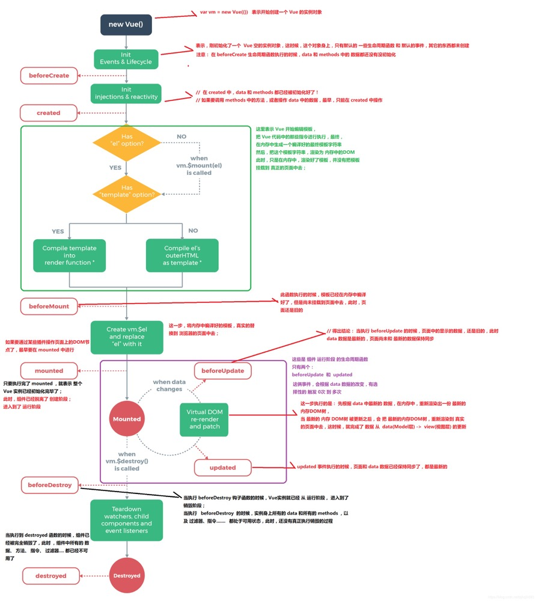

## vue修饰符有哪些
事件修饰符：为了能使用`event.stopPropagation`、`event.preventDefalut`等原生事件的一些方法。
```
.stop
.prevent
.capture
.self
.once
.passive
```

## 组件通信方式：
https://mp.weixin.qq.com/s?__biz=Mzg2NTA4NTIwNA==&mid=2247484468&idx=1&sn=3c309945992fe4f0c6276d91d7cb67b8&chksm=ce5e364ff929bf59ae686e3fa2412632348d6e190054e0b83bed11b5fd851ebbe8d326b5caf0&token=1424393752&lang=zh_CN#rd

### 父子组件的通信
1. `props & event ($emit、$on)`
2. `ref`：ref 特性可以为子组件赋予一个 ID 引用，通过这个 ID 引用可以直接访问这个子组件的实例。当父组件中需要主动获取子组件中的数据或者方法时，可以使用 `$ref` 来获取。
  使用`$ref`时需要注意的点：
  * `$refs` 是作为渲染结果被创建的，所以在初始渲染的时候它还不存在，此时无法无法访问。
  * `$refs` 不是响应式的，只能拿到获取它的那一刻子组件实例的状态，所以要避免在模板和计算属性中使用它。
3. `$parent 和 $children`：`$parent` 属性可以用来从一个子组件访问父组件的实例，`$children`属性可以获取当前实例的直接子组件。
  存在的问题：使用`$parent`会导致父组件数据变更后，很难去定位这个变更是从哪里发起的，所以在绝大多数情况下，不推荐使用。

### 用props和$emit怎么实现兄弟组件之间的通信
通过父组件作为中间传递的桥梁，透传两个子组件之间的数据

### 非父子组件的通信
1. `$attrs` 和 `$listeners`
  `$attrs`会包含父组件中没有被`prop`接收的所有属性（不包含class 和 style 属性），可以通过`v-bind="$attrs"`直接将这些属性传入内部组件。
  `$listeners` 会包含所有父组件中的`v-on`事件监听器 (不包含 .native 修饰器的) ，可以通过`v-on="$listeners"`传入内部组件。
  ```javascript
  // 父组件 parent.vue
  <template>
      <child :name="name" :message="message" @sayHello="sayHello"></child>
  </template>
  <script>
  export default {
      inheritAttrs: false,
      data() {
          return {
              name: '通信',
              message: 'Hi',
          }
      },
      methods: {
          sayHello(mes) {
              console.log('mes', mes) // => "hello"
          },
      },
  }
  </script>
  ```

  ```javascript
  // 子组件 child.vue
  <template>
      <grandchild v-bind="$attrs" v-on="$listeners"></grandchild>
  </template>
  <script>
  export default {
      data() {
          return {}
      },
      props: {
          // 注意，这里的propss只接收了父组件传入的name属性
          name,
      },
  }
  </script>
  ```

  ```javascript
  // 孙子组件 grand-child.vue
  <template>
  </template>
  <script>
  export default {
      created() {
          // 孙子组件触发的$on事件通过$listeners传递可以被爷组件接收到
          this.$emit('sayHello', 'hello')
      },
  }
  </script>
  ```
2. `provide 和 inject`
  `provide 和 inject`需要在一起使用，它可以使一个祖先组件向其所有子孙后代注入一个依赖，可以指定想要提供给后代组件的数据/方法，不论组件层次有多深，都能够使用。
  ```javascript
  // 祖先组件
  <script>
    export default {
        provide: {
            author: 'yushihu',
        },
        data() {},
    }
  </script>
  ```

  ```javascript
  // 子孙组件
  <script>
    export default {
        inject: ['author'],
        created() {
            console.log('author', this.author) // => yushihu
        },
    }
  </script>
  ```
  `provide 和 inject` 绑定不是响应的，它被设计是为组件库和高阶组件服务的，平常业务中的代码不建议使用。

3. `eventBus`：对于比较小型的项目，没有必要引入 vuex 的情况下，可以使用 eventBus。相比我们上面说的所有通信方式，`eventBus可以实现任意两个组件之间的通信`。
`eventBus`的实现思路：在要相互通信的两个组件中，都引入同一个新的vue实例，然后在两个组件中通过分别调用这个实例的`事件触发`和`监听`来实现通信。
```javascript
//eventBus.js
import Vue from 'vue';
export default new Vue();
```

```javascript
  // 组件A
  <script>
    import Bus from 'eventBus.js';
    export default {
        methods: {
            sayHello() {
                Bus.$emit('sayHello', 'hello');
            }
        }
    }
  </script>
```

```javascript
// 组件B
<script>
  import Bus from 'eventBus.js';
  export default {
      created() {
          Bus.$on('sayHello', target => {
              console.log(target);  // => 'hello'
          });
      }
  }
</script>
```
4. `Vuex`实现组件直接共享数据状态。
5. `dispatch 和 broadcast`


## computed、watcher、methods的区别
https://juejin.im/post/5d4299156fb9a06af92b82ff

### 计算属性缓存(computed) vs 方法(methods)
* computed计算属性可以当成一个`data数据`来使用。
  **注意点：**
  * computed是`在HTML DOM加载后马上执行`的，如赋值操作；
  * 计算属性计算时所`依赖的属性一定是响应式依赖`，否则计算属性不会执行。
  * 计算属性是`基于依赖进行缓存的`，就是说`在依赖没有更新的情况，调用计算属性并不会重新计算，可以减少开销`。`所以computed的值在getter执行后是会进行缓存的，只有在它依赖的属性值改变之后，下一次获取computed的值时才会重新调用对应的getter来计算出对应的新值`。
  * 其一般应用于`比较复杂的渲染数据计算`或者`不必重新计算数值的情况`
  * computed一般在首次渲染的时候会执行一次。

* methods方法：没有缓存，不像`computed在DOM加载后可以自动执行`，`methods必须有一定的触发条件才能执行`，如点击事件等；
* 使用方法`methods`实现和`computed`同样的效果：将同一函数定义为一个methods或者一个computed。对于最终的结果，两种方式确实是相同的。
```html
<p>Reversed message: "{{reversedMessage()}}"</p>
```

```javascript
methods: {
    reversedMessage: function () {
        return this.message.split('').reverse().join('');
    }
}
```

* `methods和computed最大的区别`如下：
  * `computed计算属性`是`基于它们的依赖进行缓存的`。<font color="red">（1）进行多次访问的时候（在不改变值的情况下），计算属性会立即返回之前缓存的计算结果，而不必再次执行函数；（2）并且computed还可以自动执行；（3）计算属性只有在它的相关依赖发生改变时才会重新求值</font>
  * `methods`<font color="red">只要发生重新渲染，就必定执行该函数（在HTML插值写法中，如上代码），`methods`必须有一定的触发条件才能执行。</font>
  * computed是<font color="red">属性调用</font>，methods是<font color="red">函数调用</font>

* 为什么需要缓存？
  比如有多个HTML插值写法的页面上，对某一个计算属性A用到了多次，对methods中的某个方法也用到了多次，这时，计算属性A只会计算一次，其它地方取值直接将之前计算的缓存值立即返回。但是methods中的方法每次插值都会被调用，这样导致较大的内存资源浪费，每次取值都需要执行一遍methods方法中的同样的逻辑，重复执行同样的代码逻辑。
  ```html
    <!-- computed -->
    <p>Reversed message: "{{reversedMessage}}"</p>
    <p>Reversed message: "{{reversedMessage}}"</p>
    <p>Reversed message: "{{reversedMessage}}"</p>
    <!-- methods -->
    <p>Reversed message: "{{reversedMessage()}}"</p>
    <p>Reversed message: "{{reversedMessage()}}"</p>
    <p>Reversed message: "{{reversedMessage()}}"</p>
    <p>Reversed message: "{{reversedMessage()}}"</p>
  ```

**注意：** Props、data、methods、computed的初始化都是在beforeCreated和created之间完成的。所以最早可以使用`Props、data、methods、computed`的时机（生命周期）是created。

### 计算属性(computed) vs 侦听属性(watch)
* `computed`属性默认只有`getter`，没有`setter`，可以手动添加`setter`
* computed一般在首次渲染的时候会执行一次。watch只有在监听的data数据有变化时才会执行。
* `watch`监听，专门用来`观察和响应Vue实例上的数据的变动`。
* 能使用`watch属性`的场景基本上都可以使用`computed属性`，而且`computed属性开销小，性能高`，因此能使用computed就尽量使用computed属性。
* 如果想要`执行异步或昂贵的操作以响应不断变化的数据`时，建议使用`watch`。应用场景一般像搜索框之类的，需要不断的响应数据的变化。如果搜索框有一个搜索按钮，当点击搜索按钮的时候，才会进行数据的响应和操作时，最好使用computed。

## nextTick的作用和原理
和事件循环机制有关系。
https://juejin.im/post/5e8064c551882573a13777e2

## Vue的生命周期
参考：https://juejin.im/post/5e8c8d43e51d454714426c92


1. `beforeCreate`
  beforeCreate在执行的时候，data还没有被初始化，DOM也没有初始化，所以不能在这里发起异步请求并且不能给数据模型的属性赋值。
  * 初始化生命周期
  * 初始化事件监听
  * 初始定义渲染选项，并且对一些属性进行监听
2. `created`：created被执行的时候数据模型下的val已经完成了初始化工作，但是页面DOM依旧不能获取到。说明在created里，可以发起异步请求进行数据模型的赋值操作，但是不能做页面DOM的操作。
  * 初始化注入&校验
  * 初始化数据模型 
  * `此时data和methods已经初始化完成`、`watcher`
3. `beforeMount`：`beforeMount`与`created`之间只有一个是否是浏览器的判断，所以这时候在钩子函数中的数据模型、页面的状态，`与created是一样的`。
4. `mounted`：mounted被执行到的时候，`数据模型和页面的DOM都初始化完成`，`可以给数据模型赋值也可以进行DOM操作了`。
  mounted怎么挂载DOM的？  `vm.$el = el`
5. `beforeUpdate`：beforeUpdate里的代码并不像前面四个钩子函数会把自动执行，而是通过操作数据模型里的值来触发执行的，图上的例子中，由于mounted的this.val='56789'执行，造成了beforeUpdate的执行，而且在beforeUpdate执行的时候，数据模型里的值已经是操作后的最新值。
6. `update`：虚拟DOM重新渲染并应用更新。`updated`的执行在`beforeUpdate之后`，与beforeUpdate的数据与页面保持一致。
7. `beforeDestroy`：在mounted手动进行了destroy销毁组件，触发了beforeDestroy钩子函数执行，在这里依旧能看到`数据模型与DOM是未被注销的`。
8. `destroyed`：数据监听、数据模型、DOM已经被清除了。

其它生命周期：vue2.2之后`activated钩子函数`和`deactivated钩子函数`被引用进来，因为这两个钩子函数只会是被keep-alive标签包裹的子组件才会得到触发机会
9. `activated`：`activated`只有被标签缓存的组件激活的时候才会被调用。`keep-alive`标签
10. `deactivated`：deactivated钩子函数的触发是`keep-alive`标签缓存的组件停用时触发，如被keep-alive标签包裹的my-comp组件，当子组件被v-if置为false的时候，deactivated钩子函数将得到执行。

11. `errorCaptured`：vue2.5之后引入的钩子函数，目的是为了稳定性，当子孙组件发生异常的时候，则会触发这个钩子函数，它有三个参数，错误对象、发生错误的组件实例、错误来源信息，可以主动返回 false 阻止该错误继续向上面的父组件传播。
    本质：是一个包裹子组件的try catch，将所有捕获到的异常内容做了一次拦截，并且在catch的时候决定是否继续往外层抛错。

### Ajax请求放在哪个钩子函数中？
Ajax请求应该`放在created钩子函数`是最好的，这时候数据模型data已经初始化好了。
如果放在beforeCreate函数里，这时候data还没有初始化，无法将获取到的数据赋值给数据模型。
如果放在mounted里，这时候页面结构已经完成，如果获取的数据与页面结构无联系的话，这个阶段是略微有点迟的。

### Vue 的父组件和子组件生命周期钩子函数执行顺序？
加载渲染过程
父 beforeCreate -> 父 created -> 父 beforeMount -> 子 beforeCreate -> 子 created -> 子 beforeMount -> 子 mounted -> 父 mounted


子组件更新过程
父 beforeUpdate -> 子 beforeUpdate -> 子 updated -> 父 updated


父组件更新过程
父 beforeUpdate -> 父 updated


销毁过程
父 beforeDestroy -> 子 beforeDestroy -> 子 destroyed -> 父 destroyed

### Vue中key的作用？
key为了更高效的更新VDOM，通过复用已有的DOM节点来完成DOM的更新。
`创建新DOM节点并移除旧DOM节点`和`更新已存在的DOM节点`，这两种方式里`创建新DOM节点的开销肯定是远大于更新或移动已有的DOM节点`，所以在diff中逻辑都是`为了减少新的创建而更多的去复用已有DOM节点来完成DOM的更新`。

在新旧vnode的diff过程中，<font color="red">`key`是判断两个节点是否为同一节点的首要条件</font>
<font color="red">设置key可以在diff中更快速的找到对应节点，提高diff速度，从而更高效的更新VDOM。</font>

### Vue的diff算法
时间复杂度为O(n)

### v-show 与 v-if 有什么区别？
`v-if`：是真正的条件渲染，因为它会确保在切换过程中条件块内的事件监听器和子组件适当地被销毁和重建；也是惰性的：如果在初始渲染时条件为假，则什么也不做——直到条件第一次变为真时，才会开始渲染条件块。
适用场景：`v-if`适用于在运行时很少改变条件，不需要频繁切换条件的场景；
`v-show`：不管初始条件是什么，元素总是会被渲染，并且只是简单地基于 CSS 的 “display” 属性进行切换。`display:none/block`
适用场景：`v-show`适用于需要非常频繁切换条件的场景。


### vue怎么避免样式污染？
#### scoped：实现标签内的样式在当前模板输出的HTML标签上生效
实现原理：
1. 每个Vue文件都将对应一个唯一的id，该id可以根据文件路径名和内容hash生成
2. 编译template标签时为每个标签添加了当前组件的id，如`<div class="demo"></div>`会被编译成`<div class="demo" data-v-27e4e96e></div>`
3. 编译`style`标签时，会根据当前组件的id通过属性选择器和组合选择器输出样式，如`.demo{color: red;}`会被编译成`.demo[data-v-27e4e96e]{color: red;}`

### v-for 和 v-if的优先级？
`v-for > v-if`

### vue-router中params和query的区别
1. params：路径参数，用来定义动态路由参数；
```javascript
routes: [
    // 动态路径参数 以冒号开头
    { path: '/user/:id', component: User }
  ]
```
像 `/user/foo` 和 `/user/bar` 都将映射到相同的路由。

2. query：查询参数，用来传参数，url中?后面的查询参数；

### hash和history的区别？
vue-router 默认 hash 模式 —— 使用 URL 的 hash 来模拟一个完整的 URL，`于是当 URL 改变时，页面不会重新加载`。链接如：`http://yoursite.com/user#id`
如果不想要很丑的 hash，我们可以用路由的 history 模式，这种模式充分利用 history.pushState API 来完成 URL 跳转而无须重新加载页面。
当你使用 history 模式时，URL 就像正常的 url，例如 `http://yoursite.com/user/id`，也好看！