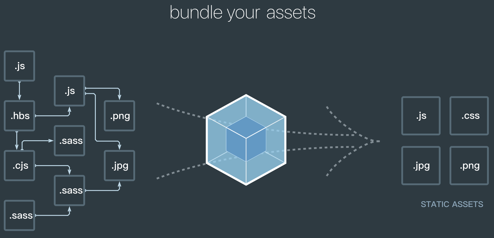

# Webpack相关
## 1.1 Webpack是什么
Webpack是一种前端资源构建工具，一个静态模块打包器（module bundler）
在Webpack看来，前端的所有资源文件（js/json/css/less/img/...）都会作为模块处理，它将根据模块的依赖关系进行静态分析，打包生成对应的静态资源（bundle）


## 1.2 Webpack五个核心概念
### 1.2.1 入口（entry）
webpack以哪个文件作为开始打包的的起点，分析构建内部依赖图
### 1.2.2 输出（output）
webpack打包后的资源bundles输出到哪里，以及如何命名
### 1.2.3 loader
webpack只能理解js和json文件，loader可以让webpack处理其它类型（除了js和json）的文件，如.txt、.css、.less、.img等，将他们转换成有效模块。
类似于翻译官，对其他类型的资源进行转义的预处理工作。
### 1.2.4 plugin
plugin可用于执行范围更广的任务，包括打包优化、资源管理（如压缩）、注入环境变量等。
### 1.2.5 mode
指示webpack使用相应模式的配置
`development`模式：能让代码本地调试、运行的环境
`production`模式：能让代码优化上线运行的环境


## HMR：hot module replacement 热模块替换 / 模块热替换 / 模块热更新
### 作用：当对代码进行修改并保存后，webpack 将对代码重新打包，并将新的模块发送到浏览器端，浏览器通过新的模块替换老的模块，这样在不刷新浏览器的前提下就能够对应用进行更新。
一个模块发生变化，只会重新打包这一个模块（而不是打包所有模块），极大提升构建速度。

### HMR的实现原理：https://zhuanlan.zhihu.com/p/30669007
1. 第一步：webpack 对文件系统进行 watch 打包到内存中。
`webpack-dev-middleware`调用 webpack 的 api 对文件系统 watch，当 某个 文件发生改变后，webpack 重新对文件进行编译打包，然后保存到内存中。
2. 第二步：`devServer`(即`webpack-dev-server`) 通知浏览器端文件发生改变
   在启动 `devServer` 的时候，sockjs 在服务端和浏览器端建立了一个 `webSocket长连接`，以便将 webpack 编译和打包的各个阶段状态告知浏览器。
3. 第三步：`webpack-dev-server/client`接收到服务端消息做出响应。
4. 第四步：webpack 接收到最新 hash 值验证并请求模块代码。
5. 第五步：HotModuleReplacement.runtime 对模块进行热更新。

### 使用webpack开发时，你用过哪些可以提高效率的插件？
HMR

## 如何对bundle体积进行监控和分析？
可以使用 `webpack-bundle-analyzer` 生成 bundle 的模块组成图，显示所占体积。

## 文件指纹是什么？怎么用？
```javascript
// 文件资源缓存
// hash: 每次webpack构建时会生成一个唯一的hash值
// filename: 'built.[hash:10].js',
// chunkhash: 根据chunk生成的hash值，如果打包来源于同一个chunk，那么hash值就一样。
// filename: 'built.[chunkhash:10].js',
// contenthash 根据文件的内容生成hash值。不同文件hash值一定不一样
// filename: 'built.[contenthash:10].js',
```

文件指纹是打包后输出的文件名的后缀。
hash：和整个项目的构建相关，只要项目文件有修改，整个项目构建的 hash 值就会更改
chunkhash：和 Webpack 打包的 chunk 有关，不同的 entry 会生出不同的 chunkhash
contenthash：根据文件内容来定义 hash，文件内容不变，则 contenthash 不变

### webpack的缓存
文件资源缓存：`hash`、`chunkhash`、`contenthash`配置文件名
`babel-loader` 开启缓存
`terser-webpack-plugin` 开启缓存
使用 `cache-loader` 或者 `hard-source-webpack-plugin`

### 在实际工程中，配置文件上百行乃是常事，如何保证各个loader按照预想方式工作？
可以使用 `enforce` 强制执行 loader 的作用顺序，`pre` 代表在所有正常 loader 之前执行，`post` 是所有 loader 之后执行

### 如何提升webpack构建速度
1. 压缩css：
   * 通过 `mini-css-extract-plugin` 提取 Chunk 中的 CSS 代码到单独文件
   * 通过 css-loader 的 minimize 选项开启 cssnano 压缩 CSS。
   * 配置`exclude`排除loader不需要打包的资源。
   * 使用`optimize-css-assets-webpack-plugin`插件压缩css。
2. 压缩html：通过`html-webpack-plugin`开启`minify`配置
    ```javascript
    new HtmlWebpackPlugin({
        template: './src/index.html',
        // 压缩html代码
        minify: {
            // 移除属性引号
            removeAttributeQuotes: true,
            // 移除空格，打包成一行
            collapseWhitespace: true,
            // 移除注释
            removeComments: true
        },
        // 给html中引入的bundle.js名字加一个hash戳
        hash: true
    })
    ```
3. 配置`resolve.modules` 告诉 webpack 解析模块时应该搜索的目录 (减少不必要的查找)
4. 配置`resolve.extensions` 配置省略文件路径的后缀名，尽可能减少后缀尝试的可能性。
5. 合理配置`resolve.alas`，配置解析模块的路径别名。
6. 配置`modlue.noParse`正则匹配到的文件不去解析。如下配置不会解析jquery这个第三方依赖库。
    ```json
    // 不去解析jquery中的依赖库
    noParse: /jquery/,
    ```
7. 使用 `html-webpack-externals-plugin`，将基础包通过 CDN 引入，不打入 bundle 中。
8. 使用 `SplitChunksPlugin` 进行(公共脚本、基础包、页面公共文件)分离(Webpack4内置) 。
9. 利用缓存提升二次构建的速度。
`babel-loader` 开启缓存
`terser-webpack-plugin` 开启缓存
使用 `cache-loader` 或者 `hard-source-webpack-plugin`
10. 使用树摇`Tree shaking`
`tree shaking`：去除无用代码，如去除未使用到的代码
前提： 1.必须使用es6模块化 2.开启production环境
作用：减少代码体积

在`package.json`中配置：
`"sideEffects": false`所有代码都没有副作用 （都可以进行`tree shaking`）
问题：可能会把css/@babel/polyfill （副作用）干掉
解决：修改`package.json`中的配置，过滤掉不需要tree shaking的文件，如过滤css文件
`"sideEffects": ["*.css"]`

### 多个loader只会生效其中一个的配置是什么？
```javascript
// 以下loader配置置灰生效1个
oneOf: []
```

### 文件监听原理？
在发现源码发生变化时，自动重新构建出新的输出文件。

Webpack开启监听模式，有两种方式：
启动 `webpack` 命令时，带上 `--watch`；
参数在配置 `webpack.config.js` 中设置 `watch:true`

缺点：每次需要手动刷新浏览器
原理：`轮询`判断文件的最后编辑时间是否变化，如果某个文件发生了变化，并不会立刻告诉监听者，而是先缓存起来，等 `aggregateTimeout` 后再执行。
```javascript
module.export = {
    // 默认false,也就是不开启
    watch: true,
    // 只有开启监听模式时，watchOptions才有意义
    watchOptions: {
        // 默认为空，不监听的文件或者文件夹，支持正则匹配
        ignored: /node_modules/,
        // 监听到变化发生后会等300ms再去执行，默认300ms
        aggregateTimeout:300,
        // 判断文件是否发生变化是通过不停询问系统指定文件有没有变化实现的，默认每秒问1000次
        poll:1000
    }
}
```

### loader和plugin的区别
#### Loader：相当于翻译官的作用，将其他类型的文件翻译成有效的模块。
1. 由于 `webpack` 只能理解 `JavaScript` 和 `JSON` 文件。`loader` 可以让 `webpack` 能够去处理其他类型的文件，并将它们转换为有效模块，以供应用程序使用，以及被添加到依赖图中。
2. `Loader` 在 `module.rules` 中配置，作为模块的解析规则，类型为数组。每一项都是一个 Object，内部包含了 test(类型文件)、loader、options (参数)等属性。

#### Plugin 插件
1. 插件可以用于执行范围更广的任务。包括：打包优化，资源管理，注入环境变量。
2. `Plugin` 在 `plugins` 中单独配置，类型为数组，每一项是一个 Plugin 的实例，参数都通过构造函数传入。