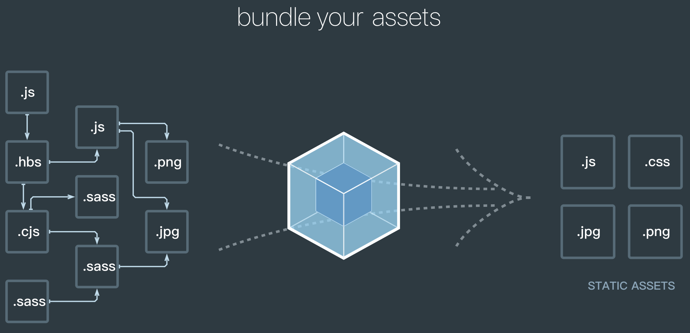

## 1.1 Webpack是什么
Webpack是一种前端资源构建工具，一个静态模块打包器（module bundler）
在Webpack看来，前端的所有资源文件（js/json/css/less/img/...）都会作为模块处理，它将根据模块的依赖关系进行静态分析，打包生成对应的静态资源（bundle）

## 1.2 Webpack五个核心概念
### 1.2.1 入口（entry）
webpack以哪个文件作为开始打包的的起点，分析构建内部依赖图
### 1.2.2 输出（output）
webpack打包后的资源bundles输出到哪里，以及如何命名
### 1.2.3 loader
webpack只能理解js和json文件，loader可以让webpack处理其它类型（除了js和json）的文件，如.txt、.css、.less、.img等，将他们转换成有效模块。
类似于翻译官，对其他类型的资源进行转义的预处理工作。
### 1.2.4 plugin
plugin可用于执行范围更广的任务，包括打包优化、资源管理（如压缩）、注入环境变量等。
### 1.2.5 mode
指示webpack使用相应模式的配置
`development`模式：能让代码本地调试、运行的环境
`production`模式：能让代码优化上线运行的环境

## 1.3 